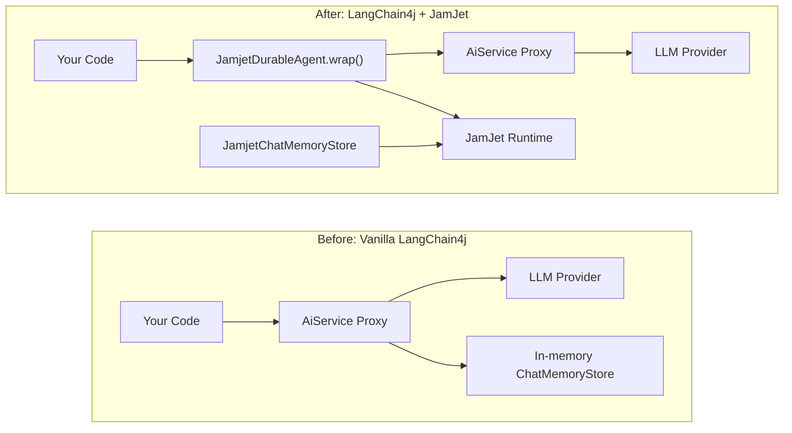

# LangChain4j-Integration

JamJet ist eine vollständige Agent-Laufzeitumgebung mit eigenem [Java SDK](/java-sdk) — sie kommuniziert nativ mit LLMs, verwaltet Tools, kompiliert zu dauerhafter Workflow-IR und setzt Kosten- und Zeit-Schranken zur Laufzeit durch. Für neue Projekte ist dies der empfohlene Weg.

Wenn Sie jedoch bereits LangChain4j-Agenten in Produktion haben — `AiServices`-Proxies, Chat-Memory-Stores, Tool-Bindings — müssen Sie diese nicht neu schreiben. Diese Integration umschließt Ihren bestehenden LangChain4j-Code mit JamJets dauerhafter Ausführungs-Engine und gibt Ihnen Crash-Recovery, Audit-Trails und Replay-Tests bei minimalen Änderungen.

### Vorher und nachher



Die linke Seite zeigt, was Sie heute haben. Die rechte Seite fügt einen dauerhaften Proxy vor Ihrem bestehenden Agenten hinzu und persistiert den Chat-Verlauf über die JamJet-Laufzeitumgebung. Ihr `AiService`-Interface, Tool-Definitionen und LLM-Konfiguration ändern sich nicht.

> **note:**
> Für neue Java-Projekte sollten Sie das [Java SDK](/java-sdk) direkt in Betracht ziehen — es bietet native LLM-Integration, typisierte Tools, Strategie-Auswahl und IR-Kompilierung ohne die LangChain4j-Abhängigkeit.

---

## Setup

### 1. Dependency hinzufügen

Das Integrationsmodul ist auf Maven Central veröffentlicht. Es benötigt `jamjet-spring-boot-starter` als Peer-Dependency für den Runtime-Client.

#### Maven

```xml
<dependency>
    <groupId>dev.jamjet</groupId>
    <artifactId>langchain4j-jamjet</artifactId>
    <version>0.1.0</version>
</dependency>
<dependency>
    <groupId>dev.jamjet</groupId>
    <artifactId>jamjet-spring-boot-starter</artifactId>
    <version>0.1.0</version>
</dependency>
```

#### Gradle (Kotlin DSL)

```kotlin
implementation("dev.jamjet:langchain4j-jamjet:0.1.0")
implementation("dev.jamjet:jamjet-spring-boot-starter:0.1.0")
```

#### Gradle (Groovy DSL)

```groovy
implementation 'dev.jamjet:langchain4j-jamjet:0.1.0'
implementation 'dev.jamjet:jamjet-spring-boot-starter:0.1.0'
```

### 2. JamJet-Runtime starten

Die Runtime ist die Ausführungsengine, die Events persistiert und den Workflow-Status verwaltet. Starten Sie sie mit Docker:

```bash
docker run -p 7700:7700 ghcr.io/jamjet-labs/jamjet:latest
```

Oder, falls Sie die CLI installiert haben:

```bash
jamjet dev
```

### 3. Konfigurieren

Fügen Sie die Runtime-URL zu Ihrer `application.yml` hinzu:

```yaml
spring:
  jamjet:
    runtime-url: http://localhost:7700
    # api-token: ${JAMJET_API_TOKEN}      # optional, für authentifizierte Runtimes
    # tenant-id: default                   # Multi-Tenant-Isolation
    durability-enabled: true
```

---

## Bestehenden Agent einbinden

Angenommen, Sie haben bereits einen LangChain4j `AiService` im Produktivbetrieb:

**Ihr bestehender Code (keine Änderungen erforderlich):**

```java
import dev.langchain4j.service.AiServices;
import dev.langchain4j.model.openai.OpenAiChatModel;

interface ResearchAssistant {
    String research(String topic);
}

var model = OpenAiChatModel.builder()
        .apiKey(System.getenv("OPENAI_API_KEY"))
        .modelName("gpt-4o")
        .build();

ResearchAssistant assistant = AiServices.create(ResearchAssistant.class, model);
```

**Dauerhaftigkeit mit einem Aufruf hinzufügen:**

```java
import dev.jamjet.langchain4j.JamjetDurableAgent;
import dev.jamjet.spring.client.JamjetRuntimeClient;

// client wird automatisch vom jamjet-spring-boot-starter konfiguriert,
// oder manuell mit JamjetConfig erstellen (siehe Konfiguration unten)
ResearchAssistant durable = JamjetDurableAgent.wrap(
        assistant,                // Ihr bestehender AiService-Proxy
        ResearchAssistant.class,  // der Interface-Typ
        client                    // JamjetRuntimeClient
);

// Verwenden Sie ihn wie gewohnt — das Interface bleibt unverändert
String result = durable.research("quantum error correction");
```

Das ist die gesamte Änderung. Ihr aufrufender Code, die Interface-Definition, Tool-Annotationen und Modellkonfiguration bleiben gleich.

### Was im Hintergrund passiert

Wenn Sie `JamjetDurableAgent.wrap()` aufrufen, wird ein JDK-Dynamic-Proxy (`java.lang.reflect.Proxy`) um Ihr `AiService`-Interface erzeugt. Jeder Methodenaufruf auf dem eingebundenen Proxy durchläuft diese Sequenz:

1. **Workflow-IR erstellen** — der Proxy konstruiert eine leichtgewichtige Zwischendarstellung mit dem Namen `langchain4j-{InterfaceName}-{methodName}` mit einem einzelnen `LlmGenerate`-Knoten. Diese IR ist das gleiche Format, das von JamJets nativem SDK und der Rust-Runtime verwendet wird.

2. **Workflow erstellen und Ausführung starten** — der Proxy ruft `client.createWorkflow(ir)` gefolgt von `client.startExecution(workflowId, ...)` auf. Die Ausführung wird nun von der JamJet-Runtime mit einer eindeutigen Execution-ID verfolgt.

3. **Delegate aufrufen** — der ursprüngliche `AiService`-Proxy übernimmt den eigentlichen LLM-Aufruf. Ihre Tools, Memory und Modellkonfiguration funktionieren wie zuvor.

4. **Abschluss oder Fehler aufzeichnen** — bei Erfolg sendet der Proxy ein `completion`-Event mit `status=completed` und dem Ergebnis. Bei Fehler wird `status=failed` mit der Fehlermeldung aufgezeichnet.

5. **Graceful Degradation** — falls die JamJet-Runtime nicht erreichbar ist (Netzwerkpartition, Container nicht gestartet), loggt der Proxy eine Warnung und delegiert direkt an den ursprünglichen `AiService`. Ihre Anwendung fällt niemals aus, weil JamJet nicht verfügbar ist.

---

## Konfiguration

Wenn Sie Spring Boot verwenden, wird der `JamjetRuntimeClient` automatisch aus den Eigenschaften in `application.yml` konfiguriert (siehe [Spring Boot Starter](/spring-boot-starter) Anleitung). Für die eigenständige Verwendung außerhalb von Spring nutzen Sie `JamjetConfig`, um einen Client manuell zu erstellen:

```java
import dev.jamjet.langchain4j.JamjetConfig;

var config = new JamjetConfig()
        .runtimeUrl("http://localhost:7700")
        .apiToken("your-token")
        .tenantId("default")
        .connectTimeout(10)
        .readTimeout(120);

var client = config.buildClient();
```

### Konfigurationsoptionen

| Option | Methode | Standard | Beschreibung |
|--------|--------|---------|-------------|
| Runtime-URL | `.runtimeUrl(String)` | `http://localhost:7700` | Adresse der JamJet-Runtime |
| API-Token | `.apiToken(String)` | `null` | Authentifizierungstoken für gesicherte Runtimes |
| Tenant-ID | `.tenantId(String)` | `"default"` | Mandantenisolierungs-Identifikator |
| Verbindungstimeout | `.connectTimeout(int)` | `10` (Sekunden) | TCP-Verbindungstimeout |
| Lese-Timeout | `.readTimeout(int)` | `120` (Sekunden) | HTTP-Lese-Timeout für lang laufende Operationen |

Alle Optionen verwenden ein Fluent-Builder-Pattern. `JamjetConfig` erzeugt einen `JamjetRuntimeClient` über `.buildClient()`, der derselbe Client-Typ ist, den die Spring Boot Auto-Konfiguration verwendet.

---

## Dauerhafter Chat-Speicher

LangChain4j speichert den Konversationsverlauf über das `ChatMemoryStore`-Interface. Die Standard-Implementierung ist speicherbasiert – bei einem Prozess-Neustart geht die gesamte Konversationshistorie verloren.

`JamjetChatMemoryStore` persistiert den Konversationsverlauf über das Audit-Event-System der JamJet-Runtime. Nachrichten werden mit dem eingebauten `ChatMessageSerializer` von LangChain4j zu JSON serialisiert und als externe Events gespeichert, wodurch sie über Neustarts hinweg persistent und über die Audit-API abfragbar sind.

```java
import dev.jamjet.langchain4j.JamjetChatMemoryStore;
import dev.langchain4j.memory.chat.MessageWindowChatMemory;

var memoryStore = new JamjetChatMemoryStore(client);

var memory = MessageWindowChatMemory.builder()
        .maxMessages(20)
        .chatMemoryStore(memoryStore)
        .build();

// Wie gewohnt mit Ihrem AiService verwenden
ResearchAssistant assistant = AiServices.builder(ResearchAssistant.class)
        .chatLanguageModel(model)
        .chatMemory(memory)
        .build();
```

### Funktionsweise

| Operation | Was passiert |
|-----------|-------------|
| `getMessages(memoryId)` | Fragt den JamJet-Audit-Trail nach dem neuesten `chat_memory`-Event für die Memory-ID ab. Deserialisiert das gespeicherte JSON zurück in `ChatMessage`-Objekte. Gibt eine leere Liste zurück, wenn kein Verlauf vorhanden ist. |
| `updateMessages(memoryId, messages)` | Serialisiert alle Nachrichten zu JSON und sendet ein `chat_memory`-External-Event an die Runtime, wobei die Nachrichtenanzahl neben der Payload aufgezeichnet wird. |
| `deleteMessages(memoryId)` | Sendet ein `memory_cleared`-Event an die Runtime. Das Event-Log ist ausschließlich erweiterbar, daher wird das Löschen als Fakt aufgezeichnet und nicht durch Entfernen vorheriger Einträge durchgeführt. |

Alle drei Operationen degradieren elegant – wenn die JamJet-Runtime nicht erreichbar ist, protokolliert der Store eine Warnung und gibt leere Ergebnisse zurück (bei Lesevorgängen) oder verwirft den Schreibvorgang stillschweigend. Dies entspricht dem gleichen Graceful-Degradation-Pattern, das von `JamjetDurableAgent` verwendet wird.

---

## Was Sie erhalten

Das Wrappen Ihrer LangChain4j-Agents mit JamJet fügt folgende Funktionen hinzu, ohne Ihren Anwendungscode zu ändern:

| Fähigkeit | Ohne JamJet | Mit JamJet |
|------------|---------------|-------------|
| **Crash-Recovery** | Prozess stirbt, Interaktion verloren, Token verschwendet | Ausführung von Runtime getrackt, nach Neustart fortsetzbar |
| **Audit-Trails** | Keine Aufzeichnung des Geschehens | Jeder Methodenaufruf als unveränderliches Event mit Args, Result und Status aufgezeichnet |
| **Replay-Testing** | Muss Live-LLM für Tests aufrufen | Aufgezeichnete Ausführungen in Testsuite wiedergeben, keine LLM-Calls nötig |
| **Kostenverfolgung** | Manuelles Token-Counting | Execution-Events enthalten Methodenname und Argumente für Kostenzuordnung |
| **Observability** | Nur Logging auf Anwendungsebene | Execution-IDs für Distributed-Tracing-Korrelation, Micrometer-Metriken via Spring-Boot-Starter |
| **Chat-Memory-Persistenz** | Nur im Speicher, bei Neustart verloren | Persistent durch JamJet-Audit-Event-System, übersteht Neustarts |

---

## Testen von umschlossenen Agents

Das Modul `jamjet-spring-boot-starter-test` funktioniert mit umschlossenen LangChain4j-Agents. Da `JamjetDurableAgent.wrap()` JamJet-Ausführungen erstellt, können Sie diese in Tests mit `@ReplayExecution` wiedergeben.

```java
import dev.jamjet.spring.test.annotations.WithJamjetRuntime;
import dev.jamjet.spring.test.annotations.ReplayExecution;
import dev.jamjet.spring.test.RecordedExecution;
import dev.jamjet.spring.test.AgentAssertions;
import org.junit.jupiter.api.Test;
import java.util.concurrent.TimeUnit;

@WithJamjetRuntime
class ResearchAssistantTest {

    @Test
    @ReplayExecution("exec-lc4j-abc123")
    void wrappedAgentProducesConsistentOutput(RecordedExecution execution) {
        AgentAssertions.assertThat(execution)
                .completedSuccessfully()
                .completedWithin(30, TimeUnit.SECONDS)
                .outputContains("quantum");
    }
}
```

Fügen Sie die Test-Abhängigkeit hinzu:

```xml
<dependency>
    <groupId>dev.jamjet</groupId>
    <artifactId>jamjet-spring-boot-starter-test</artifactId>
    <version>0.1.0</version>
    <scope>test</scope>
</dependency>
```

Die vollständige Test-API – `RecordedExecution`-Felder, `AgentAssertions` Fluent-API, `DeterministicModelStub`, Fork-at-Node-Wiedergabe – finden Sie im Testabschnitt der [Spring Boot Starter](/spring-boot-starter)-Anleitung.

---

## Nächste Schritte

- **[Java SDK-Referenz](/java-sdk)** — für neue Projekte bietet JamJets natives Java-SDK direkte LLM-Integration, typisierte Tools, Strategieauswahl und IR-Kompilierung ohne die LangChain4j-Abhängigkeit
- **[Java-Schnellstart](/java-quickstart)** — erstellen Sie Ihren ersten Agent und Workflow von Grund auf mit dem nativen SDK
- **[Spring Boot Starter](/spring-boot-starter)** — vollständige Spring-AI-Integration mit automatisch konfigurierter Dauerhaftigkeit, Audit-Trails, Human-in-the-Loop-Genehmigung und Observability
- **[Agentic-AI-Patterns](https://sunilprakash.com/agentic-ai)** — Strategieauswahl, Tool-Design und Produktionsmuster für Agentensysteme
