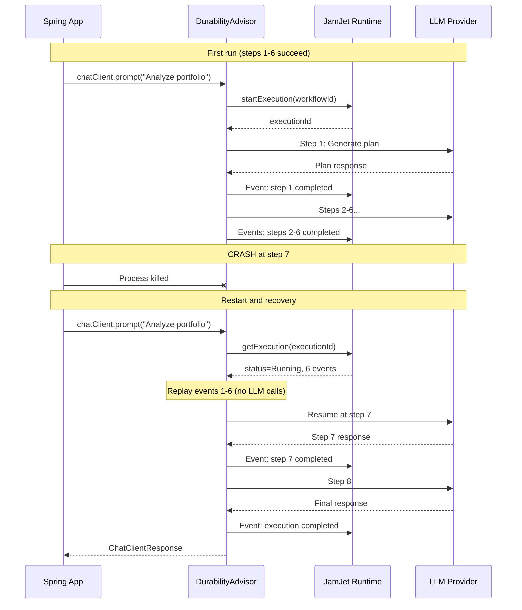
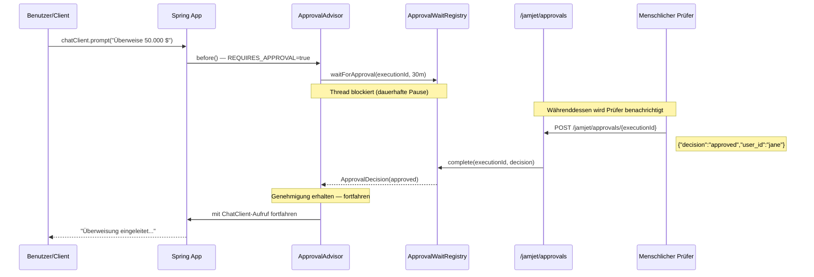
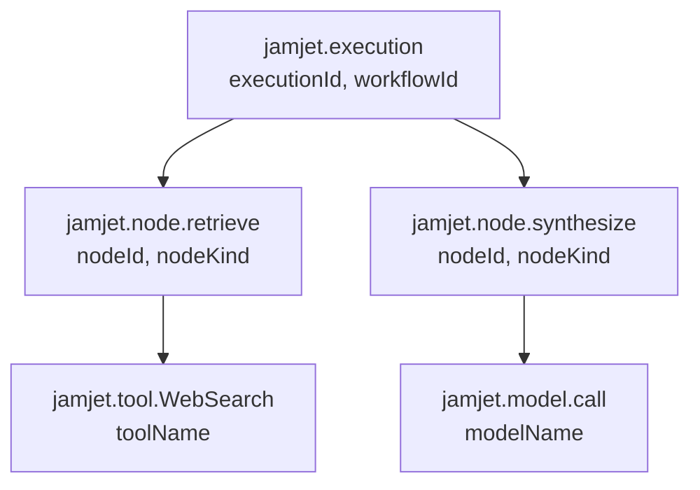

# Spring Boot Starter

Dieser Leitfaden deckt die vollständige JamJet Spring Boot Integration ab: Warum Dauerhaftigkeit für KI-Agenten wichtig ist, wie jeder Advisor unter der Haube funktioniert, wie man Agenten deterministisch testet und wie man sie in Produktion überwacht. Am Ende verfügen Sie über eine funktionierende Spring AI Anwendung, bei der jeder LLM-Aufruf crash-sicher, geprüft und beobachtbar ist.

---

## Warum Dauerhaftigkeit für KI-Agenten wichtig ist

Spring AI bietet Ihnen eine saubere Abstraktion für die Entwicklung LLM-basierter Anwendungen. Sie erhalten `ChatClient`, Advisors, Tool Calling und Modellportabilität. Was Sie nicht bekommen, ist Schutz, wenn zur Laufzeit etwas schiefgeht.

Überlegen Sie, was passiert, wenn Ihr Spring AI Agent mitten in einer mehrstufigen Aufgabe steckt --- er hat ein Suchwerkzeug aufgerufen, Ergebnisse abgerufen und ist kurz davor, eine Antwort zu synthetisieren --- und der Prozess abstürzt. Mit Standard-Spring AI geht die gesamte Interaktion verloren. Der Benutzer sieht einen Fehler. Die bereits verbrauchten Tokens sind verschwendet. Es gibt keine Aufzeichnung darüber, was passiert ist.

Das ist das Problem, das **durable execution** löst. JamJet zeichnet jeden Schritt der Interaktion Ihres Agenten als unveränderliches Event auf. Wenn der Prozess abstürzt und neu startet, spielt es diese Events ab und setzt genau dort fort, wo es aufgehört hat. Keine verlorene Arbeit, keine verschwendeten Tokens, kein für den Benutzer sichtbarer Fehler.

Dauerhaftigkeit ermöglicht auch Fähigkeiten, die ohne sie unmöglich sind:

- **Audit Trails** --- jeder Prompt, jede Antwort, jeder Tool Call und jede Token-Anzahl wird als unveränderliches Event aufgezeichnet. Erforderlich für regulierte Branchen (Finanzdienstleistungen, Gesundheitswesen, Recht).
- **Human-in-the-Loop-Genehmigung** --- pausieren Sie einen Agenten während der Ausführung, warten Sie auf Genehmigung oder Ablehnung durch einen Menschen und setzen Sie dann fort. Die Pause ist dauerhaft: Sie übersteht Neustarts.
- **Replay-Testing** --- spielen Sie eine Produktionsausführung in einer Testumgebung ab und prüfen Sie die Ergebnisse. Keine LLM-Aufrufe erforderlich.
- **Kostenverfolgung** --- aggregieren Sie echte Token-Kosten pro Ausführung, pro Benutzer, pro Workflow.

Für tiefere Hintergründe, warum wir JamJet entwickelt haben und welche Probleme es löst, siehe [Why We Built JamJet](https://jamjet.dev/blog/why-we-built-jamjet).

---

## Einrichtung

### 1. Abhängigkeit hinzufügen

Der Starter ist auf Maven Central veröffentlicht. Fügen Sie eine einzige Abhängigkeit hinzu – die Spring Boot Auto-Konfiguration übernimmt den Rest.

#### Maven

```xml
<dependency>
    <groupId>dev.jamjet</groupId>
    <artifactId>jamjet-spring-boot-starter</artifactId>
    <version>0.2.0</version>
</dependency>
```

#### Gradle (Kotlin DSL)

```kotlin
implementation("dev.jamjet:jamjet-spring-boot-starter:0.2.0")
```

#### Gradle (Groovy DSL)

```groovy
implementation 'dev.jamjet:jamjet-spring-boot-starter:0.2.0'
```

### 2. JamJet Runtime starten

Die Runtime ist die Ausführungsumgebung, die Events persistiert und Workflow-Zustände verwaltet. Starten Sie sie mit Docker:

```bash
docker run -p 7700:7700 ghcr.io/jamjet-labs/jamjet:latest
```

Oder, falls die CLI installiert ist:

```bash
jamjet dev
```

### 3. Konfigurieren

Fügen Sie die Runtime-URL zu Ihrer `application.yml` hinzu:

```yaml
spring:
  jamjet:
    runtime-url: http://localhost:7700
    # api-token: ${JAMJET_API_TOKEN}      # optional, für authentifizierte Runtimes
    # tenant-id: default                   # Mandanten-Isolierung
    durability-enabled: true               # Standard: true
    connect-timeout-seconds: 10            # Standard: 10
    read-timeout-seconds: 120              # Standard: 120
```

Oder in `application.properties`:

```properties
spring.jamjet.runtime-url=http://localhost:7700
```

### Was die Auto-Konfiguration leistet

Wenn `JamjetAutoConfiguration` den `ChatClient` von Spring AI im Classpath erkennt und `spring.jamjet.durability-enabled=true` (Standardwert) gesetzt ist, registriert sie folgende Beans:

| Bean | Bedingung | Zweck |
|------|-----------|---------|
| `JamjetRuntimeClient` | Immer (wenn Durability aktiviert) | HTTP-Client zur JamJet Runtime |
| `JamjetDurabilityAdvisor` | Immer (wenn Durability aktiviert) | Umschließt jeden ChatClient-Aufruf mit dauerhafter Ausführung |
| `ChatClientCustomizer` | Immer (wenn Durability aktiviert) | Injiziert automatisch den Durability-Advisor in alle ChatClient-Instanzen |
| `JamjetAuditAdvisor` | `spring.jamjet.audit.enabled=true` (Standard) | Zeichnet Prompts, Antworten und Token-Nutzung als Audit-Events auf |
| `JamjetAuditService` | `spring.jamjet.audit.enabled=true` (Standard) | Programmatischer Zugriff auf Audit-Trail |
| `JamjetApprovalAdvisor` | `spring.jamjet.approval.enabled=true` (Opt-in) | Pausiert Ausführung für manuelle Freigabe |
| `JamjetApprovalController` | Approval aktiviert + Webanwendung | REST-Endpunkte unter `/jamjet/approvals` |
| `JamjetMicrometerBridge` | Micrometer im Classpath (Standard) | Veröffentlicht Ausführungsmetriken |
| `JamjetOtelBridge` | `spring.jamjet.observability.opentelemetry=true` (Opt-in) | OpenTelemetry-Span-Erstellung |

Der Durability-Advisor wird über einen `ChatClientCustomizer` injiziert, Sie müssen ihn nicht manuell hinzufügen. Jeder `ChatClient`, den Sie über den auto-konfigurierten `ChatClient.Builder` erstellen, erhält Durability automatisch.

### Graceful Degradation

Wenn die JamJet-Runtime nicht verfügbar ist --- Netzwerkpartition, Container nicht gestartet, Authentifizierungsfehler --- protokolliert der `JamjetDurabilityAdvisor` eine Warnung und lässt die Anfrage ohne Durability fortfahren. Ihre Anwendung schlägt niemals fehl, weil JamJet nicht erreichbar ist. Das ist beabsichtigt: Durability ist ein Sicherheitsnetz, kein Single Point of Failure.

---

## Durability Advisor

Der `JamjetDurabilityAdvisor` ist das Herzstück der Integration. Er implementiert das `BaseAdvisor`-Interface von Spring AI und fängt jeden `ChatClient`-Aufruf ab, um ihn mit durable Execution zu umschließen.

### Event Sourcing für Spring-Entwickler

Falls Sie noch nicht mit Event Sourcing gearbeitet haben, hier die grundlegende Idee: Anstatt nur den *aktuellen Zustand* einer Operation zu speichern, speichern Sie jedes *Event, das zu diesem Zustand geführt hat*. Der aktuelle Zustand ist eine abgeleitete Sicht --- Sie können ihn jederzeit durch Replay der Events von Beginn an rekonstruieren.

Für KI-Agenten bedeutet das: Jeder LLM-Aufruf, jede Tool-Invokation, jede Zustandsänderung wird als unveränderliches Event in der JamJet-Runtime aufgezeichnet. Das Event-Log ist die Single Source of Truth.

Warum ist das wichtig? Weil es Ihnen Crash Recovery gratis liefert. Wenn ein Prozess zu irgendeinem Zeitpunkt abstürzt, replaying Sie das Event-Log bis zum letzten abgeschlossenen Event und fahren von dort fort. Kein Datenverlust. Keine doppelte Arbeit.

### Crash Recovery Walkthrough

Betrachten Sie einen Agenten, der 8 Schritte ausführt: Kontext abrufen, LLM aufrufen, Tool ausführen, LLM erneut aufrufen usw. Folgendes passiert, wenn der Prozess bei Schritt 7 abstürzt:



Die Schritte 1 bis 6 werden beim Neustart **nicht erneut ausgeführt**. Der Advisor liest ihre Events aus der Runtime und rekonstruiert den Zustand. Nur Schritt 7 (und darüber hinaus) ruft tatsächlich das LLM auf. Das spart Tokens und Zeit.

### Vorher und nachher

Die zentrale Erkenntnis: **Ihr Anwendungscode ändert sich nicht**. Die Dauerhaftigkeit kommt vom Advisor, nicht von Ihrer Geschäftslogik.

**Ohne JamJet** (reines Spring AI):

```java
@Bean
ChatClient chatClient(ChatClient.Builder builder) {
    return builder.build();
}

@Bean
CommandLineRunner demo(ChatClient chatClient) {
    return args -> {
        String result = chatClient.prompt("Summarize AI trends")
                .call()
                .content();
        System.out.println(result);
        // Bei einem Prozessabsturz hier geht alles verloren
    };
}
```

**Mit JamJet** (gleicher Code, Dauerhaftigkeit durch Auto-Konfiguration):

```java
@Bean
ChatClient chatClient(ChatClient.Builder builder) {
    return builder.build(); // JamjetDurabilityAdvisor automatisch injiziert
}

@Bean
CommandLineRunner demo(ChatClient chatClient) {
    return args -> {
        String result = chatClient.prompt("Summarize AI trends")
                .call()
                .content();
        System.out.println(result);
        // Dauerhaft — übersteht Abstürze, Events persistiert, Ausführung nachverfolgbar
    };
}
```

Der einzige Unterschied ist die Abhängigkeit in Ihrem Classpath. Der durch `JamjetAutoConfiguration` registrierte `ChatClientCustomizer` fügt den `JamjetDurabilityAdvisor` automatisch zu jedem `ChatClient.Builder` hinzu.

### Context-Schlüssel

Der Durability-Advisor verwendet drei Context-Schlüssel zur Verfolgung des Ausführungszustands:

| Schlüssel | Typ | Beschreibung |
|-----|------|-------------|
| `jamjet.execution.id` | `String` | Eindeutige Execution-ID, die von der Runtime zugewiesen wird |
| `jamjet.workflow.id` | `String` | Workflow-ID (abgeleitet aus der kompilierten IR) |
| `jamjet.session.id` | `String` | Session-ID zum Gruppieren zusammenhängender Interaktionen |

Sie können diese Werte aus dem Response-Context für Logging, Korrelation oder nachgelagerte Verarbeitung auslesen.

Mehr zu den agentischen Patterns, die Dauerhaftigkeit ermöglicht — ReAct-Schleifen, Plan-and-Execute, Critic-Chains — finden Sie unter [Agentic AI Patterns](https://sunilprakash.com/agentic-ai).

---

## Audit Advisor

Der `JamjetAuditAdvisor` zeichnet jeden Prompt, jede Response und Token-Nutzung als unveränderliche Audit-Events in der JamJet-Runtime auf. Er läuft in der Advisor-Chain nach dem Durability-Advisor (Reihenfolge `LOWEST_PRECEDENCE - 50`), sodass jeder Audit-Eintrag mit einer dauerhaften Execution-ID verknüpft ist.

### Warum Audit-Trails wichtig sind

Wenn Sie KI-Agenten für Unternehmensanwendungen entwickeln --- Finanzdienstleistungen, Gesundheitswesen, Versicherungen, Recht --- stehen Sie vor regulatorischen Anforderungen zur Aufzeichnungspflicht. Aufsichtsbehörden wollen wissen:

- Welcher Prompt wurde an das Modell gesendet?
- Wie hat das Modell geantwortet?
- Wie viele Token wurden verbraucht (und zu welchen Kosten)?
- Welcher Nutzer hat die Interaktion initiiert?
- Können Sie diese Interaktion in sechs Monaten reproduzieren?

Ohne Audit-Trail können Sie keine dieser Fragen beantworten. Der `JamjetAuditAdvisor` beantwortet alle standardmäßig.

### Struktur von Audit-Ereignissen

Jeder Audit-Eintrag wird als externes Ereignis der Ausführung persistiert. So sieht ein Prompt-Audit-Ereignis aus:

```json
{
  "type": "prompt",
  "advisor": "JamjetAuditAdvisor",
  "content": "Analyze the risk profile of portfolio XYZ-1234"
}
```

Und das entsprechende Antwort-Ereignis:

```json
{
  "type": "response",
  "advisor": "JamjetAuditAdvisor",
  "content": "Based on the current allocation, portfolio XYZ-1234 has...",
  "prompt_tokens": 847,
  "completion_tokens": 1203,
  "total_tokens": 2050
}
```

### Konfiguration

Audit ist **standardmäßig aktiviert**. Sie können steuern, was protokolliert wird:

```yaml
spring:
  jamjet:
    audit:
      enabled: true              # Standard: true
      include-prompts: true      # Standard: true — vollständigen Prompt-Text protokollieren
      include-responses: true    # Standard: true — vollständigen Antwort-Text protokollieren
```

Für regulierte Umgebungen, in denen Sie den Audit-Trail benötigen, aber keine personenbezogenen Daten oder sensible Prompt-Inhalte persistieren dürfen:

```yaml
spring:
  jamjet:
    audit:
      enabled: true
      include-prompts: false     # Prompt-Text aus Audit-Ereignissen weglassen
      include-responses: false   # Antwort-Text aus Audit-Ereignissen weglassen
```

Dies zeichnet weiterhin die *Tatsache* auf, dass eine Interaktion stattgefunden hat (mit Ausführungs-ID, Zeitstempel und Token-Anzahl), ohne den tatsächlichen Inhalt zu speichern. Mehr zum Umgang mit personenbezogenen Daten und Data Governance in Agentensystemen finden Sie unter [Data Governance und PII-Aufbewahrung](https://jamjet.dev/blog/data-governance-pii-retention).

---

## Genehmigung durch menschliche Prüfung

Der `JamjetApprovalAdvisor` implementiert ein dauerhaftes Pause-und-Fortsetzung-Muster: Der Agent hält während der Ausführung an, wartet auf eine Genehmigung oder Ablehnung durch einen Menschen über einen REST-Endpunkt und fährt dann fort oder bricht ab. Da die Pause durch die dauerhafte Ausführungsengine unterstützt wird, übersteht sie Prozessneustarts.

### Wann Genehmigungsstufen sinnvoll sind

Genehmigungsstufen sind für risikoreiche Aktionen gedacht, bei denen ein Mensch den Plan des Agenten vor der Ausführung prüfen soll:

- Finanztransaktionen über einem Schwellenwert
- Kundenkommunikation
- Datenbankmutationen in Produktionsumgebungen
- Aktionen mit rechtlichen oder Compliance-Auswirkungen

### Genehmigung aktivieren

Genehmigung ist **opt-in** (standardmäßig deaktiviert):

```yaml
spring:
  jamjet:
    approval:
      enabled: true
      webhook-url: https://hooks.slack.com/services/T.../B.../xxx  # optional
      timeout: 30m            # Standard: 30m (unterstützt s, m, h Suffixe)
      default-decision: rejected   # Standard: rejected — was bei Timeout passiert
```

| Eigenschaft | Standard | Beschreibung |
|----------|---------|-------------|
| `spring.jamjet.approval.enabled` | `false` | Genehmigungsworkflow aktivieren |
| `spring.jamjet.approval.webhook-url` | --- | Externer Webhook für Benachrichtigungen (Slack, E-Mail etc.) |
| `spring.jamjet.approval.timeout` | `30m` | Maximale Wartezeit vor Timeout (unterstützt `s`, `m`, `h`) |
| `spring.jamjet.approval.default-decision` | `rejected` | Entscheidung bei Timeout: `approved` oder `rejected` |

### Genehmigung auslösen

Um eine bestimmte Anfrage als genehmigungspflichtig zu markieren, setzen Sie den Kontextschlüssel `jamjet.approval.required`:

```java
String result = chatClient.prompt("Überweise 50.000 $ auf Konto 9876")
        .advisors(approvalAdvisor)  // oder automatisch injiziert
        .context("jamjet.approval.required", true)
        .call()
        .content();
// Thread blockiert hier, bis Genehmigung eingeht (oder Timeout)
```

### Der Genehmigungsablauf



### Genehmigen oder Ablehnen per REST

Wenn die Genehmigung aktiviert ist, registriert die automatische Konfiguration den `JamjetApprovalController` mit zwei Endpunkten:

**Eine Ausführung genehmigen:**

```bash
curl -X POST http://localhost:8080/jamjet/approvals/{executionId} \
  -H "Content-Type: application/json" \
  -d '{
    "decision": "approved",
    "user_id": "jane.doe",
    "comment": "Reviewed and approved"
  }'
```

**Eine Ausführung ablehnen:**

```bash
curl -X POST http://localhost:8080/jamjet/approvals/{executionId} \
  -H "Content-Type: application/json" \
  -d '{
    "decision": "rejected",
    "user_id": "jane.doe",
    "comment": "Amount exceeds policy limit"
  }'
```

**Ausstehende Genehmigungen auflisten:**

```bash
curl http://localhost:8080/jamjet/approvals/pending
```

Wenn eine Ablehnung eingeht, wirft der Advisor eine `ApprovalRejectedException` mit der Ausführungs-ID und dem Kommentar des Prüfers.

Der Genehmigungsanfrage-Body unterstützt folgende Felder:

| Feld | Typ | Erforderlich | Beschreibung |
|-------|------|----------|-------------|
| `decision` | `String` | Ja | `"approved"` oder `"rejected"` |
| `user_id` | `String` | Nein | Kennung des Prüfers |
| `comment` | `String` | Nein | Menschenlesbare Begründung |
| `node_id` | `String` | Nein | Spezifischer zu genehmigender Knoten (erweitert) |
| `state_patch` | `Map<String, Object>` | Nein | Bei Genehmigung anzuwendende Zustandsänderungen |

Mehr zu Human-in-the-Loop-Mustern in Agentensystemen findest du unter [Agentic AI Patterns](https://sunilprakash.com/agentic-ai).

---

## Testen

KI-Agenten sind notorisch schwer zu testen. LLMs sind nicht-deterministisch --- derselbe Prompt kann bei jedem Aufruf unterschiedliche Ausgaben produzieren. Token-Kosten summieren sich beim Testen gegen Live-APIs. Und es ist schwierig, Aussagen über Ausgaben zu treffen, die sich jedes Mal ändern.

Das Testmodul von JamJet löst dies mit zwei komplementären Ansätzen: **Replay-Testing** (Wiederholung einer realen Ausführung ohne LLM-Aufruf) und **deterministische Stubs** (Ersatz des LLM durch ein musterbasiertes Fake).

### Die Test-Abhängigkeit hinzufügen

```xml
<dependency>
    <groupId>dev.jamjet</groupId>
    <artifactId>jamjet-spring-boot-starter-test</artifactId>
    <version>0.2.0</version>
    <scope>test</scope>
</dependency>
```

### Replay-Testing mit `@WithJamjetRuntime` und `@ReplayExecution`

Replay-Testing erfasst eine Produktions-Ausführung und spielt sie in deiner Testsuite ab. Der Test verbindet sich mit einer JamJet-Runtime (via Testcontainers), ruft das Event-Log der Ausführung ab und ermöglicht Assertions auf die Ergebnisse --- ohne LLM-Aufrufe zu machen.

```java
import dev.jamjet.spring.test.annotations.WithJamjetRuntime;
import dev.jamjet.spring.test.annotations.ReplayExecution;
import dev.jamjet.spring.test.RecordedExecution;
import dev.jamjet.spring.test.AgentAssertions;
import org.junit.jupiter.api.Test;
import java.util.concurrent.TimeUnit;

@WithJamjetRuntime
class PortfolioAgentTest {

    @Test
    @ReplayExecution("exec-abc123")
    void agentProducesConsistentOutput(RecordedExecution execution) {
        AgentAssertions.assertThat(execution)
                .completedSuccessfully()
                .usedTool("WebSearch")
                .completedWithin(30, TimeUnit.SECONDS)
                .costLessThan(0.50);
    }

    @Test
    @ReplayExecution(value = "exec-abc123", forkAtNode = "retrieve")
    void forkAndRerunFromRetrieveStep(RecordedExecution execution) {
        AgentAssertions.assertThat(execution)
                .nodeCompleted("retrieve")
                .outputContains("portfolio");
    }
}
```

`@WithJamjetRuntime` ist eine JUnit 5 Extension, die vor deinen Tests einen JamJet-Runtime-Container startet. Du kannst das Image und Tag konfigurieren:

```java
@WithJamjetRuntime(image = "ghcr.io/jamjet-labs/jamjet", tag = "0.3.1")
```

`@ReplayExecution` gibt an, welche Ausführung abgespielt werden soll. Der optionale Parameter `forkAtNode` ermöglicht es, die Ausführung an einem bestimmten Node zu forken --- nützlich, um zu testen "Was wäre, wenn wir die Ausgabe von Schritt X ändern?"

### Der `RecordedExecution` Record

`RecordedExecution` erfasst alles über eine abgespielte Ausführung:

| Feld | Typ | Beschreibung |
|-------|------|-------------|
| `executionId` | `String` | Eindeutige Ausführungs-ID |
| `workflowId` | `String` | Workflow-ID |
| `status` | `String` | Finaler Status (`Completed`, `Failed`, `Cancelled`) |
| `input` | `Object` | Input, der die Ausführung gestartet hat |
| `finalState` | `Object` | Finaler State nach Abschluss aller Nodes |
| `events` | `List<ExecutionEvent>` | Vollständiges Event-Log |
| `nodes` | `List<NodeExecution>` | Ausführungsdetails pro Node |
| `totalDuration` | `Duration` | Gesamtdauer |
| `toolCallCount` | `int` | Gesamtzahl der Tool-Aufrufe |
| `totalCostUsd` | `double` | Aggregierte Token-Kosten |

Jede `NodeExecution` enthält `nodeId`, `kind`, `status`, `input`, `output`, `duration` und `retryCount`.

### `AgentAssertions` Fluent-API

Der Einstiegspunkt `AgentAssertions.assertThat(execution)` gibt eine Fluent-API zurück, die speziell für Agent-Tests entwickelt wurde:

| Assertion | Beschreibung |
|-----------|-------------|
| `.completedSuccessfully()` | Ausführungsstatus ist `Completed` |
| `.failedWith(errorContaining)` | Status ist `Failed` mit passender Fehlermeldung |
| `.wasCancelled()` | Status ist `Cancelled` |
| `.completedWithin(amount, unit)` | Wanduhr-Dauer innerhalb des Limits |
| `.costLessThan(usd)` | Gesamtkosten unter Schwellenwert |
| `.usedTool(toolName)` | Tool wurde mindestens einmal aufgerufen |
| `.usedToolTimes(toolName, n)` | Tool wurde genau `n`-mal aufgerufen |
| `.didNotUseTool(toolName)` | Tool wurde nie aufgerufen |
| `.toolCallCount(matcher)` | Hamcrest-Matcher auf Gesamtzahl der Tool-Aufrufe |
| `.nodeCompleted(nodeId)` | Bestimmter Knoten erfolgreich abgeschlossen |
| `.nodeRetried(nodeId, times)` | Knoten wurde genau `times`-mal wiederholt |
| `.nodeCount(matcher)` | Hamcrest-Matcher auf Knotenanzahl |
| `.outputContains(substring)` | Endgültige Ausgabe enthält Teilstring |
| `.outputMatches(regex)` | Endgültige Ausgabe entspricht Regex-Muster |
| `.outputSatisfies(consumer)` | Benutzerdefinierte Assertion-Lambda auf Ausgabe |
| `.hasEvent(eventType)` | Event-Log enthält Event des angegebenen Typs |
| `.eventCount(matcher)` | Hamcrest-Matcher auf Event-Anzahl |
| `.auditTrailContains(eventType)` | Alias für `.hasEvent()` |
| `.auditTrailSize(matcher)` | Alias für `.eventCount()` |

Alle Assertions sind verkettbar --- `.completedSuccessfully().usedTool("X").costLessThan(1.0)` liest sich natürlich und schlägt mit klaren Fehlermeldungen fehl.

### Deterministische Modell-Stubs

Für Unit-Tests, bei denen Sie keine echte Ausführung wiedergeben möchten, ermöglicht `DeterministicModelStub`, das `ChatModel` durch ein musterbasiertes Fake zu ersetzen:

```java
import dev.jamjet.spring.test.DeterministicModelStub;

var stub = DeterministicModelStub.builder()
        .onPromptContaining("weather", "Sunny, 72F in San Francisco")
        .onPromptContaining("stock price", "ACME: $142.50, up 2.3%")
        .defaultResponse("I don't have information about that topic.")
        .build();

// Als ChatModel im Spring-Context verwenden
@Bean
ChatModel chatModel() {
    return stub;
}
```

Der Stub gleicht Prompts in Reihenfolge ab: Das erste `onPromptContaining`-Muster, das passt, gewinnt. Wenn kein Muster passt, gibt er die `defaultResponse` zurück. Der Stub zeichnet auch alle Aufrufe auf, sodass Sie die Anzahl der Aufrufe verifizieren können:

```java
assertEquals(3, stub.getCallCount());
assertEquals("weather in SF", stub.getCalls().get(0).getContents());
stub.reset(); // Aufrufhistorie löschen
```

`DeterministicModelStub` implementiert `ChatModel`, sodass es sowohl mit `call()` als auch mit `stream()` funktioniert --- die Stream-Variante gibt einen `Flux` mit einem Element zurück, der die gematchte Antwort enthält.

---

## Observability

### Micrometer-Metriken

Wenn Spring Boot Actuator und Micrometer im Classpath vorhanden sind, veröffentlicht `JamjetMicrometerBridge` automatisch Ausführungsmetriken. Dies ist standardmäßig aktiviert – kein Opt-in erforderlich.

```yaml
spring:
  jamjet:
    observability:
      micrometer: true           # Standard: true
      metric-prefix: jamjet      # Standard: jamjet
```

#### Metrik-Referenz

| Metrik | Typ | Tags | Beschreibung |
|--------|------|------|-------------|
| `jamjet.execution.duration` | Timer | `status` | Dauer jeder Ausführung |
| `jamjet.execution.count` | Counter | `status` | Gesamtausführungen nach Status |
| `jamjet.node.duration` | Timer | `node_id`, `node_kind` | Dauer jedes Knotens |
| `jamjet.node.retries` | Counter | `node_id` | Wiederholungsanzahl pro Knoten |
| `jamjet.tool.calls` | Counter | `tool_name` | Tool-Aufrufe nach Name |
| `jamjet.tool.duration` | Timer | `tool_name` | Dauer pro Tool-Aufruf |
| `jamjet.execution.cost.usd` | DistributionSummary | --- | Token-Kosten pro Ausführung |
| `jamjet.audit.events` | Counter | `event_type` | Audit-Events nach Typ |

Das Metrik-Präfix ist konfigurierbar. Wenn Sie `metric-prefix: myapp.agent` setzen, werden Metriken zu `myapp.agent.execution.duration` usw.

#### Alert-Empfehlungen

| Alert | Bedingung | Grund |
|-------|-----------|-----|
| Hohe Fehlerrate | `rate(jamjet.execution.count{status="Failed"}) > 0.05 * rate(jamjet.execution.count)` | Mehr als 5% der Ausführungen schlagen fehl |
| Langsame Ausführungen | `jamjet.execution.duration{quantile="0.95"} > 30s` | P95-Latenz über 30 Sekunden |
| Kostenanstieg | `rate(jamjet.execution.cost.usd) > 10` | Ausgaben über $10/Minute |
| Übermäßige Wiederholungen | `rate(jamjet.node.retries) > 5` | Knoten wiederholen zu oft (instabile Tools oder Rate Limits) |
| Approval-Rückstau | Anzahl ausstehender Approvals wächst | Reviewer reagieren nicht (Webhook-Integrationsproblem) |

### OpenTelemetry-Tracing

Für verteiltes Tracing aktivieren Sie die OpenTelemetry-Bridge:

```yaml
spring:
  jamjet:
    observability:
      opentelemetry: true        # Standard: false (Opt-in)
```

Dies erfordert `io.opentelemetry:opentelemetry-api` in Ihrem Classpath. Die Bridge erstellt eine Span-Hierarchie, die die Ausführungsstruktur widerspiegelt:



Jeder Span enthält JamJet-spezifische Attribute:

| Span | Kind | Attribute |
|------|------|------------|
| `jamjet.execution` | `INTERNAL` | `jamjet.execution.id`, `jamjet.workflow.id` |
| `jamjet.node.{id}` | `INTERNAL` | `jamjet.node.id`, `jamjet.node.kind` |
| `jamjet.tool.{name}` | `CLIENT` | `jamjet.tool.name` |
| `jamjet.model.call` | `CLIENT` | `jamjet.model.name` |

Fehler-Spans enthalten `StatusCode.ERROR`, die Exception-Nachricht und ein aufgezeichnetes Exception-Event --- Standard-OTel-Semantik, die mit jedem Tracing-Backend funktioniert (Jaeger, Zipkin, Grafana Tempo, Datadog).

Abgeschlossene Spans enthalten `jamjet.cost.usd`, wenn Kostendaten verfügbar sind, sodass Sie Kosten mit Latenz in Ihrer Tracing-UI korrelieren können.

---

## Vollständiges Beispiel

Hier ist eine vollständige Spring Boot-Anwendung, die Durability, Audit, Approval und Observability zusammenführt:

### `pom.xml` (Dependencies)

```xml
<dependencies>
    <!-- Spring AI + OpenAI -->
    <dependency>
        <groupId>org.springframework.ai</groupId>
        <artifactId>spring-ai-openai-spring-boot-starter</artifactId>
    </dependency>

    <!-- JamJet durability -->
    <dependency>
        <groupId>dev.jamjet</groupId>
        <artifactId>jamjet-spring-boot-starter</artifactId>
        <version>0.2.0</version>
    </dependency>

    <!-- Spring Boot Actuator (enables Micrometer metrics) -->
    <dependency>
        <groupId>org.springframework.boot</groupId>
        <artifactId>spring-boot-starter-actuator</artifactId>
    </dependency>

    <!-- Test -->
    <dependency>
        <groupId>dev.jamjet</groupId>
        <artifactId>jamjet-spring-boot-starter-test</artifactId>
        <version>0.2.0</version>
        <scope>test</scope>
    </dependency>
</dependencies>
```

### `application.yml`

```yaml
spring:
  ai:
    openai:
      api-key: ${OPENAI_API_KEY}

  jamjet:
    runtime-url: http://localhost:7700
    durability-enabled: true

    audit:
      enabled: true
      include-prompts: true
      include-responses: true

    approval:
      enabled: true
      timeout: 15m
      default-decision: rejected

    observability:
      micrometer: true
      metric-prefix: jamjet
```

### `DurableAgentApplication.java`

```java
import dev.jamjet.spring.advisor.JamjetApprovalAdvisor;
import org.springframework.ai.chat.client.ChatClient;
import org.springframework.boot.SpringApplication;
import org.springframework.boot.autoconfigure.SpringBootApplication;
import org.springframework.context.annotation.Bean;
import org.springframework.web.bind.annotation.*;

@SpringBootApplication
public class DurableAgentApplication {

    public static void main(String[] args) {
        SpringApplication.run(DurableAgentApplication.class, args);
    }

    @Bean
    ChatClient chatClient(ChatClient.Builder builder) {
        return builder.build(); // Durability + Audit-Advisors automatisch injiziert
    }

    @RestController
    @RequestMapping("/api/agent")
    static class AgentController {

        private final ChatClient chatClient;

        AgentController(ChatClient chatClient) {
            this.chatClient = chatClient;
        }

        // Standard-Durable-Call — Crash-Recovery + Audit-Trail
        @PostMapping("/ask")
        String ask(@RequestBody String prompt) {
            return chatClient.prompt(prompt)
                    .call()
                    .content();
        }

        // High-Stakes-Call — erfordert menschliche Genehmigung vor Fortfahren
        @PostMapping("/ask-with-approval")
        String askWithApproval(@RequestBody String prompt) {
            return chatClient.prompt(prompt)
                    .context(JamjetApprovalAdvisor.REQUIRES_APPROVAL_KEY, true)
                    .call()
                    .content();
        }
    }
}
```

### Ausführung

```bash

# Terminal 1: JamJet-Runtime starten

docker run -p 7700:7700 ghcr.io/jamjet-labs/jamjet:latest

# Terminal 2: Spring Boot-App starten

export OPENAI_API_KEY=sk-...
mvn spring-boot:run

# Terminal 3: Dauerhaften Aufruf durchführen

curl -X POST http://localhost:8080/api/agent/ask \
  -H "Content-Type: text/plain" \
  -d "Was sind die Top 3 KI-Trends im Jahr 2026?"

# Aufruf durchführen, der Genehmigung erfordert

curl -X POST http://localhost:8080/api/agent/ask-with-approval \
  -H "Content-Type: text/plain" \
  -d "Entwirf eine E-Mail an alle Kunden zu einer Preisänderung"

# In einem anderen Terminal: ausstehende Ausführung genehmigen

curl http://localhost:8080/jamjet/approvals/pending

# executionId aus der Antwort kopieren, dann:

curl -X POST http://localhost:8080/jamjet/approvals/{executionId} \
  -H "Content-Type: application/json" \
  -d '{"decision":"approved","user_id":"admin","comment":"Sieht gut aus"}'
```

---

## Engram Memory

[Engram](https://java-ai-memory.dev) ist JamJets dauerhafte Memory-Schicht für KI-Agenten. Es geht weit über einfachen Chat-Verlauf hinaus --- Engram extrahiert Entitäten und Beziehungen aus Konversationen, baut einen temporalen Wissensgraphen auf und unterstützt semantische Abfragen über Embeddings. In Kombination mit dem Spring Boot Starter erhalten Ihre Agenten persistentes, durchsuchbares Langzeitgedächtnis, das Neustarts überlebt und über Sessions hinweg skaliert.

### Dependency hinzufügen

Der Engram-Starter ist ein separates Artefakt vom Core-JamJet-Starter. Fügen Sie es neben Ihren bestehenden Dependencies hinzu:

#### Maven

```xml
<dependency>
    <groupId>dev.jamjet</groupId>
    <artifactId>engram-spring-boot-starter</artifactId>
    <version>0.2.0</version>
</dependency>
```

#### Gradle (Kotlin DSL)

```kotlin
implementation("dev.jamjet:engram-spring-boot-starter:0.2.0")
```

#### Gradle (Groovy DSL)

```groovy
implementation 'dev.jamjet:engram-spring-boot-starter:0.2.0'
```

### Engram-Server starten

Starten Sie den Engram-Server mit Docker:

```bash
docker run -p 7680:7680 ghcr.io/jamjet-labs/engram-server:latest
```

Oder ziehen Sie eine bestimmte Version:

```bash
docker run -p 7680:7680 ghcr.io/jamjet-labs/engram-server:0.5.0
```

### Konfigurieren

Fügen Sie die Engram-Server-Verbindung zu Ihrer `application.yml` hinzu:

```yaml
engram:
  server:
    host: localhost
    port: 7680
```

### ChatMemoryRepository

Der Starter konfiguriert automatisch eine `ChatMemoryRepository`-Bean, die vom Engram-Server unterstützt wird. Spring AIs `MessageChatMemoryAdvisor` nutzt diese, um Konversationsverläufe dauerhaft zu speichern --- kein flüchtiger In-Memory-State, der bei Neustarts verloren geht.

```java
@Bean
public ChatClient chatClient(ChatClient.Builder builder, ChatMemoryRepository memoryRepository) {
    return builder
        .defaultAdvisors(MessageChatMemoryAdvisor.builder(memoryRepository).build())
        .build();
}
```

Mit dieser Konfiguration wird jeder Konversationsschritt über Engram gespeichert. Das `ChatMemoryRepository` verwaltet das Lesen und Schreiben des Nachrichtenverlaufs transparent --- Ihr Anwendungscode arbeitet wie gewohnt mit `ChatClient`.

### Über den Chat-Verlauf hinaus

`ChatMemoryRepository` speichert rohe Konversationsnachrichten. Engram leistet unter der Haube jedoch mehr: Es extrahiert Entitäten und Beziehungen aus jeder Nachricht, versieht sie mit Zeitstempeln und indiziert sie für die semantische Suche. Das bedeutet, dass Ihr Agent Fakten aus vergangenen Konversationen abrufen kann --- nicht nur Nachrichtenprotokolle wiedergeben, sondern Fragen wie „was hat der Benutzer letzte Woche über sein Budget gesagt?“ über die Engram MCP-Tools oder API beantworten kann.

Für den vollständigen Engram-Funktionsumfang --- Knowledge-Graph-Abfragen, semantische Suche, SQLite- und Postgres-Backends, MCP-Server-Tools --- siehe die [Engram-Dokumentation](https://java-ai-memory.dev).

---

## Anforderungen

| Anforderung | Mindestversion |
|-------------|----------------|
| Java | 21+ |
| Spring Boot | 3.4+ |
| Spring AI | 1.0+ |
| JamJet Runtime | 0.3.1+ (Docker oder Binary) |

---

## Nächste Schritte

- **[LangChain4j-Integration](/langchain4j-integration)** --- nutzen Sie JamJet als dauerhafte Ausführungsschicht für LangChain4j-Agents mit `JamjetDurableAgent` und `JamjetChatMemoryStore`
- **[Java SDK-Referenz](/java-sdk)** --- vollständige API-Abdeckung für Tools, Strategien, IR-Kompilierung und den Runtime-Client
- **[Java-Schnellstart](/java-quickstart)** --- erstellen Sie Ihren ersten Agent und Workflow von Grund auf mit dem Java SDK
- **[Kernkonzepte](/concepts)** --- Agents, Nodes, State und Dauerhaftigkeit im Detail
- **[Agentic AI Patterns](https://sunilprakash.com/agentic-ai)** --- Strategieauswahl, Tool-Design und Produktionsmuster für Agentensysteme
