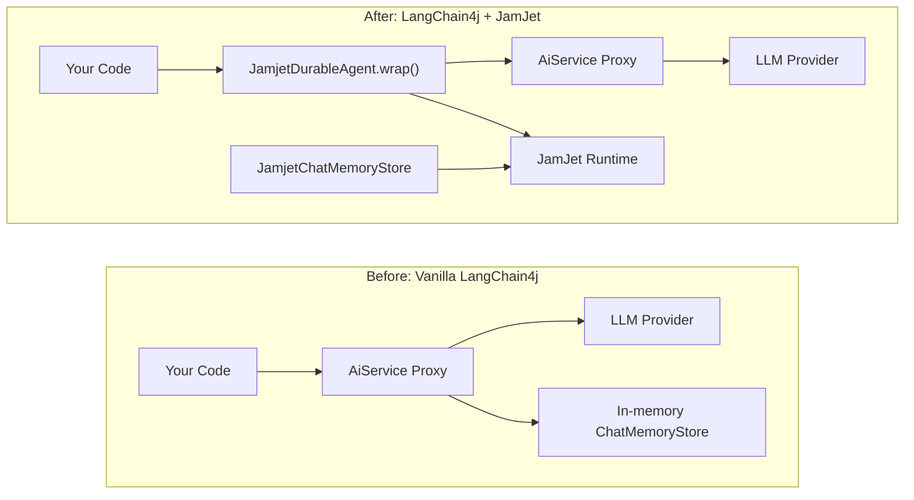

# LangChain4j Integration

JamJet is a full agent runtime with its own [Java SDK](/java-sdk) — it talks to LLMs natively, manages tools, compiles to durable workflow IR, and enforces cost and time guardrails at runtime. For new projects, that is the recommended path.

But if you already have LangChain4j agents in production — `AiServices` proxies, chat memory stores, tool bindings — you do not need to rewrite them. This integration wraps your existing LangChain4j code with JamJet's durable execution engine, giving you crash recovery, audit trails, and replay testing with minimal changes.

### Before and after



The left side is what you have today. The right side adds a durable proxy in front of your existing agent and persists chat memory through the JamJet runtime. Your `AiService` interface, tool definitions, and LLM configuration do not change.

> **note:**
> For greenfield Java projects, consider the [Java SDK](/java-sdk) directly — it provides native LLM integration, typed tools, strategy selection, and IR compilation without the LangChain4j dependency.

---

## Setup

### 1. Add the dependency

The integration module is published on Maven Central. It requires `jamjet-spring-boot-starter` as a peer dependency for the runtime client.

#### Maven

```xml
<dependency>
    <groupId>dev.jamjet</groupId>
    <artifactId>langchain4j-jamjet</artifactId>
    <version>0.1.0</version>
</dependency>
<dependency>
    <groupId>dev.jamjet</groupId>
    <artifactId>jamjet-spring-boot-starter</artifactId>
    <version>0.1.0</version>
</dependency>
```

#### Gradle (Kotlin DSL)

```kotlin
implementation("dev.jamjet:langchain4j-jamjet:0.1.0")
implementation("dev.jamjet:jamjet-spring-boot-starter:0.1.0")
```

#### Gradle (Groovy DSL)

```groovy
implementation 'dev.jamjet:langchain4j-jamjet:0.1.0'
implementation 'dev.jamjet:jamjet-spring-boot-starter:0.1.0'
```

### 2. Start the JamJet runtime

The runtime is the execution engine that persists events and manages workflow state. Run it with Docker:

```bash
docker run -p 7700:7700 ghcr.io/jamjet-labs/jamjet:latest
```

Or, if you have the CLI installed:

```bash
jamjet dev
```

### 3. Configure

Add the runtime URL to your `application.yml`:

```yaml
spring:
  jamjet:
    runtime-url: http://localhost:7700
    # api-token: ${JAMJET_API_TOKEN}      # optional, for authenticated runtimes
    # tenant-id: default                   # multi-tenant isolation
    durability-enabled: true
```

---

## Wrap an existing agent

Suppose you have a LangChain4j `AiService` already in production:

**Your existing code (no changes needed):**

```java
import dev.langchain4j.service.AiServices;
import dev.langchain4j.model.openai.OpenAiChatModel;

interface ResearchAssistant {
    String research(String topic);
}

var model = OpenAiChatModel.builder()
        .apiKey(System.getenv("OPENAI_API_KEY"))
        .modelName("gpt-4o")
        .build();

ResearchAssistant assistant = AiServices.create(ResearchAssistant.class, model);
```

**Add durability with one call:**

```java
import dev.jamjet.langchain4j.JamjetDurableAgent;
import dev.jamjet.spring.client.JamjetRuntimeClient;

// client is auto-configured by jamjet-spring-boot-starter,
// or build one manually with JamjetConfig (see Configuration below)
ResearchAssistant durable = JamjetDurableAgent.wrap(
        assistant,                // your existing AiService proxy
        ResearchAssistant.class,  // the interface type
        client                    // JamjetRuntimeClient
);

// Use exactly as before — the interface is unchanged
String result = durable.research("quantum error correction");
```

That is the entire change. Your calling code, interface definition, tool annotations, and model configuration stay the same.

### What happens under the hood

When you call `JamjetDurableAgent.wrap()`, it creates a JDK dynamic proxy (`java.lang.reflect.Proxy`) around your `AiService` interface. Every method call on the wrapped proxy goes through this sequence:

1. **Build workflow IR** — the proxy constructs a lightweight intermediate representation named `langchain4j-{InterfaceName}-{methodName}` with a single `LlmGenerate` node. This IR is the same format used by JamJet's native SDK and Rust runtime.

2. **Create workflow and start execution** — the proxy calls `client.createWorkflow(ir)` followed by `client.startExecution(workflowId, ...)`. The execution is now tracked by the JamJet runtime with a unique execution ID.

3. **Invoke the delegate** — the original `AiService` proxy handles the actual LLM call. Your tools, memory, and model configuration all work as before.

4. **Record completion or failure** — on success, the proxy sends a `completion` event with `status=completed` and the result. On failure, it records `status=failed` with the error message.

5. **Graceful degradation** — if the JamJet runtime is unreachable (network partition, container not started), the proxy logs a warning and delegates directly to the original `AiService`. Your application never fails because of JamJet being down.

---

## Configuration

If you are using Spring Boot, the `JamjetRuntimeClient` is auto-configured from `application.yml` properties (see the [Spring Boot Starter](/spring-boot-starter) guide). For standalone usage outside Spring, use `JamjetConfig` to build a client manually:

```java
import dev.jamjet.langchain4j.JamjetConfig;

var config = new JamjetConfig()
        .runtimeUrl("http://localhost:7700")
        .apiToken("your-token")
        .tenantId("default")
        .connectTimeout(10)
        .readTimeout(120);

var client = config.buildClient();
```

### Configuration options

| Option | Method | Default | Description |
|--------|--------|---------|-------------|
| Runtime URL | `.runtimeUrl(String)` | `http://localhost:7700` | Address of the JamJet runtime |
| API token | `.apiToken(String)` | `null` | Authentication token for secured runtimes |
| Tenant ID | `.tenantId(String)` | `"default"` | Multi-tenant isolation identifier |
| Connect timeout | `.connectTimeout(int)` | `10` (seconds) | TCP connection timeout |
| Read timeout | `.readTimeout(int)` | `120` (seconds) | HTTP read timeout for long-running operations |

All options use a fluent builder pattern. `JamjetConfig` produces a `JamjetRuntimeClient` via `.buildClient()`, which is the same client type used by the Spring Boot auto-configuration.

---

## Durable chat memory

LangChain4j stores conversation history through the `ChatMemoryStore` interface. The default implementation is in-memory — if the process restarts, all conversation history is lost.

`JamjetChatMemoryStore` persists conversation history through the JamJet runtime's audit event system. Messages are serialized to JSON using LangChain4j's built-in `ChatMessageSerializer` and stored as external events, making them durable across restarts and queryable through the audit API.

```java
import dev.jamjet.langchain4j.JamjetChatMemoryStore;
import dev.langchain4j.memory.chat.MessageWindowChatMemory;

var memoryStore = new JamjetChatMemoryStore(client);

var memory = MessageWindowChatMemory.builder()
        .maxMessages(20)
        .chatMemoryStore(memoryStore)
        .build();

// Use with your AiService as usual
ResearchAssistant assistant = AiServices.builder(ResearchAssistant.class)
        .chatLanguageModel(model)
        .chatMemory(memory)
        .build();
```

### How it works

| Operation | What happens |
|-----------|-------------|
| `getMessages(memoryId)` | Queries the JamJet audit trail for the latest `chat_memory` event associated with the memory ID. Deserializes the stored JSON back into `ChatMessage` objects. Returns an empty list if no history exists. |
| `updateMessages(memoryId, messages)` | Serializes all messages to JSON and sends a `chat_memory` external event to the runtime, recording the message count alongside the payload. |
| `deleteMessages(memoryId)` | Sends a `memory_cleared` event to the runtime. The event log is append-only, so the clear is recorded as a fact rather than deleting previous entries. |

All three operations degrade gracefully — if the JamJet runtime is unreachable, the store logs a warning and returns empty results (for reads) or silently drops the write. This matches the same graceful degradation pattern used by `JamjetDurableAgent`.

---

## What you get

Wrapping your LangChain4j agents with JamJet adds the following capabilities without changing your application code:

| Capability | Without JamJet | With JamJet |
|------------|---------------|-------------|
| **Crash recovery** | Process dies, interaction lost, tokens wasted | Execution tracked by runtime, resumable after restart |
| **Audit trails** | No record of what happened | Every method call recorded as an immutable event with args, result, and status |
| **Replay testing** | Must call live LLM to test | Replay recorded executions in test suite, no LLM calls needed |
| **Cost tracking** | Manual token counting | Execution events include method name and arguments for cost attribution |
| **Observability** | Application-level logging only | Execution IDs for distributed tracing correlation, Micrometer metrics via Spring Boot starter |
| **Chat memory persistence** | In-memory only, lost on restart | Durable through JamJet audit event system, survives restarts |

---

## Testing wrapped agents

The `jamjet-spring-boot-starter-test` module works with wrapped LangChain4j agents. Since `JamjetDurableAgent.wrap()` creates JamJet executions, you can replay them in tests using `@ReplayExecution`.

```java
import dev.jamjet.spring.test.annotations.WithJamjetRuntime;
import dev.jamjet.spring.test.annotations.ReplayExecution;
import dev.jamjet.spring.test.RecordedExecution;
import dev.jamjet.spring.test.AgentAssertions;
import org.junit.jupiter.api.Test;
import java.util.concurrent.TimeUnit;

@WithJamjetRuntime
class ResearchAssistantTest {

    @Test
    @ReplayExecution("exec-lc4j-abc123")
    void wrappedAgentProducesConsistentOutput(RecordedExecution execution) {
        AgentAssertions.assertThat(execution)
                .completedSuccessfully()
                .completedWithin(30, TimeUnit.SECONDS)
                .outputContains("quantum");
    }
}
```

Add the test dependency:

```xml
<dependency>
    <groupId>dev.jamjet</groupId>
    <artifactId>jamjet-spring-boot-starter-test</artifactId>
    <version>0.1.0</version>
    <scope>test</scope>
</dependency>
```

For the full testing API — `RecordedExecution` fields, `AgentAssertions` fluent API, `DeterministicModelStub`, fork-at-node replay — see the testing section of the [Spring Boot Starter](/spring-boot-starter) guide.

---

## Next steps

- **[Java SDK Reference](/java-sdk)** — for new projects, JamJet's native Java SDK provides direct LLM integration, typed tools, strategy selection, and IR compilation without the LangChain4j dependency
- **[Java Quickstart](/java-quickstart)** — build your first agent and workflow from scratch with the native SDK
- **[Spring Boot Starter](/spring-boot-starter)** — full Spring AI integration with auto-configured durability, audit trails, human-in-the-loop approval, and observability
- **[Agentic AI Patterns](https://sunilprakash.com/agentic-ai)** — strategy selection, tool design, and production patterns for agent systems
