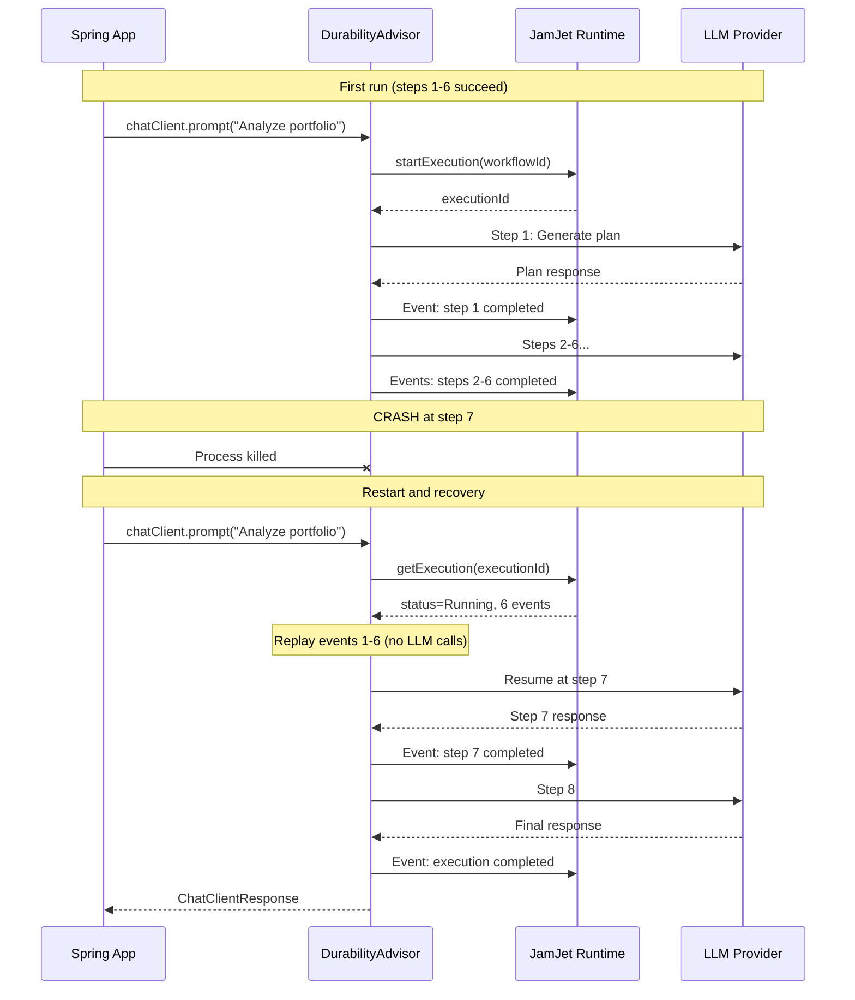
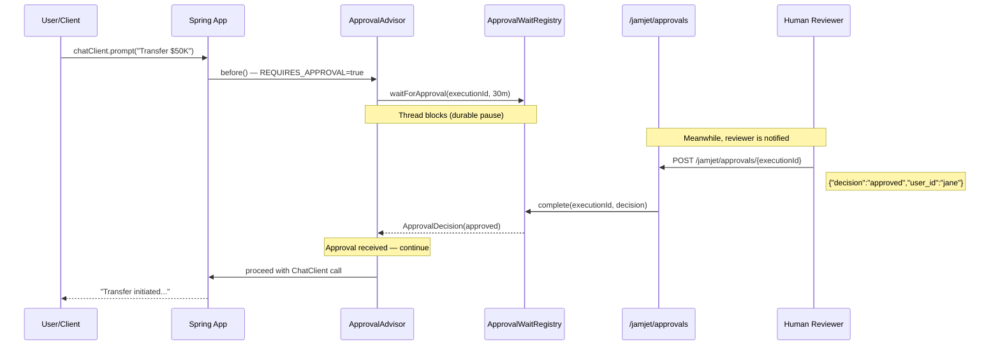
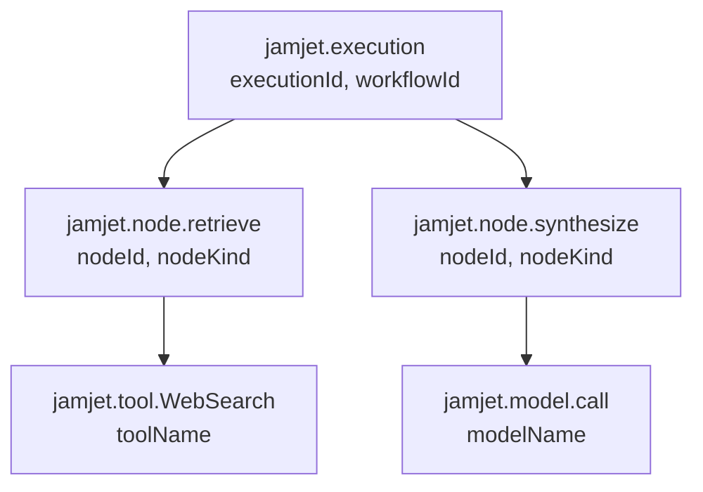

# Spring Boot Starter

This guide covers the full JamJet Spring Boot integration: why durability matters for AI agents, how each advisor works under the hood, how to test agents deterministically, and how to monitor them in production. By the end you will have a working Spring AI application where every LLM call is crash-recoverable, audited, and observable.

---

## Why durability matters for AI agents

Spring AI gives you a clean abstraction for building LLM-powered applications. You get `ChatClient`, advisors, tool calling, and model portability. What you do not get is any protection when things go wrong at runtime.

Consider what happens when your Spring AI agent is halfway through a multi-step task --- it has called a search tool, retrieved results, and is about to synthesize an answer --- and the process crashes. With vanilla Spring AI, the entire interaction is lost. The user sees an error. The tokens you already spent are wasted. There is no record of what happened.

This is the problem **durable execution** solves. JamJet records every step of your agent's interaction as an immutable event. If the process crashes and restarts, it replays those events and resumes from exactly where it left off. No lost work, no wasted tokens, no user-visible failure.

Durability also unlocks capabilities that are impossible without it:

- **Audit trails** --- every prompt, response, tool call, and token count recorded as immutable events. Required for regulated industries (financial services, healthcare, legal).
- **Human-in-the-loop approval** --- pause an agent mid-execution, wait for a human to approve or reject, then resume. The pause is durable: it survives restarts.
- **Replay testing** --- replay a production execution in a test environment and assert on the results. No LLM calls needed.
- **Cost tracking** --- aggregate real token costs per execution, per user, per workflow.

For deeper background on why we built JamJet and the problems it solves, see [Why We Built JamJet](https://jamjet.dev/blog/why-we-built-jamjet).

---

## Setup

### 1. Add the dependency

The starter is published on Maven Central. Add a single dependency and Spring Boot auto-configuration handles the rest.

#### Maven

```xml
<dependency>
    <groupId>dev.jamjet</groupId>
    <artifactId>jamjet-spring-boot-starter</artifactId>
    <version>0.1.0</version>
</dependency>
```

#### Gradle (Kotlin DSL)

```kotlin
implementation("dev.jamjet:jamjet-spring-boot-starter:0.1.0")
```

#### Gradle (Groovy DSL)

```groovy
implementation 'dev.jamjet:jamjet-spring-boot-starter:0.1.0'
```

### 2. Start the JamJet runtime

The runtime is the execution engine that persists events and manages workflow state. Run it with Docker:

```bash
docker run -p 7700:7700 ghcr.io/jamjet-labs/jamjet:latest
```

Or, if you have the CLI installed:

```bash
jamjet dev
```

### 3. Configure

Add the runtime URL to your `application.yml`:

```yaml
spring:
  jamjet:
    runtime-url: http://localhost:7700
    # api-token: ${JAMJET_API_TOKEN}      # optional, for authenticated runtimes
    # tenant-id: default                   # multi-tenant isolation
    durability-enabled: true               # default: true
    connect-timeout-seconds: 10            # default: 10
    read-timeout-seconds: 120              # default: 120
```

Or in `application.properties`:

```properties
spring.jamjet.runtime-url=http://localhost:7700
```

### What auto-configuration does

When `JamjetAutoConfiguration` detects Spring AI's `ChatClient` on the classpath and `spring.jamjet.durability-enabled=true` (the default), it registers the following beans:

| Bean | Condition | Purpose |
|------|-----------|---------|
| `JamjetRuntimeClient` | Always (when durability enabled) | HTTP client to the JamJet runtime |
| `JamjetDurabilityAdvisor` | Always (when durability enabled) | Wraps every ChatClient call with durable execution |
| `ChatClientCustomizer` | Always (when durability enabled) | Auto-injects the durability advisor into all ChatClient instances |
| `JamjetAuditAdvisor` | `spring.jamjet.audit.enabled=true` (default) | Records prompts, responses, and token usage as audit events |
| `JamjetAuditService` | `spring.jamjet.audit.enabled=true` (default) | Programmatic access to audit trail |
| `JamjetApprovalAdvisor` | `spring.jamjet.approval.enabled=true` (opt-in) | Pauses execution for human approval |
| `JamjetApprovalController` | Approval enabled + web application | REST endpoints at `/jamjet/approvals` |
| `JamjetMicrometerBridge` | Micrometer on classpath (default) | Publishes execution metrics |
| `JamjetOtelBridge` | `spring.jamjet.observability.opentelemetry=true` (opt-in) | OpenTelemetry span creation |

The durability advisor is injected via a `ChatClientCustomizer`, so you do not need to add it manually. Every `ChatClient` you build from the auto-configured `ChatClient.Builder` gets durability for free.

### Graceful degradation

If the JamJet runtime is unavailable --- network partition, container not started, authentication failure --- the `JamjetDurabilityAdvisor` logs a warning and lets the request proceed without durability. Your application never fails because of JamJet being down. This is intentional: durability is a safety net, not a single point of failure.

---

## Durability Advisor

The `JamjetDurabilityAdvisor` is the core of the integration. It implements Spring AI's `BaseAdvisor` interface and intercepts every `ChatClient` call to wrap it with durable execution.

### Event sourcing for Spring developers

If you have not worked with event sourcing before, here is the essential idea: instead of storing only the *current state* of an operation, you store every *event that led to that state*. The current state is a derived view --- you can always reconstruct it by replaying the events from the beginning.

For AI agents, this means every LLM call, every tool invocation, every state change is recorded as an immutable event in the JamJet runtime. The event log is the source of truth.

Why does this matter? Because it gives you crash recovery for free. If a process dies at any point, you replay the event log up to the last completed event and resume from there. No data loss. No duplicate work.

### Crash recovery walkthrough

Consider an agent that performs 8 steps: retrieve context, call the LLM, execute a tool, call the LLM again, and so on. Here is what happens when the process crashes at step 7:



Steps 1 through 6 are **not re-executed** on restart. The advisor reads their events from the runtime and reconstructs the state. Only step 7 (and beyond) actually calls the LLM. This saves tokens and time.

### Before and after

The key insight: **your application code does not change**. Durability comes from the advisor, not from your business logic.

**Without JamJet** (vanilla Spring AI):

```java
@Bean
ChatClient chatClient(ChatClient.Builder builder) {
    return builder.build();
}

@Bean
CommandLineRunner demo(ChatClient chatClient) {
    return args -> {
        String result = chatClient.prompt("Summarize AI trends")
                .call()
                .content();
        System.out.println(result);
        // If the process crashes here, everything is lost
    };
}
```

**With JamJet** (same code, durability comes from auto-configuration):

```java
@Bean
ChatClient chatClient(ChatClient.Builder builder) {
    return builder.build(); // JamjetDurabilityAdvisor auto-injected
}

@Bean
CommandLineRunner demo(ChatClient chatClient) {
    return args -> {
        String result = chatClient.prompt("Summarize AI trends")
                .call()
                .content();
        System.out.println(result);
        // Durable — survives crashes, events persisted, execution tracked
    };
}
```

The only difference is the dependency on your classpath. The `ChatClientCustomizer` registered by `JamjetAutoConfiguration` adds the `JamjetDurabilityAdvisor` to every `ChatClient.Builder` automatically.

### Context keys

The durability advisor uses three context keys to track execution state:

| Key | Type | Description |
|-----|------|-------------|
| `jamjet.execution.id` | `String` | Unique execution ID assigned by the runtime |
| `jamjet.workflow.id` | `String` | Workflow ID (derived from the compiled IR) |
| `jamjet.session.id` | `String` | Session ID for grouping related interactions |

You can read these from the response context for logging, correlation, or downstream processing.

For more on the agentic patterns that durability enables --- ReAct loops, plan-and-execute, critic chains --- see [Agentic AI Patterns](https://sunilprakash.com/agentic-ai).

---

## Audit Advisor

The `JamjetAuditAdvisor` records every prompt, response, and token usage as immutable audit events in the JamJet runtime. It runs in the advisor chain after the durability advisor (order `LOWEST_PRECEDENCE - 50`), so every audit entry is associated with a durable execution ID.

### Why audit trails matter

If you are building AI agents for enterprise use --- financial services, healthcare, insurance, legal --- you face regulatory requirements around recordkeeping. Regulators want to know:

- What prompt was sent to the model?
- What did the model respond?
- How many tokens were consumed (and at what cost)?
- Which user initiated the interaction?
- Can you reproduce this interaction six months from now?

Without an audit trail, you cannot answer any of these questions. The `JamjetAuditAdvisor` answers all of them by default.

### Audit event structure

Each audit entry is persisted as an external event on the execution. Here is what a prompt audit event looks like:

```json
{
  "type": "prompt",
  "advisor": "JamjetAuditAdvisor",
  "content": "Analyze the risk profile of portfolio XYZ-1234"
}
```

And the corresponding response event:

```json
{
  "type": "response",
  "advisor": "JamjetAuditAdvisor",
  "content": "Based on the current allocation, portfolio XYZ-1234 has...",
  "prompt_tokens": 847,
  "completion_tokens": 1203,
  "total_tokens": 2050
}
```

### Configuration

Audit is **enabled by default**. You can control what gets logged:

```yaml
spring:
  jamjet:
    audit:
      enabled: true              # default: true
      include-prompts: true      # default: true — log full prompt text
      include-responses: true    # default: true — log full response text
```

For regulated environments where you need the audit trail but must not persist PII or sensitive prompt content:

```yaml
spring:
  jamjet:
    audit:
      enabled: true
      include-prompts: false     # omit prompt text from audit events
      include-responses: false   # omit response text from audit events
```

This still records the *fact* that an interaction happened (with the execution ID, timestamp, and token counts) without storing the actual content. For more on PII handling and data governance in agent systems, see [Data Governance and PII Retention](https://jamjet.dev/blog/data-governance-pii-retention).

---

## Human-in-the-loop approval

The `JamjetApprovalAdvisor` implements a durable pause-and-resume pattern: the agent pauses mid-execution, waits for a human to approve or reject via a REST endpoint, and then continues or aborts. Because the pause is backed by the durable execution engine, it survives process restarts.

### When to use approval gates

Approval gates are for high-stakes actions where you want a human to review the agent's plan before it executes:

- Financial transactions above a threshold
- Customer-facing communications
- Database mutations in production
- Actions with legal or compliance implications

### Enabling approval

Approval is **opt-in** (disabled by default):

```yaml
spring:
  jamjet:
    approval:
      enabled: true
      webhook-url: https://hooks.slack.com/services/T.../B.../xxx  # optional
      timeout: 30m            # default: 30m (supports s, m, h suffixes)
      default-decision: rejected   # default: rejected — what happens on timeout
```

| Property | Default | Description |
|----------|---------|-------------|
| `spring.jamjet.approval.enabled` | `false` | Enable approval workflow |
| `spring.jamjet.approval.webhook-url` | --- | External webhook for notifications (Slack, email, etc.) |
| `spring.jamjet.approval.timeout` | `30m` | Max wait time before timeout (supports `s`, `m`, `h`) |
| `spring.jamjet.approval.default-decision` | `rejected` | Decision applied on timeout: `approved` or `rejected` |

### Triggering approval

To mark a specific request as requiring approval, set the `jamjet.approval.required` context key:

```java
String result = chatClient.prompt("Transfer $50,000 to account 9876")
        .advisors(approvalAdvisor)  // or auto-injected
        .context("jamjet.approval.required", true)
        .call()
        .content();
// Thread blocks here until approval is received (or timeout)
```

### The approval flow



### Approving or rejecting via REST

When approval is enabled, the auto-configuration registers `JamjetApprovalController` with two endpoints:

**Approve an execution:**

```bash
curl -X POST http://localhost:8080/jamjet/approvals/{executionId} \
  -H "Content-Type: application/json" \
  -d '{
    "decision": "approved",
    "user_id": "jane.doe",
    "comment": "Reviewed and approved"
  }'
```

**Reject an execution:**

```bash
curl -X POST http://localhost:8080/jamjet/approvals/{executionId} \
  -H "Content-Type: application/json" \
  -d '{
    "decision": "rejected",
    "user_id": "jane.doe",
    "comment": "Amount exceeds policy limit"
  }'
```

**List pending approvals:**

```bash
curl http://localhost:8080/jamjet/approvals/pending
```

When a rejection is received, the advisor throws an `ApprovalRejectedException` with the execution ID and the reviewer's comment.

The approval request body supports the following fields:

| Field | Type | Required | Description |
|-------|------|----------|-------------|
| `decision` | `String` | Yes | `"approved"` or `"rejected"` |
| `user_id` | `String` | No | Identifier of the reviewer |
| `comment` | `String` | No | Human-readable justification |
| `node_id` | `String` | No | Specific node to approve (advanced) |
| `state_patch` | `Map<String, Object>` | No | State modifications to apply on approval |

For more on human-in-the-loop patterns in agent systems, see [Agentic AI Patterns](https://sunilprakash.com/agentic-ai).

---

## Testing

AI agents are notoriously difficult to test. LLMs are non-deterministic --- the same prompt can produce different outputs on every call. Token costs add up when running tests against live APIs. And it is hard to assert on outputs that change every time.

JamJet's test module solves this with two complementary approaches: **replay testing** (replay a real execution without calling the LLM) and **deterministic stubs** (replace the LLM with a pattern-matched fake).

### Add the test dependency

```xml
<dependency>
    <groupId>dev.jamjet</groupId>
    <artifactId>jamjet-spring-boot-starter-test</artifactId>
    <version>0.1.0</version>
    <scope>test</scope>
</dependency>
```

### Replay testing with `@WithJamjetRuntime` and `@ReplayExecution`

Replay testing captures a production execution and replays it in your test suite. The test connects to a JamJet runtime (via Testcontainers), fetches the execution's event log, and lets you assert on the results --- without making any LLM calls.

```java
import dev.jamjet.spring.test.annotations.WithJamjetRuntime;
import dev.jamjet.spring.test.annotations.ReplayExecution;
import dev.jamjet.spring.test.RecordedExecution;
import dev.jamjet.spring.test.AgentAssertions;
import org.junit.jupiter.api.Test;
import java.util.concurrent.TimeUnit;

@WithJamjetRuntime
class PortfolioAgentTest {

    @Test
    @ReplayExecution("exec-abc123")
    void agentProducesConsistentOutput(RecordedExecution execution) {
        AgentAssertions.assertThat(execution)
                .completedSuccessfully()
                .usedTool("WebSearch")
                .completedWithin(30, TimeUnit.SECONDS)
                .costLessThan(0.50);
    }

    @Test
    @ReplayExecution(value = "exec-abc123", forkAtNode = "retrieve")
    void forkAndRerunFromRetrieveStep(RecordedExecution execution) {
        AgentAssertions.assertThat(execution)
                .nodeCompleted("retrieve")
                .outputContains("portfolio");
    }
}
```

`@WithJamjetRuntime` is a JUnit 5 extension that starts a JamJet runtime container before your tests. You can configure the image and tag:

```java
@WithJamjetRuntime(image = "ghcr.io/jamjet-labs/jamjet", tag = "0.3.1")
```

`@ReplayExecution` specifies which execution to replay. The optional `forkAtNode` parameter lets you fork the execution at a specific node --- useful for testing "what if we changed the output of step X?"

### The `RecordedExecution` record

`RecordedExecution` captures everything about a replayed execution:

| Field | Type | Description |
|-------|------|-------------|
| `executionId` | `String` | Unique execution ID |
| `workflowId` | `String` | Workflow ID |
| `status` | `String` | Final status (`Completed`, `Failed`, `Cancelled`) |
| `input` | `Object` | Input that started the execution |
| `finalState` | `Object` | Final state after all nodes completed |
| `events` | `List<ExecutionEvent>` | Full event log |
| `nodes` | `List<NodeExecution>` | Per-node execution details |
| `totalDuration` | `Duration` | Wall-clock duration |
| `toolCallCount` | `int` | Total tool invocations |
| `totalCostUsd` | `double` | Aggregated token cost |

Each `NodeExecution` contains `nodeId`, `kind`, `status`, `input`, `output`, `duration`, and `retryCount`.

### `AgentAssertions` fluent API

The `AgentAssertions.assertThat(execution)` entry point returns a fluent API designed specifically for agent testing:

| Assertion | Description |
|-----------|-------------|
| `.completedSuccessfully()` | Execution status is `Completed` |
| `.failedWith(errorContaining)` | Status is `Failed` with matching error message |
| `.wasCancelled()` | Status is `Cancelled` |
| `.completedWithin(amount, unit)` | Wall-clock duration within limit |
| `.costLessThan(usd)` | Total cost below threshold |
| `.usedTool(toolName)` | Tool was invoked at least once |
| `.usedToolTimes(toolName, n)` | Tool was invoked exactly `n` times |
| `.didNotUseTool(toolName)` | Tool was never invoked |
| `.toolCallCount(matcher)` | Hamcrest matcher on total tool call count |
| `.nodeCompleted(nodeId)` | Specific node completed successfully |
| `.nodeRetried(nodeId, times)` | Node was retried exactly `times` times |
| `.nodeCount(matcher)` | Hamcrest matcher on node count |
| `.outputContains(substring)` | Final output contains substring |
| `.outputMatches(regex)` | Final output matches regex pattern |
| `.outputSatisfies(consumer)` | Custom assertion lambda on output |
| `.hasEvent(eventType)` | Event log contains event of given type |
| `.eventCount(matcher)` | Hamcrest matcher on event count |
| `.auditTrailContains(eventType)` | Alias for `.hasEvent()` |
| `.auditTrailSize(matcher)` | Alias for `.eventCount()` |

All assertions are chainable --- `.completedSuccessfully().usedTool("X").costLessThan(1.0)` reads naturally and fails with clear error messages.

### Deterministic model stubs

For unit tests where you do not want to replay a real execution, `DeterministicModelStub` lets you replace the `ChatModel` with a pattern-matched fake:

```java
import dev.jamjet.spring.test.DeterministicModelStub;

var stub = DeterministicModelStub.builder()
        .onPromptContaining("weather", "Sunny, 72F in San Francisco")
        .onPromptContaining("stock price", "ACME: $142.50, up 2.3%")
        .defaultResponse("I don't have information about that topic.")
        .build();

// Use as a ChatModel in your Spring context
@Bean
ChatModel chatModel() {
    return stub;
}
```

The stub matches prompts in order: the first `onPromptContaining` pattern that matches wins. If no pattern matches, it returns the `defaultResponse`. The stub also records all calls so you can verify invocation counts:

```java
assertEquals(3, stub.getCallCount());
assertEquals("weather in SF", stub.getCalls().get(0).getContents());
stub.reset(); // clear call history
```

`DeterministicModelStub` implements `ChatModel`, so it works with both `call()` and `stream()` --- the stream variant returns a single-element `Flux` with the matched response.

---

## Observability

### Micrometer metrics

When Spring Boot Actuator and Micrometer are on the classpath, `JamjetMicrometerBridge` automatically publishes execution metrics. This is enabled by default --- no opt-in required.

```yaml
spring:
  jamjet:
    observability:
      micrometer: true           # default: true
      metric-prefix: jamjet      # default: jamjet
```

#### Metrics reference

| Metric | Type | Tags | Description |
|--------|------|------|-------------|
| `jamjet.execution.duration` | Timer | `status` | Duration of each execution |
| `jamjet.execution.count` | Counter | `status` | Total executions by status |
| `jamjet.node.duration` | Timer | `node_id`, `node_kind` | Duration of each node |
| `jamjet.node.retries` | Counter | `node_id` | Retry count per node |
| `jamjet.tool.calls` | Counter | `tool_name` | Tool invocations by name |
| `jamjet.tool.duration` | Timer | `tool_name` | Duration per tool call |
| `jamjet.execution.cost.usd` | DistributionSummary | --- | Token cost per execution |
| `jamjet.audit.events` | Counter | `event_type` | Audit events by type |

The metric prefix is configurable. If you set `metric-prefix: myapp.agent`, metrics become `myapp.agent.execution.duration`, etc.

#### Alert recommendations

| Alert | Condition | Why |
|-------|-----------|-----|
| High failure rate | `rate(jamjet.execution.count{status="Failed"}) > 0.05 * rate(jamjet.execution.count)` | More than 5% of executions failing |
| Slow executions | `jamjet.execution.duration{quantile="0.95"} > 30s` | P95 latency above 30 seconds |
| Cost spike | `rate(jamjet.execution.cost.usd) > 10` | Spending more than $10/minute |
| Excessive retries | `rate(jamjet.node.retries) > 5` | Nodes retrying too often (flaky tools or rate limits) |
| Approval backlog | Pending approvals count growing | Reviewers not responding (webhook integration issue) |

### OpenTelemetry tracing

For distributed tracing, enable the OpenTelemetry bridge:

```yaml
spring:
  jamjet:
    observability:
      opentelemetry: true        # default: false (opt-in)
```

This requires `io.opentelemetry:opentelemetry-api` on your classpath. The bridge creates a span hierarchy that mirrors the execution structure:



Each span carries JamJet-specific attributes:

| Span | Kind | Attributes |
|------|------|------------|
| `jamjet.execution` | `INTERNAL` | `jamjet.execution.id`, `jamjet.workflow.id` |
| `jamjet.node.{id}` | `INTERNAL` | `jamjet.node.id`, `jamjet.node.kind` |
| `jamjet.tool.{name}` | `CLIENT` | `jamjet.tool.name` |
| `jamjet.model.call` | `CLIENT` | `jamjet.model.name` |

Error spans include `StatusCode.ERROR`, the exception message, and a recorded exception event --- standard OTel semantics that work with any tracing backend (Jaeger, Zipkin, Grafana Tempo, Datadog).

Completed spans carry `jamjet.cost.usd` when cost data is available, allowing you to correlate cost with latency in your tracing UI.

---

## Complete example

Here is a full Spring Boot application that ties together durability, audit, approval, and observability:

### `pom.xml` (dependencies)

```xml
<dependencies>
    <!-- Spring AI + OpenAI -->
    <dependency>
        <groupId>org.springframework.ai</groupId>
        <artifactId>spring-ai-openai-spring-boot-starter</artifactId>
    </dependency>

    <!-- JamJet durability -->
    <dependency>
        <groupId>dev.jamjet</groupId>
        <artifactId>jamjet-spring-boot-starter</artifactId>
        <version>0.1.0</version>
    </dependency>

    <!-- Spring Boot Actuator (enables Micrometer metrics) -->
    <dependency>
        <groupId>org.springframework.boot</groupId>
        <artifactId>spring-boot-starter-actuator</artifactId>
    </dependency>

    <!-- Test -->
    <dependency>
        <groupId>dev.jamjet</groupId>
        <artifactId>jamjet-spring-boot-starter-test</artifactId>
        <version>0.1.0</version>
        <scope>test</scope>
    </dependency>
</dependencies>
```

### `application.yml`

```yaml
spring:
  ai:
    openai:
      api-key: ${OPENAI_API_KEY}

  jamjet:
    runtime-url: http://localhost:7700
    durability-enabled: true

    audit:
      enabled: true
      include-prompts: true
      include-responses: true

    approval:
      enabled: true
      timeout: 15m
      default-decision: rejected

    observability:
      micrometer: true
      metric-prefix: jamjet
```

### `DurableAgentApplication.java`

```java
import dev.jamjet.spring.advisor.JamjetApprovalAdvisor;
import org.springframework.ai.chat.client.ChatClient;
import org.springframework.boot.SpringApplication;
import org.springframework.boot.autoconfigure.SpringBootApplication;
import org.springframework.context.annotation.Bean;
import org.springframework.web.bind.annotation.*;

@SpringBootApplication
public class DurableAgentApplication {

    public static void main(String[] args) {
        SpringApplication.run(DurableAgentApplication.class, args);
    }

    @Bean
    ChatClient chatClient(ChatClient.Builder builder) {
        return builder.build(); // Durability + audit advisors auto-injected
    }

    @RestController
    @RequestMapping("/api/agent")
    static class AgentController {

        private final ChatClient chatClient;

        AgentController(ChatClient chatClient) {
            this.chatClient = chatClient;
        }

        // Standard durable call — crash recovery + audit trail
        @PostMapping("/ask")
        String ask(@RequestBody String prompt) {
            return chatClient.prompt(prompt)
                    .call()
                    .content();
        }

        // High-stakes call — requires human approval before proceeding
        @PostMapping("/ask-with-approval")
        String askWithApproval(@RequestBody String prompt) {
            return chatClient.prompt(prompt)
                    .context(JamjetApprovalAdvisor.REQUIRES_APPROVAL_KEY, true)
                    .call()
                    .content();
        }
    }
}
```

### Running it

```bash
# Terminal 1: Start JamJet runtime
docker run -p 7700:7700 ghcr.io/jamjet-labs/jamjet:latest

# Terminal 2: Start the Spring Boot app
export OPENAI_API_KEY=sk-...
mvn spring-boot:run

# Terminal 3: Make a durable call
curl -X POST http://localhost:8080/api/agent/ask \
  -H "Content-Type: text/plain" \
  -d "What are the top 3 AI trends in 2026?"

# Make a call that requires approval
curl -X POST http://localhost:8080/api/agent/ask-with-approval \
  -H "Content-Type: text/plain" \
  -d "Draft an email to all customers about a pricing change"

# In another terminal: approve the pending execution
curl http://localhost:8080/jamjet/approvals/pending
# Copy the executionId from the response, then:
curl -X POST http://localhost:8080/jamjet/approvals/{executionId} \
  -H "Content-Type: application/json" \
  -d '{"decision":"approved","user_id":"admin","comment":"Looks good"}'
```

---

## Requirements

| Requirement | Minimum version |
|-------------|----------------|
| Java | 21+ |
| Spring Boot | 3.4+ |
| Spring AI | 1.0+ |
| JamJet runtime | 0.3.1+ (Docker or binary) |

---

## Next steps

- **[LangChain4j Integration](/langchain4j)** --- use JamJet as a durable execution layer for LangChain4j agents with `JamjetDurableAgent` and `JamjetChatMemoryStore`
- **[Java SDK Reference](/java-sdk)** --- full API coverage for tools, strategies, IR compilation, and the runtime client
- **[Java Quickstart](/java-quickstart)** --- build your first agent and workflow from scratch with the Java SDK
- **[Core Concepts](/concepts)** --- agents, nodes, state, and durability in depth
- **[Agentic AI Patterns](https://sunilprakash.com/agentic-ai)** --- strategy selection, tool design, and production patterns for agent systems
