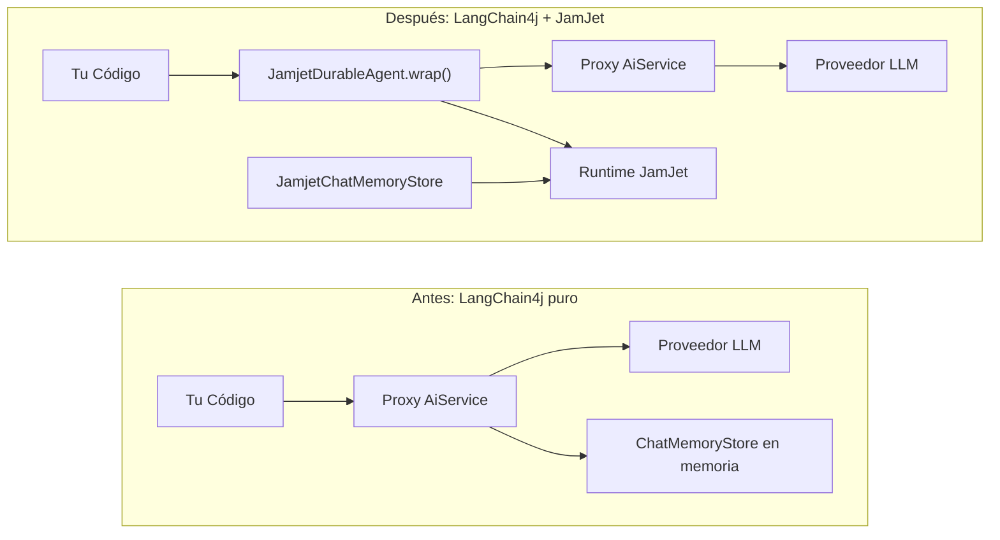

# Integración con LangChain4j

JamJet es un runtime de agentes completo con su propio [SDK de Java](/java-sdk) — se comunica con LLMs de forma nativa, gestiona herramientas, compila a IR de workflow duradero y aplica límites de costo y tiempo en ejecución. Para proyectos nuevos, esta es la vía recomendada.

Pero si ya tienes agentes LangChain4j en producción — proxies `AiServices`, almacenes de memoria de chat, vinculaciones de herramientas — no necesitas reescribirlos. Esta integración envuelve tu código LangChain4j existente con el motor de ejecución duradera de JamJet, proporcionándote recuperación ante fallos, trazas de auditoría y pruebas de replay con cambios mínimos.

### Antes y después



El lado izquierdo es lo que tienes hoy. El lado derecho añade un proxy duradero delante de tu agente existente y persiste la memoria de chat a través del runtime de JamJet. Tu interfaz `AiService`, definiciones de herramientas y configuración de LLM no cambian.

> **nota:**
> Para proyectos Java desde cero, considera usar directamente el [SDK de Java](/java-sdk) — proporciona integración nativa con LLMs, herramientas tipadas, selección de estrategias y compilación a IR sin la dependencia de LangChain4j.

---

## Configuración

### 1. Añadir la dependencia

El módulo de integración está publicado en Maven Central. Requiere `jamjet-spring-boot-starter` como dependencia par para el cliente de runtime.

#### Maven

```xml
<dependency>
    <groupId>dev.jamjet</groupId>
    <artifactId>langchain4j-jamjet</artifactId>
    <version>0.1.0</version>
</dependency>
<dependency>
    <groupId>dev.jamjet</groupId>
    <artifactId>jamjet-spring-boot-starter</artifactId>
    <version>0.1.0</version>
</dependency>
```

#### Gradle (Kotlin DSL)

```kotlin
implementation("dev.jamjet:langchain4j-jamjet:0.1.0")
implementation("dev.jamjet:jamjet-spring-boot-starter:0.1.0")
```

#### Gradle (Groovy DSL)

```groovy
implementation 'dev.jamjet:langchain4j-jamjet:0.1.0'
implementation 'dev.jamjet:jamjet-spring-boot-starter:0.1.0'
```

### 2. Iniciar el runtime de JamJet

El runtime es el motor de ejecución que persiste eventos y gestiona el estado de los flujos de trabajo. Ejecútalo con Docker:

```bash
docker run -p 7700:7700 ghcr.io/jamjet-labs/jamjet:latest
```

O, si tienes la CLI instalada:

```bash
jamjet dev
```

### 3. Configurar

Agrega la URL del runtime a tu `application.yml`:

```yaml
spring:
  jamjet:
    runtime-url: http://localhost:7700
    # api-token: ${JAMJET_API_TOKEN}      # opcional, para runtimes autenticados
    # tenant-id: default                   # aislamiento multi-tenant
    durability-enabled: true
```

---

## Envolver un agente existente

Supón que ya tienes un `AiService` de LangChain4j en producción:

**Tu código existente (sin cambios necesarios):**

```java
import dev.langchain4j.service.AiServices;
import dev.langchain4j.model.openai.OpenAiChatModel;

interface ResearchAssistant {
    String research(String topic);
}

var model = OpenAiChatModel.builder()
        .apiKey(System.getenv("OPENAI_API_KEY"))
        .modelName("gpt-4o")
        .build();

ResearchAssistant assistant = AiServices.create(ResearchAssistant.class, model);
```

**Agrega durabilidad con una sola llamada:**

```java
import dev.jamjet.langchain4j.JamjetDurableAgent;
import dev.jamjet.spring.client.JamjetRuntimeClient;

// el cliente se autoconfigura mediante jamjet-spring-boot-starter,
// o crea uno manualmente con JamjetConfig (ver Configuración abajo)
ResearchAssistant durable = JamjetDurableAgent.wrap(
        assistant,                // tu proxy AiService existente
        ResearchAssistant.class,  // el tipo de interfaz
        client                    // JamjetRuntimeClient
);

// Usa exactamente igual que antes — la interfaz no cambia
String result = durable.research("corrección de errores cuánticos");
```

Ese es todo el cambio. Tu código de llamada, definición de interfaz, anotaciones de herramientas y configuración del modelo permanecen igual.

### Qué sucede internamente

Cuando llamas a `JamjetDurableAgent.wrap()`, crea un proxy dinámico de JDK (`java.lang.reflect.Proxy`) alrededor de tu interfaz `AiService`. Cada llamada de método en el proxy envuelto pasa por esta secuencia:

1. **Construir IR de flujo de trabajo** — el proxy construye una representación intermedia ligera llamada `langchain4j-{InterfaceName}-{methodName}` con un único nodo `LlmGenerate`. Este IR es el mismo formato usado por el SDK nativo de JamJet y el runtime de Rust.

2. **Crear flujo de trabajo e iniciar ejecución** — el proxy llama a `client.createWorkflow(ir)` seguido de `client.startExecution(workflowId, ...)`. La ejecución ahora está rastreada por el runtime de JamJet con un ID de ejecución único.

3. **Invocar el delegado** — el proxy original de `AiService` maneja la llamada real al LLM. Tus herramientas, memoria y configuración del modelo funcionan como antes.

4. **Registrar finalización o fallo** — en caso de éxito, el proxy envía un evento `completion` con `status=completed` y el resultado. En caso de fallo, registra `status=failed` con el mensaje de error.

5. **Degradación elegante** — si el runtime de JamJet no es alcanzable (partición de red, contenedor no iniciado), el proxy registra una advertencia y delega directamente al `AiService` original. Tu aplicación nunca falla porque JamJet esté caído.

---

## Configuración

Si estás usando Spring Boot, `JamjetRuntimeClient` se configura automáticamente desde las propiedades de `application.yml` (consulta la guía del [Spring Boot Starter](/spring-boot-starter)). Para uso standalone fuera de Spring, utiliza `JamjetConfig` para construir un cliente manualmente:

```java
import dev.jamjet.langchain4j.JamjetConfig;

var config = new JamjetConfig()
        .runtimeUrl("http://localhost:7700")
        .apiToken("your-token")
        .tenantId("default")
        .connectTimeout(10)
        .readTimeout(120);

var client = config.buildClient();
```

### Opciones de configuración

| Opción | Método | Por defecto | Descripción |
|--------|--------|---------|-------------|
| Runtime URL | `.runtimeUrl(String)` | `http://localhost:7700` | Dirección del runtime de JamJet |
| API token | `.apiToken(String)` | `null` | Token de autenticación para runtimes seguros |
| Tenant ID | `.tenantId(String)` | `"default"` | Identificador de aislamiento multi-tenant |
| Connect timeout | `.connectTimeout(int)` | `10` (segundos) | Tiempo de espera de conexión TCP |
| Read timeout | `.readTimeout(int)` | `120` (segundos) | Tiempo de espera de lectura HTTP para operaciones de larga duración |

Todas las opciones usan un patrón de constructor fluido. `JamjetConfig` produce un `JamjetRuntimeClient` mediante `.buildClient()`, que es el mismo tipo de cliente usado por la configuración automática de Spring Boot.

---

## Memoria de chat duradera

LangChain4j almacena el historial de conversaciones a través de la interfaz `ChatMemoryStore`. La implementación por defecto es en memoria — si el proceso se reinicia, se pierde todo el historial de conversaciones.

`JamjetChatMemoryStore` persiste el historial de conversaciones a través del sistema de eventos de auditoría del runtime de JamJet. Los mensajes se serializan a JSON usando el `ChatMessageSerializer` integrado de LangChain4j y se almacenan como eventos externos, haciéndolos duraderos entre reinicios y consultables a través de la API de auditoría.

```java
import dev.jamjet.langchain4j.JamjetChatMemoryStore;
import dev.langchain4j.memory.chat.MessageWindowChatMemory;

var memoryStore = new JamjetChatMemoryStore(client);

var memory = MessageWindowChatMemory.builder()
        .maxMessages(20)
        .chatMemoryStore(memoryStore)
        .build();

// Úsalo con tu AiService como siempre
ResearchAssistant assistant = AiServices.builder(ResearchAssistant.class)
        .chatLanguageModel(model)
        .chatMemory(memory)
        .build();
```

### Cómo funciona

| Operación | Qué sucede |
|-----------|-------------|
| `getMessages(memoryId)` | Consulta el registro de auditoría de JamJet para el último evento `chat_memory` asociado con el ID de memoria. Deserializa el JSON almacenado de vuelta a objetos `ChatMessage`. Devuelve una lista vacía si no existe historial. |
| `updateMessages(memoryId, messages)` | Serializa todos los mensajes a JSON y envía un evento externo `chat_memory` al runtime, registrando el número de mensajes junto con la carga útil. |
| `deleteMessages(memoryId)` | Envía un evento `memory_cleared` al runtime. El registro de eventos es de solo adición, por lo que el borrado se registra como un hecho en lugar de eliminar entradas previas. |

Las tres operaciones se degradan de forma elegante — si el runtime de JamJet es inaccesible, el almacenamiento registra una advertencia y devuelve resultados vacíos (para lecturas) o descarta silenciosamente la escritura. Esto coincide con el mismo patrón de degradación elegante utilizado por `JamjetDurableAgent`.

---

## Qué obtienes

Envolver tus agentes de LangChain4j con JamJet añade las siguientes capacidades sin cambiar el código de tu aplicación:

| Capacidad | Sin JamJet | Con JamJet |
|------------|---------------|-------------|
| **Recuperación ante fallos** | El proceso muere, la interacción se pierde, tokens desperdiciados | Ejecución rastreada por el runtime, reanudable después de reinicio |
| **Registros de auditoría** | Sin registro de lo que ocurrió | Cada llamada a método registrada como un evento inmutable con argumentos, resultado y estado |
| **Pruebas de repetición** | Debe llamar al LLM en vivo para probar | Reproduce ejecuciones registradas en la suite de pruebas, sin necesidad de llamadas al LLM |
| **Seguimiento de costos** | Conteo manual de tokens | Los eventos de ejecución incluyen nombre de método y argumentos para atribución de costos |
| **Observabilidad** | Solo registro a nivel de aplicación | IDs de ejecución para correlación de rastreo distribuido, métricas de Micrometer vía Spring Boot starter |
| **Persistencia de memoria de chat** | Solo en memoria, se pierde al reiniciar | Duradera a través del sistema de eventos de auditoría de JamJet, sobrevive a reinicios |

---

## Pruebas de agentes envueltos

El módulo `jamjet-spring-boot-starter-test` funciona con agentes LangChain4j envueltos. Dado que `JamjetDurableAgent.wrap()` crea ejecuciones de JamJet, puedes reproducirlas en pruebas usando `@ReplayExecution`.

```java
import dev.jamjet.spring.test.annotations.WithJamjetRuntime;
import dev.jamjet.spring.test.annotations.ReplayExecution;
import dev.jamjet.spring.test.RecordedExecution;
import dev.jamjet.spring.test.AgentAssertions;
import org.junit.jupiter.api.Test;
import java.util.concurrent.TimeUnit;

@WithJamjetRuntime
class ResearchAssistantTest {

    @Test
    @ReplayExecution("exec-lc4j-abc123")
    void wrappedAgentProducesConsistentOutput(RecordedExecution execution) {
        AgentAssertions.assertThat(execution)
                .completedSuccessfully()
                .completedWithin(30, TimeUnit.SECONDS)
                .outputContains("quantum");
    }
}
```

Agrega la dependencia de pruebas:

```xml
<dependency>
    <groupId>dev.jamjet</groupId>
    <artifactId>jamjet-spring-boot-starter-test</artifactId>
    <version>0.1.0</version>
    <scope>test</scope>
</dependency>
```

Para la API completa de pruebas — campos de `RecordedExecution`, API fluida de `AgentAssertions`, `DeterministicModelStub`, reproducción fork-at-node — consulta la sección de pruebas de la guía de [Spring Boot Starter](/spring-boot-starter).

---

## Próximos pasos

- **[Referencia del SDK de Java](/java-sdk)** — para proyectos nuevos, el SDK nativo de Java de JamJet proporciona integración directa con LLM, herramientas tipadas, selección de estrategias y compilación IR sin la dependencia de LangChain4j
- **[Inicio Rápido de Java](/java-quickstart)** — construye tu primer agente y flujo de trabajo desde cero con el SDK nativo
- **[Spring Boot Starter](/spring-boot-starter)** — integración completa con Spring AI con durabilidad autoconfigurada, registros de auditoría, aprobación human-in-the-loop y observabilidad
- **[Patrones de IA Agéntica](https://sunilprakash.com/agentic-ai)** — selección de estrategias, diseño de herramientas y patrones de producción para sistemas de agentes
