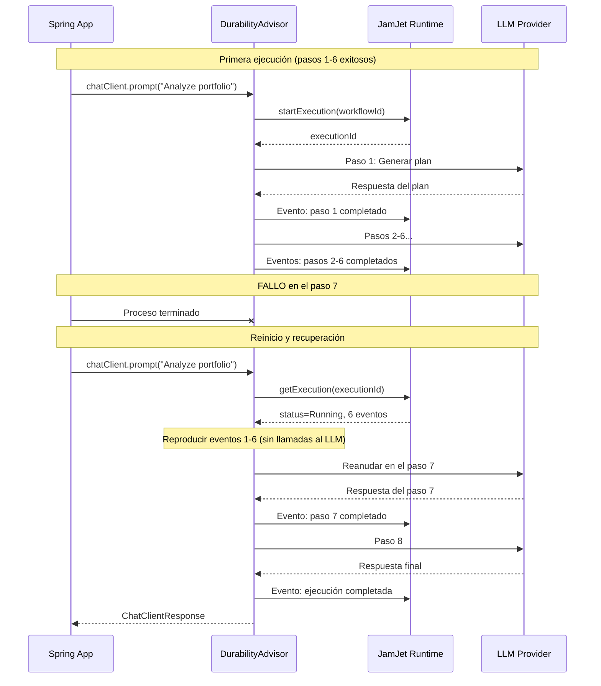
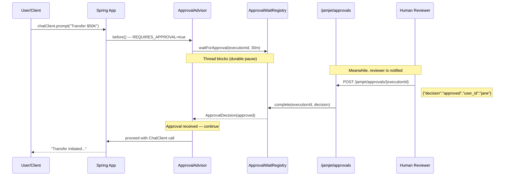
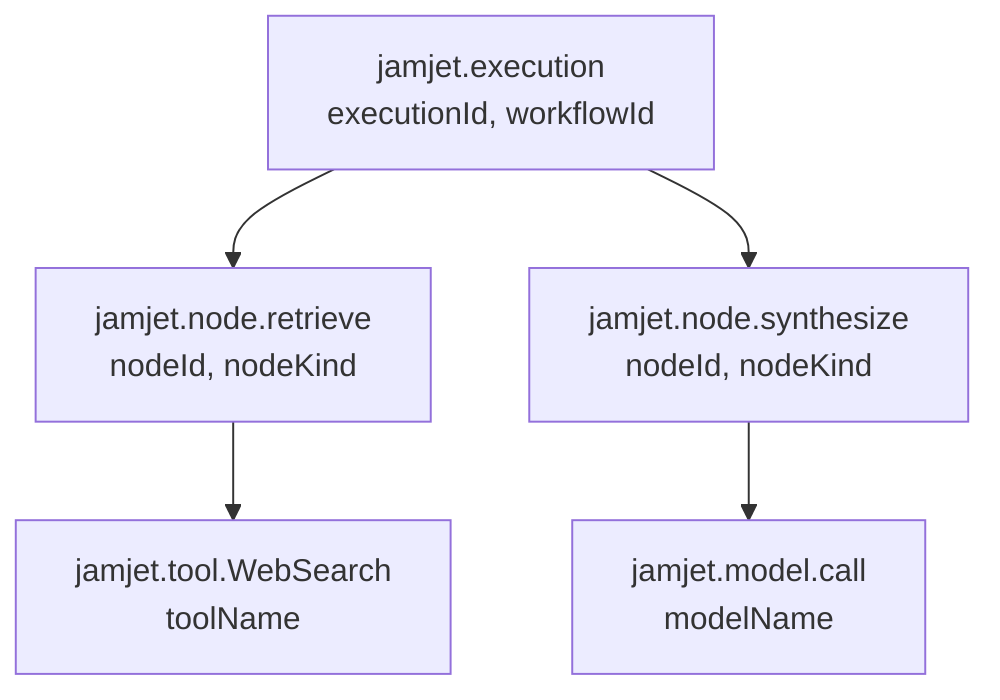

# Spring Boot Starter

Esta guía cubre la integración completa de JamJet con Spring Boot: por qué la durabilidad importa para los agentes de IA, cómo funciona cada advisor internamente, cómo probar agentes de forma determinista y cómo monitorearlos en producción. Al final tendrás una aplicación Spring AI funcional donde cada llamada LLM es recuperable ante fallos, auditada y observable.

---

## Por qué la durabilidad importa para los agentes de IA

Spring AI te proporciona una abstracción limpia para construir aplicaciones potenciadas por LLM. Obtienes `ChatClient`, advisors, llamadas a herramientas y portabilidad de modelos. Lo que no obtienes es ninguna protección cuando las cosas fallan en tiempo de ejecución.

Considera qué sucede cuando tu agente Spring AI está a mitad de una tarea de múltiples pasos --- ha llamado a una herramienta de búsqueda, recuperado resultados y está a punto de sintetizar una respuesta --- y el proceso falla. Con Spring AI básico, toda la interacción se pierde. El usuario ve un error. Los tokens que ya gastaste se desperdician. No hay registro de lo que pasó.

Este es el problema que resuelve la **ejecución durable**. JamJet registra cada paso de la interacción de tu agente como un evento inmutable. Si el proceso falla y se reinicia, reproduce esos eventos y continúa exactamente desde donde se quedó. Sin trabajo perdido, sin tokens desperdiciados, sin fallos visibles para el usuario.

La durabilidad también desbloquea capacidades imposibles sin ella:

- **Pistas de auditoría** --- cada prompt, respuesta, llamada a herramienta y conteo de tokens registrado como eventos inmutables. Requerido para industrias reguladas (servicios financieros, salud, legal).
- **Aprobación humana en el ciclo** --- pausa un agente a mitad de ejecución, espera a que un humano apruebe o rechace, luego reanuda. La pausa es durable: sobrevive reinicios.
- **Pruebas por repetición** --- reproduce una ejecución de producción en un entorno de prueba y valida los resultados. Sin necesidad de llamadas LLM.
- **Seguimiento de costos** --- agrega costos reales de tokens por ejecución, por usuario, por flujo de trabajo.

Para mayor contexto sobre por qué construimos JamJet y los problemas que resuelve, consulta [Why We Built JamJet](https://jamjet.dev/blog/why-we-built-jamjet).

---

## Configuración

### 1. Añadir la dependencia

El starter está publicado en Maven Central. Añade una sola dependencia y la autoconfiguración de Spring Boot se encarga del resto.

#### Maven

```xml
<dependency>
    <groupId>dev.jamjet</groupId>
    <artifactId>jamjet-spring-boot-starter</artifactId>
    <version>0.1.0</version>
</dependency>
```

#### Gradle (Kotlin DSL)

```kotlin
implementation("dev.jamjet:jamjet-spring-boot-starter:0.1.0")
```

#### Gradle (Groovy DSL)

```groovy
implementation 'dev.jamjet:jamjet-spring-boot-starter:0.1.0'
```

### 2. Iniciar el runtime de JamJet

El runtime es el motor de ejecución que persiste eventos y gestiona el estado del flujo de trabajo. Ejecútalo con Docker:

```bash
docker run -p 7700:7700 ghcr.io/jamjet-labs/jamjet:latest
```

O, si tienes la CLI instalada:

```bash
jamjet dev
```

### 3. Configurar

Añade la URL del runtime a tu `application.yml`:

```yaml
spring:
  jamjet:
    runtime-url: http://localhost:7700
    # api-token: ${JAMJET_API_TOKEN}      # opcional, para runtimes autenticados
    # tenant-id: default                   # aislamiento multi-tenant
    durability-enabled: true               # por defecto: true
    connect-timeout-seconds: 10            # por defecto: 10
    read-timeout-seconds: 120              # por defecto: 120
```

O en `application.properties`:

```properties
spring.jamjet.runtime-url=http://localhost:7700
```

### Qué hace la autoconfiguración

Cuando `JamjetAutoConfiguration` detecta el `ChatClient` de Spring AI en el classpath y `spring.jamjet.durability-enabled=true` (el valor por defecto), registra los siguientes beans:

| Bean | Condición | Propósito |
|------|-----------|---------|
| `JamjetRuntimeClient` | Siempre (cuando durability está habilitado) | Cliente HTTP para el runtime de JamJet |
| `JamjetDurabilityAdvisor` | Siempre (cuando durability está habilitado) | Envuelve cada llamada a ChatClient con ejecución durable |
| `ChatClientCustomizer` | Siempre (cuando durability está habilitado) | Inyecta automáticamente el asesor de durabilidad en todas las instancias de ChatClient |
| `JamjetAuditAdvisor` | `spring.jamjet.audit.enabled=true` (por defecto) | Registra prompts, respuestas y uso de tokens como eventos de auditoría |
| `JamjetAuditService` | `spring.jamjet.audit.enabled=true` (por defecto) | Acceso programático al registro de auditoría |
| `JamjetApprovalAdvisor` | `spring.jamjet.approval.enabled=true` (opt-in) | Pausa la ejecución para aprobación humana |
| `JamjetApprovalController` | Aprobación habilitada + aplicación web | Endpoints REST en `/jamjet/approvals` |
| `JamjetMicrometerBridge` | Micrometer en el classpath (por defecto) | Publica métricas de ejecución |
| `JamjetOtelBridge` | `spring.jamjet.observability.opentelemetry=true` (opt-in) | Creación de spans de OpenTelemetry |

El asesor de durabilidad se inyecta mediante un `ChatClientCustomizer`, por lo que no necesitas añadirlo manualmente. Cada `ChatClient` que construyas desde el `ChatClient.Builder` autoconfigurado obtiene durabilidad de forma automática.

### Degradación elegante

Si el runtime de JamJet no está disponible --- partición de red, contenedor no iniciado, fallo de autenticación --- el `JamjetDurabilityAdvisor` registra una advertencia y permite que la solicitud continúe sin durabilidad. Tu aplicación nunca falla porque JamJet esté caído. Esto es intencional: la durabilidad es una red de seguridad, no un punto único de fallo.

---

## Asesor de Durabilidad

El `JamjetDurabilityAdvisor` es el núcleo de la integración. Implementa la interfaz `BaseAdvisor` de Spring AI e intercepta cada llamada a `ChatClient` para envolverla con ejecución duradera.

### Event sourcing para desarrolladores Spring

Si no has trabajado antes con event sourcing, esta es la idea esencial: en lugar de almacenar solo el *estado actual* de una operación, almacenas cada *evento que llevó a ese estado*. El estado actual es una vista derivada --- siempre puedes reconstruirlo reproduciendo los eventos desde el principio.

Para agentes de IA, esto significa que cada llamada al LLM, cada invocación de herramienta, cada cambio de estado se registra como un evento inmutable en el runtime de JamJet. El registro de eventos es la fuente de verdad.

¿Por qué importa esto? Porque te da recuperación ante fallos gratis. Si un proceso muere en cualquier momento, reproduces el registro de eventos hasta el último evento completado y reanudas desde ahí. Sin pérdida de datos. Sin trabajo duplicado.

### Recorrido de recuperación ante fallos

Considera un agente que realiza 8 pasos: recuperar contexto, llamar al LLM, ejecutar una herramienta, llamar al LLM nuevamente, y así sucesivamente. Esto es lo que sucede cuando el proceso falla en el paso 7:



Los pasos 1 al 6 **no se vuelven a ejecutar** al reiniciar. El advisor lee sus eventos desde el runtime y reconstruye el estado. Solo el paso 7 (y siguientes) realmente llama al LLM. Esto ahorra tokens y tiempo.

### Antes y después

La idea clave: **tu código de aplicación no cambia**. La durabilidad viene del advisor, no de tu lógica de negocio.

**Sin JamJet** (Spring AI vanilla):

```java
@Bean
ChatClient chatClient(ChatClient.Builder builder) {
    return builder.build();
}

@Bean
CommandLineRunner demo(ChatClient chatClient) {
    return args -> {
        String result = chatClient.prompt("Summarize AI trends")
                .call()
                .content();
        System.out.println(result);
        // Si el proceso colapsa aquí, todo se pierde
    };
}
```

**Con JamJet** (mismo código, la durabilidad viene de la autoconfiguración):

```java
@Bean
ChatClient chatClient(ChatClient.Builder builder) {
    return builder.build(); // JamjetDurabilityAdvisor auto-inyectado
}

@Bean
CommandLineRunner demo(ChatClient chatClient) {
    return args -> {
        String result = chatClient.prompt("Summarize AI trends")
                .call()
                .content();
        System.out.println(result);
        // Durable — sobrevive colapsos, eventos persistidos, ejecución rastreada
    };
}
```

La única diferencia es la dependencia en tu classpath. El `ChatClientCustomizer` registrado por `JamjetAutoConfiguration` añade el `JamjetDurabilityAdvisor` a cada `ChatClient.Builder` automáticamente.

### Claves de contexto

El advisor de durabilidad usa tres claves de contexto para rastrear el estado de ejecución:

| Clave | Tipo | Descripción |
|-----|------|-------------|
| `jamjet.execution.id` | `String` | ID de ejecución único asignado por el runtime |
| `jamjet.workflow.id` | `String` | ID de workflow (derivado del IR compilado) |
| `jamjet.session.id` | `String` | ID de sesión para agrupar interacciones relacionadas |

Puedes leer estos desde el contexto de respuesta para logging, correlación o procesamiento posterior.

Para más sobre los patrones agénticos que la durabilidad habilita --- bucles ReAct, plan-and-execute, cadenas de crítica --- consulta [Patrones de IA Agéntica](https://sunilprakash.com/agentic-ai).

---

## Audit Advisor

El `JamjetAuditAdvisor` registra cada prompt, respuesta y uso de tokens como eventos de auditoría inmutables en el runtime de JamJet. Se ejecuta en la cadena de advisors después del advisor de durabilidad (orden `LOWEST_PRECEDENCE - 50`), así que cada entrada de auditoría está asociada con un ID de ejecución durable.

### Por qué importan las pistas de auditoría

Si estás construyendo agentes de IA para uso empresarial --- servicios financieros, salud, seguros, legal --- enfrentas requisitos regulatorios sobre el mantenimiento de registros. Los reguladores quieren saber:

- ¿Qué prompt se envió al modelo?
- ¿Qué respondió el modelo?
- ¿Cuántos tokens se consumieron (y a qué costo)?
- ¿Qué usuario inició la interacción?
- ¿Puedes reproducir esta interacción dentro de seis meses?

Sin una pista de auditoría, no puedes responder ninguna de estas preguntas. El `JamjetAuditAdvisor` las responde todas por defecto.

### Estructura de eventos de auditoría

Cada entrada de auditoría se persiste como un evento externo en la ejecución. Así se ve un evento de auditoría de prompt:

```json
{
  "type": "prompt",
  "advisor": "JamjetAuditAdvisor",
  "content": "Analyze the risk profile of portfolio XYZ-1234"
}
```

Y el evento de respuesta correspondiente:

```json
{
  "type": "response",
  "advisor": "JamjetAuditAdvisor",
  "content": "Based on the current allocation, portfolio XYZ-1234 has...",
  "prompt_tokens": 847,
  "completion_tokens": 1203,
  "total_tokens": 2050
}
```

### Configuración

La auditoría está **habilitada por defecto**. Puedes controlar qué se registra:

```yaml
spring:
  jamjet:
    audit:
      enabled: true              # por defecto: true
      include-prompts: true      # por defecto: true — registra el texto completo del prompt
      include-responses: true    # por defecto: true — registra el texto completo de la respuesta
```

Para entornos regulados donde necesitas la pista de auditoría pero no debes persistir PII o contenido sensible del prompt:

```yaml
spring:
  jamjet:
    audit:
      enabled: true
      include-prompts: false     # omite el texto del prompt de los eventos de auditoría
      include-responses: false   # omite el texto de respuesta de los eventos de auditoría
```

Esto aún registra el *hecho* de que ocurrió una interacción (con el ID de ejecución, marca de tiempo y conteo de tokens) sin almacenar el contenido real. Para más información sobre el manejo de PII y gobernanza de datos en sistemas de agentes, consulta [Gobernanza de datos y retención de PII](https://jamjet.dev/blog/data-governance-pii-retention).

---

## Aprobación con humano en el circuito

El `JamjetApprovalAdvisor` implementa un patrón duradero de pausa y reanudación: el agente se pausa a mitad de la ejecución, espera a que un humano apruebe o rechace a través de un endpoint REST, y luego continúa o aborta. Dado que la pausa está respaldada por el motor de ejecución durable, sobrevive a reinicios de proceso.

### Cuándo usar puertas de aprobación

Las puertas de aprobación son para acciones de alto riesgo donde quieres que un humano revise el plan del agente antes de ejecutarlo:

- Transacciones financieras por encima de un umbral
- Comunicaciones de cara al cliente
- Mutaciones de base de datos en producción
- Acciones con implicaciones legales o de cumplimiento

### Habilitar aprobación

La aprobación es **opcional** (deshabilitada por defecto):

```yaml
spring:
  jamjet:
    approval:
      enabled: true
      webhook-url: https://hooks.slack.com/services/T.../B.../xxx  # opcional
      timeout: 30m            # por defecto: 30m (admite sufijos s, m, h)
      default-decision: rejected   # por defecto: rejected — qué ocurre en timeout
```

| Propiedad | Por defecto | Descripción |
|----------|---------|-------------|
| `spring.jamjet.approval.enabled` | `false` | Habilitar flujo de aprobación |
| `spring.jamjet.approval.webhook-url` | --- | Webhook externo para notificaciones (Slack, email, etc.) |
| `spring.jamjet.approval.timeout` | `30m` | Tiempo máximo de espera antes del timeout (admite `s`, `m`, `h`) |
| `spring.jamjet.approval.default-decision` | `rejected` | Decisión aplicada en timeout: `approved` o `rejected` |

### Activar aprobación

Para marcar una solicitud específica como que requiere aprobación, establece la clave de contexto `jamjet.approval.required`:

```java
String result = chatClient.prompt("Transfer $50,000 to account 9876")
        .advisors(approvalAdvisor)  // o auto-inyectado
        .context("jamjet.approval.required", true)
        .call()
        .content();
// El hilo se bloquea aquí hasta que se recibe la aprobación (o timeout)
```

### El flujo de aprobación



### Aprobar o rechazar mediante REST

Cuando la aprobación está habilitada, la autoconfiguración registra `JamjetApprovalController` con dos endpoints:

**Aprobar una ejecución:**

```bash
curl -X POST http://localhost:8080/jamjet/approvals/{executionId} \
  -H "Content-Type: application/json" \
  -d '{
    "decision": "approved",
    "user_id": "jane.doe",
    "comment": "Reviewed and approved"
  }'
```

**Rechazar una ejecución:**

```bash
curl -X POST http://localhost:8080/jamjet/approvals/{executionId} \
  -H "Content-Type: application/json" \
  -d '{
    "decision": "rejected",
    "user_id": "jane.doe",
    "comment": "Amount exceeds policy limit"
  }'
```

**Listar aprobaciones pendientes:**

```bash
curl http://localhost:8080/jamjet/approvals/pending
```

Cuando se recibe un rechazo, el asesor lanza una `ApprovalRejectedException` con el ID de ejecución y el comentario del revisor.

El cuerpo de solicitud de aprobación admite los siguientes campos:

| Campo | Tipo | Requerido | Descripción |
|-------|------|----------|-------------|
| `decision` | `String` | Sí | `"approved"` o `"rejected"` |
| `user_id` | `String` | No | Identificador del revisor |
| `comment` | `String` | No | Justificación legible |
| `node_id` | `String` | No | Nodo específico a aprobar (avanzado) |
| `state_patch` | `Map<String, Object>` | No | Modificaciones de estado a aplicar al aprobar |

Para más información sobre patrones de humano en el bucle en sistemas de agentes, consulta [Agentic AI Patterns](https://sunilprakash.com/agentic-ai).

---

## Testing

Los agentes de IA son notoriamente difíciles de probar. Los LLMs son no deterministas --- el mismo prompt puede producir salidas diferentes en cada llamada. Los costos de tokens se acumulan al ejecutar pruebas contra APIs en vivo. Y es difícil hacer aserciones sobre salidas que cambian cada vez.

El módulo de testing de JamJet resuelve esto con dos enfoques complementarios: **replay testing** (reproducir una ejecución real sin llamar al LLM) y **stubs deterministas** (reemplazar el LLM con un fake basado en patrones).

### Añadir la dependencia de prueba

```xml
<dependency>
    <groupId>dev.jamjet</groupId>
    <artifactId>jamjet-spring-boot-starter-test</artifactId>
    <version>0.1.0</version>
    <scope>test</scope>
</dependency>
```

### Pruebas de repetición con `@WithJamjetRuntime` y `@ReplayExecution`

Las pruebas de repetición capturan una ejecución en producción y la reproducen en tu suite de tests. El test se conecta a un runtime de JamJet (vía Testcontainers), obtiene el registro de eventos de la ejecución y te permite hacer aserciones sobre los resultados — sin realizar llamadas a LLM.

```java
import dev.jamjet.spring.test.annotations.WithJamjetRuntime;
import dev.jamjet.spring.test.annotations.ReplayExecution;
import dev.jamjet.spring.test.RecordedExecution;
import dev.jamjet.spring.test.AgentAssertions;
import org.junit.jupiter.api.Test;
import java.util.concurrent.TimeUnit;

@WithJamjetRuntime
class PortfolioAgentTest {

    @Test
    @ReplayExecution("exec-abc123")
    void agentProducesConsistentOutput(RecordedExecution execution) {
        AgentAssertions.assertThat(execution)
                .completedSuccessfully()
                .usedTool("WebSearch")
                .completedWithin(30, TimeUnit.SECONDS)
                .costLessThan(0.50);
    }

    @Test
    @ReplayExecution(value = "exec-abc123", forkAtNode = "retrieve")
    void forkAndRerunFromRetrieveStep(RecordedExecution execution) {
        AgentAssertions.assertThat(execution)
                .nodeCompleted("retrieve")
                .outputContains("portfolio");
    }
}
```

`@WithJamjetRuntime` es una extensión de JUnit 5 que inicia un contenedor del runtime de JamJet antes de tus tests. Puedes configurar la imagen y la etiqueta:

```java
@WithJamjetRuntime(image = "ghcr.io/jamjet-labs/jamjet", tag = "0.3.1")
```

`@ReplayExecution` especifica qué ejecución reproducir. El parámetro opcional `forkAtNode` te permite bifurcar la ejecución en un nodo específico — útil para probar "¿qué pasaría si cambiamos el output del paso X?"

### El registro `RecordedExecution`

`RecordedExecution` captura todo sobre una ejecución reproducida:

| Campo | Tipo | Descripción |
|-------|------|-------------|
| `executionId` | `String` | ID único de ejecución |
| `workflowId` | `String` | ID del workflow |
| `status` | `String` | Estado final (`Completed`, `Failed`, `Cancelled`) |
| `input` | `Object` | Input que inició la ejecución |
| `finalState` | `Object` | Estado final después de que todos los nodos se completaron |
| `events` | `List<ExecutionEvent>` | Registro completo de eventos |
| `nodes` | `List<NodeExecution>` | Detalles de ejecución por nodo |
| `totalDuration` | `Duration` | Duración total |
| `toolCallCount` | `int` | Total de invocaciones de herramientas |
| `totalCostUsd` | `double` | Costo agregado de tokens |

Cada `NodeExecution` contiene `nodeId`, `kind`, `status`, `input`, `output`, `duration` y `retryCount`.

### API fluida de `AgentAssertions`

El punto de entrada `AgentAssertions.assertThat(execution)` devuelve una API fluida diseñada específicamente para pruebas de agentes:

| Aserción | Descripción |
|-----------|-------------|
| `.completedSuccessfully()` | El estado de ejecución es `Completed` |
| `.failedWith(errorContaining)` | El estado es `Failed` con mensaje de error coincidente |
| `.wasCancelled()` | El estado es `Cancelled` |
| `.completedWithin(amount, unit)` | Duración de reloj dentro del límite |
| `.costLessThan(usd)` | Costo total por debajo del umbral |
| `.usedTool(toolName)` | La herramienta fue invocada al menos una vez |
| `.usedToolTimes(toolName, n)` | La herramienta fue invocada exactamente `n` veces |
| `.didNotUseTool(toolName)` | La herramienta nunca fue invocada |
| `.toolCallCount(matcher)` | Comparador Hamcrest en el conteo total de llamadas a herramientas |
| `.nodeCompleted(nodeId)` | Nodo específico completado exitosamente |
| `.nodeRetried(nodeId, times)` | El nodo fue reintentado exactamente `times` veces |
| `.nodeCount(matcher)` | Comparador Hamcrest en el conteo de nodos |
| `.outputContains(substring)` | La salida final contiene la subcadena |
| `.outputMatches(regex)` | La salida final coincide con el patrón regex |
| `.outputSatisfies(consumer)` | Lambda de aserción personalizada en la salida |
| `.hasEvent(eventType)` | El registro de eventos contiene un evento del tipo dado |
| `.eventCount(matcher)` | Comparador Hamcrest en el conteo de eventos |
| `.auditTrailContains(eventType)` | Alias para `.hasEvent()` |
| `.auditTrailSize(matcher)` | Alias para `.eventCount()` |

Todas las aserciones son encadenables --- `.completedSuccessfully().usedTool("X").costLessThan(1.0)` se lee naturalmente y falla con mensajes de error claros.

### Stubs de modelo determinístico

Para pruebas unitarias donde no quieres reproducir una ejecución real, `DeterministicModelStub` te permite reemplazar el `ChatModel` con un fake de coincidencia de patrones:

```java
import dev.jamjet.spring.test.DeterministicModelStub;

var stub = DeterministicModelStub.builder()
        .onPromptContaining("weather", "Sunny, 72F in San Francisco")
        .onPromptContaining("stock price", "ACME: $142.50, up 2.3%")
        .defaultResponse("I don't have information about that topic.")
        .build();

// Usa como un ChatModel en tu contexto Spring
@Bean
ChatModel chatModel() {
    return stub;
}
```

El stub coincide prompts en orden: el primer patrón `onPromptContaining` que coincide gana. Si ningún patrón coincide, devuelve el `defaultResponse`. El stub también registra todas las llamadas para que puedas verificar conteos de invocación:

```java
assertEquals(3, stub.getCallCount());
assertEquals("weather in SF", stub.getCalls().get(0).getContents());
stub.reset(); // limpiar historial de llamadas
```

`DeterministicModelStub` implementa `ChatModel`, por lo que funciona tanto con `call()` como con `stream()` --- la variante stream devuelve un `Flux` de un solo elemento con la respuesta coincidente.

---

## Observabilidad

### Métricas de Micrometer

Cuando Spring Boot Actuator y Micrometer están en el classpath, `JamjetMicrometerBridge` publica automáticamente métricas de ejecución. Esto está habilitado por defecto --- no requiere activación.

```yaml
spring:
  jamjet:
    observability:
      micrometer: true           # por defecto: true
      metric-prefix: jamjet      # por defecto: jamjet
```

#### Referencia de métricas

| Métrica | Tipo | Etiquetas | Descripción |
|--------|------|------|-------------|
| `jamjet.execution.duration` | Timer | `status` | Duración de cada ejecución |
| `jamjet.execution.count` | Counter | `status` | Total de ejecuciones por estado |
| `jamjet.node.duration` | Timer | `node_id`, `node_kind` | Duración de cada nodo |
| `jamjet.node.retries` | Counter | `node_id` | Recuento de reintentos por nodo |
| `jamjet.tool.calls` | Counter | `tool_name` | Invocaciones de herramientas por nombre |
| `jamjet.tool.duration` | Timer | `tool_name` | Duración por llamada de herramienta |
| `jamjet.execution.cost.usd` | DistributionSummary | --- | Costo de tokens por ejecución |
| `jamjet.audit.events` | Counter | `event_type` | Eventos de auditoría por tipo |

El prefijo de métrica es configurable. Si estableces `metric-prefix: myapp.agent`, las métricas se convierten en `myapp.agent.execution.duration`, etc.

#### Recomendaciones de alertas

| Alerta | Condición | Por qué |
|-------|-----------|-----|
| Tasa alta de fallos | `rate(jamjet.execution.count{status="Failed"}) > 0.05 * rate(jamjet.execution.count)` | Más del 5% de las ejecuciones fallando |
| Ejecuciones lentas | `jamjet.execution.duration{quantile="0.95"} > 30s` | Latencia P95 superior a 30 segundos |
| Pico de costos | `rate(jamjet.execution.cost.usd) > 10` | Gastando más de $10/minuto |
| Reintentos excesivos | `rate(jamjet.node.retries) > 5` | Nodos reintentando con demasiada frecuencia (herramientas inestables o límites de tasa) |
| Acumulación de aprobaciones | Recuento de aprobaciones pendientes creciendo | Los revisores no responden (problema de integración de webhook) |

### Trazabilidad con OpenTelemetry

Para el rastreo distribuido, activa el puente de OpenTelemetry:

```yaml
spring:
  jamjet:
    observability:
      opentelemetry: true        # por defecto: false (opt-in)
```

Esto requiere `io.opentelemetry:opentelemetry-api` en tu classpath. El puente crea una jerarquía de spans que refleja la estructura de ejecución:



Cada span lleva atributos específicos de JamJet:

| Span | Kind | Atributos |
|------|------|------------|
| `jamjet.execution` | `INTERNAL` | `jamjet.execution.id`, `jamjet.workflow.id` |
| `jamjet.node.{id}` | `INTERNAL` | `jamjet.node.id`, `jamjet.node.kind` |
| `jamjet.tool.{name}` | `CLIENT` | `jamjet.tool.name` |
| `jamjet.model.call` | `CLIENT` | `jamjet.model.name` |

Los spans con errores incluyen `StatusCode.ERROR`, el mensaje de excepción y un evento de excepción registrado --- semántica estándar de OTel que funciona con cualquier backend de rastreo (Jaeger, Zipkin, Grafana Tempo, Datadog).

Los spans completados llevan `jamjet.cost.usd` cuando hay datos de costo disponibles, permitiéndote correlacionar costo con latencia en tu interfaz de rastreo.

---

## Ejemplo completo

Aquí tienes una aplicación completa de Spring Boot que integra durabilidad, auditoría, aprobación y observabilidad:

### `pom.xml` (dependencias)

```xml
<dependencies>
    <!-- Spring AI + OpenAI -->
    <dependency>
        <groupId>org.springframework.ai</groupId>
        <artifactId>spring-ai-openai-spring-boot-starter</artifactId>
    </dependency>

    <!-- JamJet durability -->
    <dependency>
        <groupId>dev.jamjet</groupId>
        <artifactId>jamjet-spring-boot-starter</artifactId>
        <version>0.1.0</version>
    </dependency>

    <!-- Spring Boot Actuator (habilita métricas de Micrometer) -->
    <dependency>
        <groupId>org.springframework.boot</groupId>
        <artifactId>spring-boot-starter-actuator</artifactId>
    </dependency>

    <!-- Test -->
    <dependency>
        <groupId>dev.jamjet</groupId>
        <artifactId>jamjet-spring-boot-starter-test</artifactId>
        <version>0.1.0</version>
        <scope>test</scope>
    </dependency>
</dependencies>
```

### `application.yml`

```yaml
spring:
  ai:
    openai:
      api-key: ${OPENAI_API_KEY}

  jamjet:
    runtime-url: http://localhost:7700
    durability-enabled: true

    audit:
      enabled: true
      include-prompts: true
      include-responses: true

    approval:
      enabled: true
      timeout: 15m
      default-decision: rejected

    observability:
      micrometer: true
      metric-prefix: jamjet
```

### `DurableAgentApplication.java`

```java
import dev.jamjet.spring.advisor.JamjetApprovalAdvisor;
import org.springframework.ai.chat.client.ChatClient;
import org.springframework.boot.SpringApplication;
import org.springframework.boot.autoconfigure.SpringBootApplication;
import org.springframework.context.annotation.Bean;
import org.springframework.web.bind.annotation.*;

@SpringBootApplication
public class DurableAgentApplication {

    public static void main(String[] args) {
        SpringApplication.run(DurableAgentApplication.class, args);
    }

    @Bean
    ChatClient chatClient(ChatClient.Builder builder) {
        return builder.build(); // Advisors de durabilidad + auditoría autoinyectados
    }

    @RestController
    @RequestMapping("/api/agent")
    static class AgentController {

        private final ChatClient chatClient;

        AgentController(ChatClient chatClient) {
            this.chatClient = chatClient;
        }

        // Llamada durable estándar — recuperación ante fallos + rastro de auditoría
        @PostMapping("/ask")
        String ask(@RequestBody String prompt) {
            return chatClient.prompt(prompt)
                    .call()
                    .content();
        }

        // Llamada de alto impacto — requiere aprobación humana antes de continuar
        @PostMapping("/ask-with-approval")
        String askWithApproval(@RequestBody String prompt) {
            return chatClient.prompt(prompt)
                    .context(JamjetApprovalAdvisor.REQUIRES_APPROVAL_KEY, true)
                    .call()
                    .content();
        }
    }
}
```

### Ejecución

```bash

# Terminal 1: Iniciar el runtime de JamJet

docker run -p 7700:7700 ghcr.io/jamjet-labs/jamjet:latest

# Terminal 2: Iniciar la aplicación Spring Boot

export OPENAI_API_KEY=sk-...
mvn spring-boot:run

# Terminal 3: Realizar una llamada durable

curl -X POST http://localhost:8080/api/agent/ask \
  -H "Content-Type: text/plain" \
  -d "¿Cuáles son las 3 principales tendencias de IA en 2026?"

# Realizar una llamada que requiere aprobación

curl -X POST http://localhost:8080/api/agent/ask-with-approval \
  -H "Content-Type: text/plain" \
  -d "Redactar un correo a todos los clientes sobre un cambio de precios"

# En otra terminal: aprobar la ejecución pendiente

curl http://localhost:8080/jamjet/approvals/pending

# Copia el executionId de la respuesta, luego:

curl -X POST http://localhost:8080/jamjet/approvals/{executionId} \
  -H "Content-Type: application/json" \
  -d '{"decision":"approved","user_id":"admin","comment":"Se ve bien"}'
```

---

## Requisitos

| Requisito | Versión mínima |
|-------------|----------------|
| Java | 21+ |
| Spring Boot | 3.4+ |
| Spring AI | 1.0+ |
| Runtime JamJet | 0.3.1+ (Docker o binario) |

---

## Próximos pasos

- **[Integración con LangChain4j](/langchain4j-integration)** --- usa JamJet como capa de ejecución durable para agentes LangChain4j con `JamjetDurableAgent` y `JamjetChatMemoryStore`
- **[Referencia del SDK Java](/java-sdk)** --- cobertura completa de la API para herramientas, estrategias, compilación IR y el cliente del runtime
- **[Inicio Rápido Java](/java-quickstart)** --- construye tu primer agente y flujo de trabajo desde cero con el SDK Java
- **[Conceptos Fundamentales](/concepts)** --- agentes, nodos, estado y durabilidad en profundidad
- **[Patrones de IA Agéntica](https://sunilprakash.com/agentic-ai)** --- selección de estrategias, diseño de herramientas y patrones de producción para sistemas agentes
