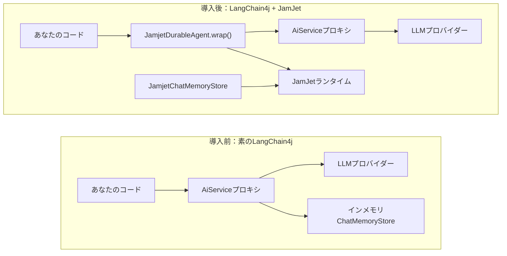

# LangChain4j統合

JamJetは独自の[Java SDK](/java-sdk)を持つ完全なエージェントランタイムです。LLMとネイティブに通信し、ツールを管理し、永続的なワークフローIRにコンパイルし、実行時にコストと時間のガードレールを適用します。新規プロジェクトでは、これが推奨される方法です。

しかし、既に本番環境でLangChain4jエージェント（`AiServices`プロキシ、チャットメモリストア、ツールバインディング）を運用している場合、それらを書き直す必要はありません。この統合により、既存のLangChain4jコードをJamJetの永続実行エンジンでラップし、最小限の変更でクラッシュリカバリ、監査証跡、リプレイテストを実現できます。

### 導入前と導入後



左側が現在の構成です。右側では、既存のエージェントの前段に永続化プロキシを追加し、チャットメモリをJamJetランタイム経由で永続化します。`AiService`インターフェース、ツール定義、LLM設定は変更不要です。

> **注：**
> 新規のJavaプロジェクトの場合、[Java SDK](/java-sdk)を直接使用することを検討してください。LangChain4jの依存関係なしで、ネイティブなLLM統合、型付きツール、戦略選択、IRコンパイルを提供します。

---

## セットアップ

### 1. 依存関係を追加

統合モジュールはMaven Centralで公開されています。ランタイムクライアント用のピア依存関係として`jamjet-spring-boot-starter`が必要です。

#### Maven

```xml
<dependency>
    <groupId>dev.jamjet</groupId>
    <artifactId>langchain4j-jamjet</artifactId>
    <version>0.1.2</version>
</dependency>
<dependency>
    <groupId>dev.jamjet</groupId>
    <artifactId>jamjet-spring-boot-starter</artifactId>
    <version>0.2.0</version>
</dependency>
```

#### Gradle (Kotlin DSL)

```kotlin
implementation("dev.jamjet:langchain4j-jamjet:0.1.2")
implementation("dev.jamjet:jamjet-spring-boot-starter:0.2.0")
```

#### Gradle (Groovy DSL)

```groovy
implementation 'dev.jamjet:langchain4j-jamjet:0.1.2'
implementation 'dev.jamjet:jamjet-spring-boot-starter:0.2.0'
```

### 2. JamJetランタイムを起動

ランタイムはイベントを永続化し、ワークフローの状態を管理する実行エンジンです。Dockerで起動します:

```bash
docker run -p 7700:7700 ghcr.io/jamjet-labs/jamjet:latest
```

または、CLIをインストール済みの場合:

```bash
jamjet dev
```

### 3. 設定

`application.yml`にランタイムのURLを追加します:

```yaml
spring:
  jamjet:
    runtime-url: http://localhost:7700
    # api-token: ${JAMJET_API_TOKEN}      # 認証が必要なランタイムの場合はオプション
    # tenant-id: default                   # マルチテナント分離
    durability-enabled: true
```

---

## 既存エージェントをラップ

すでにプロダクションで動作しているLangChain4jの`AiService`があるとします:

**既存のコード(変更不要):**

```java
import dev.langchain4j.service.AiServices;
import dev.langchain4j.model.openai.OpenAiChatModel;

interface ResearchAssistant {
    String research(String topic);
}

var model = OpenAiChatModel.builder()
        .apiKey(System.getenv("OPENAI_API_KEY"))
        .modelName("gpt-4o")
        .build();

ResearchAssistant assistant = AiServices.create(ResearchAssistant.class, model);
```

**1回の呼び出しで永続性を追加:**

```java
import dev.jamjet.langchain4j.JamjetDurableAgent;
import dev.jamjet.spring.client.JamjetRuntimeClient;

// clientはjamjet-spring-boot-starterにより自動設定されます。
// または、JamjetConfigで手動構築することも可能(後述の設定セクションを参照)
ResearchAssistant durable = JamjetDurableAgent.wrap(
        assistant,                // 既存のAiServiceプロキシ
        ResearchAssistant.class,  // インターフェース型
        client                    // JamjetRuntimeClient
);

// 以前と全く同じように使用 — インターフェースは変更なし
String result = durable.research("量子エラー訂正");
```

変更はこれだけです。呼び出しコード、インターフェース定義、ツールアノテーション、モデル設定はすべてそのままです。

### 内部動作の仕組み

`JamjetDurableAgent.wrap()`を呼び出すと、`AiService`インターフェースの周囲にJDK動的プロキシ(`java.lang.reflect.Proxy`)が作成されます。ラップされたプロキシへのすべてのメソッド呼び出しは、次のシーケンスを通ります:

1. **ワークフローIRの構築** — プロキシは`langchain4j-{InterfaceName}-{methodName}`という名前の軽量な中間表現を構築します。これには単一の`LlmGenerate`ノードが含まれます。このIRは、JamJetのネイティブSDKやRustランタイムで使用されるものと同じフォーマットです。

2. **ワークフローの作成と実行開始** — プロキシは`client.createWorkflow(ir)`を呼び出し、続いて`client.startExecution(workflowId, ...)`を実行します。実行は一意の実行IDでJamJetランタイムによって追跡されます。

3. **デリゲートの呼び出し** — 元の`AiService`プロキシが実際のLLM呼び出しを処理します。ツール、メモリ、モデル設定はすべて従来通り動作します。

4. **完了または失敗の記録** — 成功時、プロキシは`status=completed`と結果を含む`completion`イベントを送信します。失敗時は、エラーメッセージと共に`status=failed`を記録します。

5. **グレースフルデグラデーション** — JamJetランタイムに到達できない場合(ネットワーク分断、コンテナ未起動など)、プロキシは警告をログに記録し、元の`AiService`に直接デリゲートします。JamJetがダウンしていても、アプリケーションは決して失敗しません。

---

## 設定

Spring Bootを使用している場合、`JamjetRuntimeClient`は`application.yml`のプロパティから自動設定されます（[Spring Boot Starter](/spring-boot-starter)ガイドを参照）。Spring以外のスタンドアロン環境では、`JamjetConfig`を使用して手動でクライアントを構築します：

```java
import dev.jamjet.langchain4j.JamjetConfig;

var config = new JamjetConfig()
        .runtimeUrl("http://localhost:7700")
        .apiToken("your-token")
        .tenantId("default")
        .connectTimeout(10)
        .readTimeout(120);

var client = config.buildClient();
```

### 設定オプション

| オプション | メソッド | デフォルト | 説明 |
|--------|--------|---------|-------------|
| ランタイムURL | `.runtimeUrl(String)` | `http://localhost:7700` | JamJetランタイムのアドレス |
| APIトークン | `.apiToken(String)` | `null` | セキュアなランタイム用の認証トークン |
| テナントID | `.tenantId(String)` | `"default"` | マルチテナント分離識別子 |
| 接続タイムアウト | `.connectTimeout(int)` | `10`（秒） | TCP接続タイムアウト |
| 読み取りタイムアウト | `.readTimeout(int)` | `120`（秒） | 長時間実行操作のHTTP読み取りタイムアウト |

すべてのオプションは流暢なビルダーパターンを使用します。`JamjetConfig`は`.buildClient()`を介して`JamjetRuntimeClient`を生成します。これはSpring Bootの自動設定で使用されるクライアントタイプと同じです。

---

## 永続的なチャットメモリ

LangChain4jは`ChatMemoryStore`インターフェースを通じて会話履歴を保存します。デフォルトの実装はインメモリであるため、プロセスが再起動すると会話履歴はすべて失われます。

`JamjetChatMemoryStore`は、JamJetランタイムの監査イベントシステムを通じて会話履歴を永続化します。メッセージはLangChain4j組み込みの`ChatMessageSerializer`を使用してJSONにシリアライズされ、外部イベントとして保存されるため、再起動後も保持され、監査APIを通じてクエリ可能になります。

```java
import dev.jamjet.langchain4j.JamjetChatMemoryStore;
import dev.langchain4j.memory.chat.MessageWindowChatMemory;

var memoryStore = new JamjetChatMemoryStore(client);

var memory = MessageWindowChatMemory.builder()
        .maxMessages(20)
        .chatMemoryStore(memoryStore)
        .build();

// 通常通りAiServiceで使用
ResearchAssistant assistant = AiServices.builder(ResearchAssistant.class)
        .chatLanguageModel(model)
        .chatMemory(memory)
        .build();
```

### 動作の仕組み

| 操作 | 何が起こるか |
|-----------|-------------|
| `getMessages(memoryId)` | メモリIDに関連付けられた最新の`chat_memory`イベントをJamJet監査証跡から照会します。保存されたJSONを`ChatMessage`オブジェクトに逆シリアル化します。履歴が存在しない場合は空のリストを返します。 |
| `updateMessages(memoryId, messages)` | すべてのメッセージをJSONにシリアル化し、`chat_memory`外部イベントをランタイムに送信し、ペイロードと共にメッセージ数を記録します。 |
| `deleteMessages(memoryId)` | `memory_cleared`イベントをランタイムに送信します。イベントログは追記専用であるため、クリアは以前のエントリを削除するのではなく、事実として記録されます。 |

3つの操作すべてが適切にデグレードします — JamJetランタイムに到達できない場合、ストアは警告をログに記録し、空の結果を返す(読み取りの場合)か、書き込みを黙って破棄します。これは`JamjetDurableAgent`で使用されているのと同じ適切なデグレードパターンに一致します。

### Engram: チャット履歴を超える長期記憶

`JamjetChatMemoryStore`は、JamJetランタイムを通じて生の会話メッセージを永続化します。エンティティ抽出、時系列知識グラフ、セマンティック検索など、より豊富なメモリを必要とするエージェントについては、JamJet専用のメモリレイヤーである[Engram](https://java-ai-memory.dev)を検討してください。`engram-spring-boot-starter`は、Engramサーバーを通じてメッセージを保存するSpring AI用の`ChatMemoryRepository`を提供し、さらにエンティティと関係を抽出してセマンティック検索用にインデックス化します。セットアップの詳細については、Spring Boot Starterガイドの[Engramメモリセクション](/spring-boot-starter#engram-memory)を参照してください。

---

## 得られるもの

LangChain4jエージェントをJamJetでラップすることで、アプリケーションコードを変更することなく、以下の機能が追加されます:

| 機能 | JamJetなし | JamJetあり |
|------------|---------------|-------------|
| **クラッシュリカバリ** | プロセスが停止すると対話が失われ、トークンが無駄になる | ランタイムが実行を追跡し、再起動後に再開可能 |
| **監査証跡** | 何が起きたかの記録がない | すべてのメソッド呼び出しが引数、結果、ステータスとともに不変イベントとして記録される |
| **リプレイテスト** | テストにはライブLLMの呼び出しが必要 | 記録された実行をテストスイートでリプレイ可能、LLM呼び出し不要 |
| **コスト追跡** | 手動でのトークンカウントが必要 | 実行イベントにメソッド名と引数が含まれ、コスト帰属が可能 |
| **可観測性** | アプリケーションレベルのログのみ | 分散トレース相関のための実行ID、Spring Boot starter経由のMicrometerメトリクス |
| **チャットメモリの永続化** | インメモリのみ、再起動で消失 | JamJet監査イベントシステムにより永続化、再起動後も保持 |

---

## ラップされたエージェントのテスト

`jamjet-spring-boot-starter-test`モジュールは、ラップされたLangChain4jエージェントと連携します。`JamjetDurableAgent.wrap()`はJamJetの実行を作成するため、`@ReplayExecution`を使用してテスト内で再生できます。

```java
import dev.jamjet.spring.test.annotations.WithJamjetRuntime;
import dev.jamjet.spring.test.annotations.ReplayExecution;
import dev.jamjet.spring.test.RecordedExecution;
import dev.jamjet.spring.test.AgentAssertions;
import org.junit.jupiter.api.Test;
import java.util.concurrent.TimeUnit;

@WithJamjetRuntime
class ResearchAssistantTest {

    @Test
    @ReplayExecution("exec-lc4j-abc123")
    void wrappedAgentProducesConsistentOutput(RecordedExecution execution) {
        AgentAssertions.assertThat(execution)
                .completedSuccessfully()
                .completedWithin(30, TimeUnit.SECONDS)
                .outputContains("quantum");
    }
}
```

テスト用の依存関係を追加します:

```xml
<dependency>
    <groupId>dev.jamjet</groupId>
    <artifactId>jamjet-spring-boot-starter-test</artifactId>
    <version>0.2.0</version>
    <scope>test</scope>
</dependency>
```

完全なテストAPI(`RecordedExecution`フィールド、`AgentAssertions`フルエントAPI、`DeterministicModelStub`、ノード単位でのフォーク再生)については、[Spring Boot Starter](/spring-boot-starter)ガイドのテストセクションを参照してください。

---

## 次のステップ

- **[Java SDKリファレンス](/java-sdk)** — 新規プロジェクトでは、JamJetのネイティブJava SDKがLangChain4j依存なしで直接LLM統合、型付きツール、戦略選択、IRコンパイルを提供します
- **[Javaクイックスタート](/java-quickstart)** — ネイティブSDKを使用して、最初のエージェントとワークフローをゼロから構築します
- **[Spring Boot Starter](/spring-boot-starter)** — 永続性、監査証跡、ヒューマンインザループ承認、可観測性が自動設定されたSpring AI統合
- **[エージェントAIパターン](https://sunilprakash.com/agentic-ai)** — エージェントシステムのための戦略選択、ツール設計、本番環境パターン
