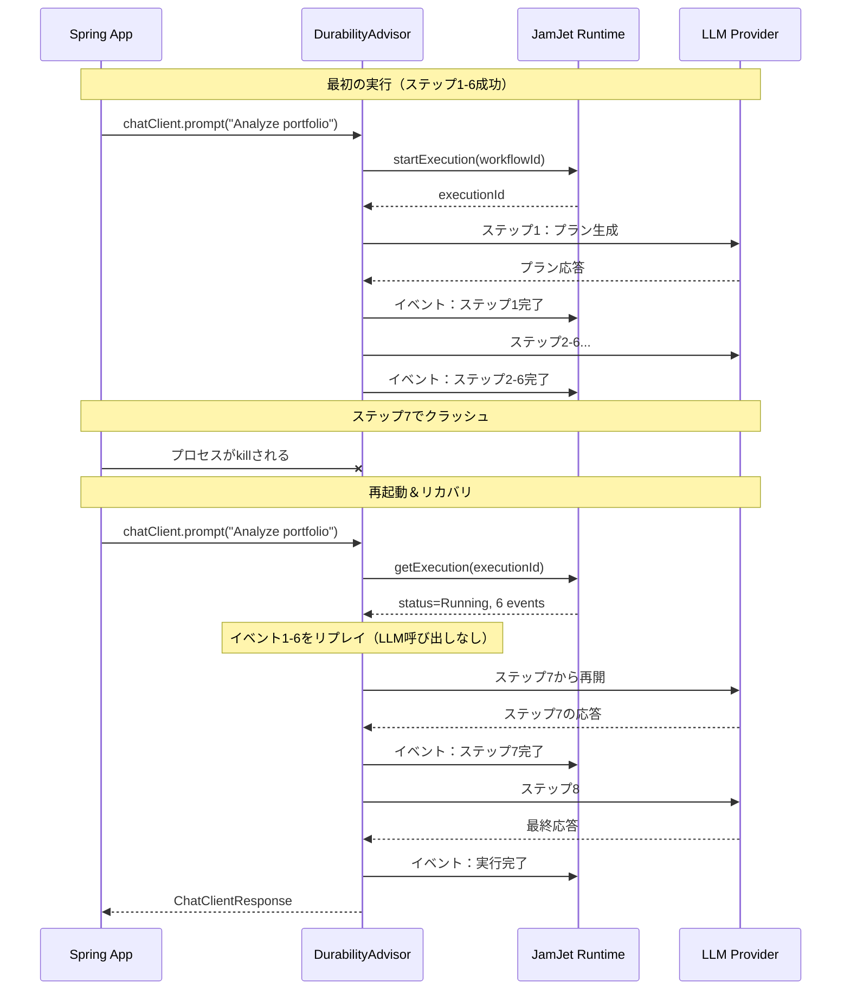
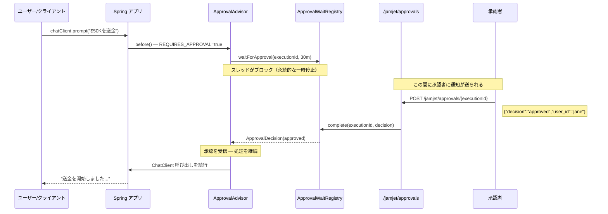
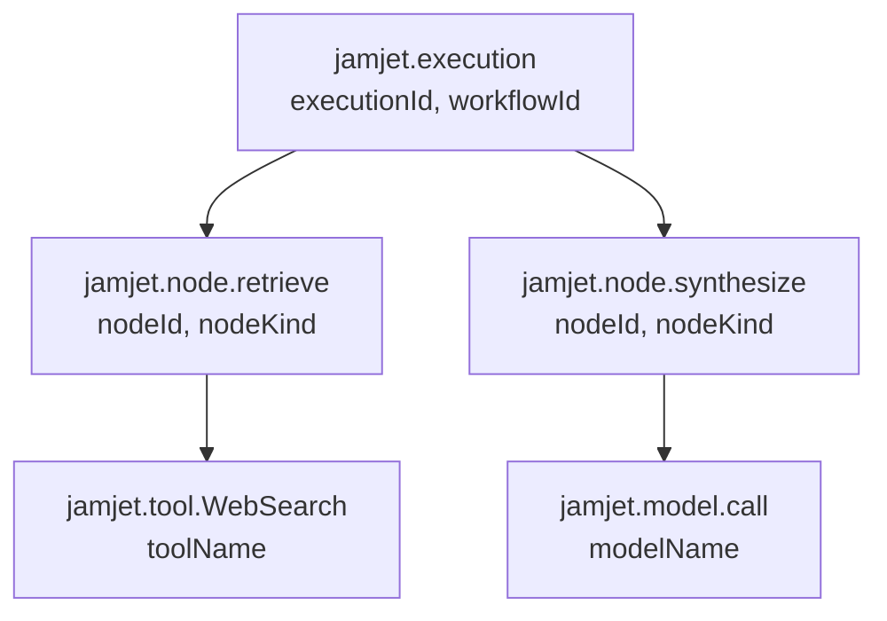

# Spring Boot スターター

このガイドでは、JamJet Spring Boot 統合の全体を網羅します。AI エージェントにとって永続性がなぜ重要なのか、各アドバイザーが内部でどのように動作するのか、エージェントを決定論的にテストする方法、そして本番環境で監視する方法を説明します。最終的には、すべての LLM 呼び出しがクラッシュから回復可能で、監査され、観測可能な実用的な Spring AI アプリケーションを構築できるようになります。

---

## AI エージェントにおける永続性の重要性

Spring AI は、LLM を活用したアプリケーションを構築するためのクリーンな抽象化を提供します。`ChatClient`、アドバイザー、ツール呼び出し、モデルの移植性が利用できます。しかし、実行時に問題が発生した際の保護機能は提供されません。

Spring AI エージェントが複数ステップのタスクの途中——検索ツールを呼び出し、結果を取得し、回答を合成しようとしている段階——でプロセスがクラッシュした場合を考えてみてください。通常の Spring AI では、インタラクション全体が失われます。ユーザーにはエラーが表示され、既に消費したトークンは無駄になり、何が起こったかの記録も残りません。

これが **永続的実行** が解決する問題です。JamJet は、エージェントのインタラクションの各ステップを不変のイベントとして記録します。プロセスがクラッシュして再起動した場合、これらのイベントを再生し、中断した箇所から正確に再開します。作業の損失もトークンの無駄もユーザーに見えるエラーもありません。

永続性は、それなしでは実現不可能な機能も可能にします。

- **監査証跡** ——すべてのプロンプト、応答、ツール呼び出し、トークン数が不変のイベントとして記録されます。規制産業(金融サービス、医療、法務)で必須です。
- **ヒューマン・イン・ザ・ループ承認** ——エージェントを実行中に一時停止し、人間の承認または却下を待ってから再開します。一時停止は永続的で、再起動後も維持されます。
- **リプレイテスト** ——本番環境の実行をテスト環境で再生し、結果をアサートします。LLM 呼び出しは不要です。
- **コスト追跡** ——実行ごと、ユーザーごと、ワークフローごとの実際のトークンコストを集計します。

なぜ JamJet を構築したのか、そしてそれが解決する問題についての詳細は、[Why We Built JamJet](https://jamjet.dev/blog/why-we-built-jamjet) をご覧ください。

---

## セットアップ

### 1. 依存関係の追加

スターターはMaven Centralで公開されています。依存関係を1つ追加すれば、Spring Bootの自動設定が残りを処理します。

#### Maven

```xml
<dependency>
    <groupId>dev.jamjet</groupId>
    <artifactId>jamjet-spring-boot-starter</artifactId>
    <version>0.2.0</version>
</dependency>
```

#### Gradle (Kotlin DSL)

```kotlin
implementation("dev.jamjet:jamjet-spring-boot-starter:0.2.0")
```

#### Gradle (Groovy DSL)

```groovy
implementation 'dev.jamjet:jamjet-spring-boot-starter:0.2.0'
```

### 2. JamJetランタイムの起動

ランタイムはイベントを永続化しワークフローの状態を管理する実行エンジンです。Dockerで起動します：

```bash
docker run -p 7700:7700 ghcr.io/jamjet-labs/jamjet:latest
```

または、CLIをインストール済みの場合：

```bash
jamjet dev
```

### 3. 設定

ランタイムのURLを`application.yml`に追加します：

```yaml
spring:
  jamjet:
    runtime-url: http://localhost:7700
    # api-token: ${JAMJET_API_TOKEN}      # オプション、認証が必要なランタイム用
    # tenant-id: default                   # マルチテナント分離
    durability-enabled: true               # デフォルト: true
    connect-timeout-seconds: 10            # デフォルト: 10
    read-timeout-seconds: 120              # デフォルト: 120
```

または`application.properties`で：

```properties
spring.jamjet.runtime-url=http://localhost:7700
```

### 自動設定の動作

`JamjetAutoConfiguration`がクラスパス上でSpring AIの`ChatClient`を検出し、`spring.jamjet.durability-enabled=true`（デフォルト）の場合、以下のBeanを登録します：

| Bean | 条件 | 目的 |
|------|-----------|---------|
| `JamjetRuntimeClient` | 常時（durability有効時） | JamJetランタイムへのHTTPクライアント |
| `JamjetDurabilityAdvisor` | 常時（durability有効時） | すべてのChatClient呼び出しを永続的実行でラップ |
| `ChatClientCustomizer` | 常時（durability有効時） | durabilityアドバイザーをすべてのChatClientインスタンスに自動注入 |
| `JamjetAuditAdvisor` | `spring.jamjet.audit.enabled=true`（デフォルト） | プロンプト、レスポンス、トークン使用量を監査イベントとして記録 |
| `JamjetAuditService` | `spring.jamjet.audit.enabled=true`（デフォルト） | 監査証跡へのプログラマティックアクセス |
| `JamjetApprovalAdvisor` | `spring.jamjet.approval.enabled=true`（オプトイン） | 人間の承認のため実行を一時停止 |
| `JamjetApprovalController` | Approval有効 + Webアプリケーション | `/jamjet/approvals`のRESTエンドポイント |
| `JamjetMicrometerBridge` | Micrometerがクラスパス上（デフォルト） | 実行メトリクスの公開 |
| `JamjetOtelBridge` | `spring.jamjet.observability.opentelemetry=true`（オプトイン） | OpenTelemetryスパンの作成 |

durabilityアドバイザーは`ChatClientCustomizer`経由で注入されるため、手動で追加する必要はありません。自動設定された`ChatClient.Builder`から構築するすべての`ChatClient`は、追加設定なしでdurabilityを利用できます。

### 優雅なデグレード

JamJetランタイムが利用できない場合（ネットワーク分断、コンテナ未起動、認証失敗など）、`JamjetDurabilityAdvisor`は警告を記録し、リクエストを耐久性なしでそのまま処理します。JamJetがダウンしてもアプリケーションが停止することはありません。これは意図的な設計です。耐久性はあくまでセーフティネットであり、単一障害点ではありません。

---

## Durability Advisor（耐久アドバイザー）

`JamjetDurabilityAdvisor`が統合のコアです。Spring AIの`BaseAdvisor`インターフェースを実装し、すべての`ChatClient`呼び出しをフックして耐久実行で包みます。

### Spring開発者向けイベントソーシング

イベントソーシング未経験の場合、要点はこうです：操作の*現在の状態*だけを保存するのではなく、その状態に至る*すべてのイベント*を記録します。現在の状態は導出ビューであり、イベントを最初から再生すれば再現できます。

AIエージェントでは、すべてのLLM呼び出し、ツール呼び出し、状態変化がJamJetランタイムで不変イベントとして記録されます。イベントログこそが真実の源です。

なぜ重要か？プロセスが途中で落ちても、イベントログを最後の完了イベントまで再生して復帰できるからです。データ消失なし、作業の重複もありません。

### クラッシュリカバリ手順

8ステップ実行するエージェントを想定：コンテキスト取得、LLM呼び出し、ツール実行、再びLLM呼び出し...。プロセスがステップ7でクラッシュした場合の流れです：



ステップ1～6は再実行されません。アドバイザーはランタイムのイベントを読み取り状態を再構築します。実際にLLMに問い合わせるのは7以降のみ。これによりトークンと時間を節約します。

### 処理前と処理後

重要なポイント：**アプリケーションのコード自体は変更しません**。堅牢性はアドバイザー側で担保され、ビジネスロジックには手を加える必要がありません。

**JamJet未使用時**（標準のSpring AI）:

```java
@Bean
ChatClient chatClient(ChatClient.Builder builder) {
    return builder.build();
}

@Bean
CommandLineRunner demo(ChatClient chatClient) {
    return args -> {
        String result = chatClient.prompt("Summarize AI trends")
                .call()
                .content();
        System.out.println(result);
        // この処理でプロセスがクラッシュすると、状態はすべて失われます
    };
}
```

**JamJet使用時**（同一コード。堅牢性は自動構成で付与）:

```java
@Bean
ChatClient chatClient(ChatClient.Builder builder) {
    return builder.build(); // JamjetDurabilityAdvisorが自動的に注入
}

@Bean
CommandLineRunner demo(ChatClient chatClient) {
    return args -> {
        String result = chatClient.prompt("Summarize AI trends")
                .call()
                .content();
        System.out.println(result);
        // 耐障害性あり — クラッシュしても状態が残り、進行状況も記録される
    };
}
```

違いはクラスパス上の依存関係のみです。`JamjetAutoConfiguration` が登録する `ChatClientCustomizer` が、すべての `ChatClient.Builder` に自動で `JamjetDurabilityAdvisor` を追加します。

### コンテキストキー

耐障害アドバイザーは、実行状態を追跡するために3つのコンテキストキーを使います:

| Key | Type | 説明 |
|-----|------|-------------|
| `jamjet.execution.id` | `String` | ランタイムで割り当てられる一意の実行ID |
| `jamjet.workflow.id` | `String` | ワークフローID（コンパイル済みIRから生成） |
| `jamjet.session.id` | `String` | 関連する一連の操作をまとめるためのセッションID |

これらのキーはレスポンスのコンテキストから参照でき、ログ出力や相関付け、下流処理に利用できます。

耐障害性が実現するエージェント型パターン（ReActループ、計画＆実行、クリティックチェーン等）の詳細は [Agentic AI Patterns](https://sunilprakash.com/agentic-ai) をご覧ください。

---

## 監査アドバイザー

`JamjetAuditAdvisor` は、JamJetランタイム内で全てのプロンプト、レスポンス、トークン使用量を改ざん不可な監査イベントとして記録します。このアドバイザーは堅牢性アドバイザーの後（順序 `LOWEST_PRECEDENCE - 50`）で実行されるため、すべての監査記録は確実に耐障害な実行IDに紐付きます。

### 監査証跡が重要な理由

金融サービス、医療、保険、法務など、エンタープライズ向けにAIエージェントを構築する場合、記録保持に関する規制要件に直面します。規制当局が知りたいのは以下の点です：

- モデルに送信されたプロンプトは何か？
- モデルは何を応答したか？
- 何トークンが消費されたか（そしてどのようなコストで）？
- どのユーザーがインタラクションを開始したか？
- 6ヶ月後にこのインタラクションを再現できるか？

監査証跡がなければ、これらの質問に答えることはできません。`JamjetAuditAdvisor`は、デフォルトでこれらすべてに対応します。

### 監査イベント構造

各監査エントリは、実行上の外部イベントとして永続化されます。プロンプト監査イベントの例を以下に示します：

```json
{
  "type": "prompt",
  "advisor": "JamjetAuditAdvisor",
  "content": "ポートフォリオXYZ-1234のリスクプロファイルを分析してください"
}
```

対応するレスポンスイベントは以下の通りです：

```json
{
  "type": "response",
  "advisor": "JamjetAuditAdvisor",
  "content": "現在の配分に基づくと、ポートフォリオXYZ-1234は...",
  "prompt_tokens": 847,
  "completion_tokens": 1203,
  "total_tokens": 2050
}
```

### 設定

監査は**デフォルトで有効**です。ログに記録する内容を制御できます：

```yaml
spring:
  jamjet:
    audit:
      enabled: true              # デフォルト: true
      include-prompts: true      # デフォルト: true — プロンプトテキスト全体をログに記録
      include-responses: true    # デフォルト: true — レスポンステキスト全体をログに記録
```

監査証跡が必要だが、PIIや機密性の高いプロンプト内容を永続化してはならない規制環境の場合：

```yaml
spring:
  jamjet:
    audit:
      enabled: true
      include-prompts: false     # 監査イベントからプロンプトテキストを除外
      include-responses: false   # 監査イベントからレスポンステキストを除外
```

これにより、実際のコンテンツを保存せずに、インタラクションが発生した*事実*（実行ID、タイムスタンプ、トークン数）を記録できます。エージェントシステムにおけるPII処理とデータガバナンスの詳細については、[データガバナンスとPII保持](https://jamjet.dev/blog/data-governance-pii-retention)を参照してください。

---

## 人間による承認プロセス

`JamjetApprovalAdvisor`は、永続的な一時停止・再開パターンを実装しています。エージェントは実行途中で一時停止し、REST エンドポイント経由で人間による承認または却下を待機してから、処理を継続または中止します。この一時停止は永続実行エンジンによって支えられているため、プロセスの再起動後も状態が保持されます。

### 承認ゲートを使用すべき場面

承認ゲートは、エージェントの計画を実行前に人間がレビューする必要がある重要な操作に適しています。

- しきい値を超える金融取引
- 顧客向けコミュニケーション
- 本番環境でのデータベース変更
- 法的またはコンプライアンス上の影響を伴う操作

### 承認機能の有効化

承認機能は**オプトイン方式**です（デフォルトでは無効）。

```yaml
spring:
  jamjet:
    approval:
      enabled: true
      webhook-url: https://hooks.slack.com/services/T.../B.../xxx  # オプション
      timeout: 30m            # デフォルト: 30m（s、m、h の接尾辞をサポート）
      default-decision: rejected   # デフォルト: rejected — タイムアウト時の処理
```

| プロパティ | デフォルト | 説明 |
|----------|---------|-------------|
| `spring.jamjet.approval.enabled` | `false` | 承認ワークフローを有効化 |
| `spring.jamjet.approval.webhook-url` | --- | 通知用の外部 Webhook（Slack、メールなど） |
| `spring.jamjet.approval.timeout` | `30m` | タイムアウトまでの最大待機時間（`s`、`m`、`h` をサポート） |
| `spring.jamjet.approval.default-decision` | `rejected` | タイムアウト時に適用される決定: `approved` または `rejected` |

### 承認のトリガー

特定のリクエストに承認を必須とするには、`jamjet.approval.required` コンテキストキーを設定します。

```java
String result = chatClient.prompt("口座9876に$50,000を送金")
        .advisors(approvalAdvisor)  // または自動注入
        .context("jamjet.approval.required", true)
        .call()
        .content();
// 承認を受信するまで（またはタイムアウトまで）スレッドはここでブロックされます
```

### 承認フロー



### REST経由での承認または却下

承認が有効な場合、自動設定により2つのエンドポイントを持つ`JamjetApprovalController`が登録されます：

**実行を承認する:**

```bash
curl -X POST http://localhost:8080/jamjet/approvals/{executionId} \
  -H "Content-Type: application/json" \
  -d '{
    "decision": "approved",
    "user_id": "jane.doe",
    "comment": "Reviewed and approved"
  }'
```

**実行を却下する:**

```bash
curl -X POST http://localhost:8080/jamjet/approvals/{executionId} \
  -H "Content-Type: application/json" \
  -d '{
    "decision": "rejected",
    "user_id": "jane.doe",
    "comment": "Amount exceeds policy limit"
  }'
```

**保留中の承認をリスト表示:**

```bash
curl http://localhost:8080/jamjet/approvals/pending
```

却下が受信されると、アドバイザーは実行IDとレビュアーのコメントを含む`ApprovalRejectedException`をスローします。

承認リクエストボディは以下のフィールドをサポートします：

| フィールド | 型 | 必須 | 説明 |
|-------|------|----------|-------------|
| `decision` | `String` | はい | `"approved"`または`"rejected"` |
| `user_id` | `String` | いいえ | レビュアーの識別子 |
| `comment` | `String` | いいえ | 人間が読める形式の理由 |
| `node_id` | `String` | いいえ | 承認する特定のノード（上級者向け） |
| `state_patch` | `Map<String, Object>` | いいえ | 承認時に適用する状態の変更 |

エージェントシステムにおけるヒューマン・イン・ザ・ループパターンの詳細については、[Agentic AI Patterns](https://sunilprakash.com/agentic-ai)を参照してください。

---

## テスト

AIエージェントのテストは非常に困難です。LLMは非決定的であり、同じプロンプトでも呼び出しごとに異なる出力を生成する可能性があります。ライブAPIに対してテストを実行すると、トークンコストが積み重なります。さらに、毎回変化する出力に対してアサーションを行うのは困難です。

JamJetのテストモジュールは、2つの補完的なアプローチでこの問題を解決します：**リプレイテスト**（LLMを呼び出さずに実際の実行を再現）と**決定的スタブ**（LLMをパターンマッチングされた偽物に置き換える）。

### テスト依存関係を追加

```xml
<dependency>
    <groupId>dev.jamjet</groupId>
    <artifactId>jamjet-spring-boot-starter-test</artifactId>
    <version>0.2.0</version>
    <scope>test</scope>
</dependency>
```

### `@WithJamjetRuntime`と`@ReplayExecution`によるリプレイテスト

リプレイテストは本番環境の実行をキャプチャし、テストスイート内で再生します。テストはJamJetランタイム（Testcontainers経由）に接続し、実行のイベントログを取得して結果をアサートできます。LLM呼び出しは一切行われません。

```java
import dev.jamjet.spring.test.annotations.WithJamjetRuntime;
import dev.jamjet.spring.test.annotations.ReplayExecution;
import dev.jamjet.spring.test.RecordedExecution;
import dev.jamjet.spring.test.AgentAssertions;
import org.junit.jupiter.api.Test;
import java.util.concurrent.TimeUnit;

@WithJamjetRuntime
class PortfolioAgentTest {

    @Test
    @ReplayExecution("exec-abc123")
    void agentProducesConsistentOutput(RecordedExecution execution) {
        AgentAssertions.assertThat(execution)
                .completedSuccessfully()
                .usedTool("WebSearch")
                .completedWithin(30, TimeUnit.SECONDS)
                .costLessThan(0.50);
    }

    @Test
    @ReplayExecution(value = "exec-abc123", forkAtNode = "retrieve")
    void forkAndRerunFromRetrieveStep(RecordedExecution execution) {
        AgentAssertions.assertThat(execution)
                .nodeCompleted("retrieve")
                .outputContains("portfolio");
    }
}
```

`@WithJamjetRuntime`はJUnit 5拡張機能で、テスト実行前にJamJetランタイムコンテナを起動します。イメージとタグは設定可能です：

```java
@WithJamjetRuntime(image = "ghcr.io/jamjet-labs/jamjet", tag = "0.3.1")
```

`@ReplayExecution`はリプレイする実行を指定します。オプションの`forkAtNode`パラメータを使用すると、特定のノードで実行を分岐できます。これは「ステップXの出力を変更したらどうなるか？」をテストする際に便利です。

### `RecordedExecution`レコード

`RecordedExecution`はリプレイされた実行のすべての情報をキャプチャします：

| フィールド | 型 | 説明 |
|-------|------|-------------|
| `executionId` | `String` | 一意の実行ID |
| `workflowId` | `String` | ワークフローID |
| `status` | `String` | 最終ステータス（`Completed`、`Failed`、`Cancelled`） |
| `input` | `Object` | 実行を開始した入力 |
| `finalState` | `Object` | すべてのノード完了後の最終状態 |
| `events` | `List<ExecutionEvent>` | 完全なイベントログ |
| `nodes` | `List<NodeExecution>` | ノード毎の実行詳細 |
| `totalDuration` | `Duration` | 実時間での実行時間 |
| `toolCallCount` | `int` | ツール呼び出しの総数 |
| `totalCostUsd` | `double` | トークンコストの合計 |

各`NodeExecution`には`nodeId`、`kind`、`status`、`input`、`output`、`duration`、`retryCount`が含まれます。

### `AgentAssertions` フルエントAPI

`AgentAssertions.assertThat(execution)` エントリーポイントは、エージェントテスト専用に設計されたフルエントAPIを返します:

| アサーション | 説明 |
|-----------|-------------|
| `.completedSuccessfully()` | 実行ステータスが `Completed` |
| `.failedWith(errorContaining)` | ステータスが `Failed` で、エラーメッセージが一致 |
| `.wasCancelled()` | ステータスが `Cancelled` |
| `.completedWithin(amount, unit)` | 実時間での実行時間が制限内 |
| `.costLessThan(usd)` | 総コストが閾値未満 |
| `.usedTool(toolName)` | ツールが少なくとも1回呼び出された |
| `.usedToolTimes(toolName, n)` | ツールが正確に `n` 回呼び出された |
| `.didNotUseTool(toolName)` | ツールが一度も呼び出されなかった |
| `.toolCallCount(matcher)` | ツール呼び出し総数に対するHamcrestマッチャー |
| `.nodeCompleted(nodeId)` | 特定のノードが正常に完了 |
| `.nodeRetried(nodeId, times)` | ノードが正確に `times` 回リトライされた |
| `.nodeCount(matcher)` | ノード数に対するHamcrestマッチャー |
| `.outputContains(substring)` | 最終出力に部分文字列が含まれる |
| `.outputMatches(regex)` | 最終出力が正規表現パターンに一致 |
| `.outputSatisfies(consumer)` | 出力に対するカスタムアサーションラムダ |
| `.hasEvent(eventType)` | イベントログに指定タイプのイベントが含まれる |
| `.eventCount(matcher)` | イベント数に対するHamcrestマッチャー |
| `.auditTrailContains(eventType)` | `.hasEvent()` のエイリアス |
| `.auditTrailSize(matcher)` | `.eventCount()` のエイリアス |

すべてのアサーションは連鎖可能です --- `.completedSuccessfully().usedTool("X").costLessThan(1.0)` は自然に読め、明確なエラーメッセージで失敗します。

### 決定的モデルスタブ

実際の実行をリプレイしたくないユニットテストでは、`DeterministicModelStub` を使用して `ChatModel` をパターンマッチングされたフェイクに置き換えることができます:

```java
import dev.jamjet.spring.test.DeterministicModelStub;

var stub = DeterministicModelStub.builder()
        .onPromptContaining("weather", "Sunny, 72F in San Francisco")
        .onPromptContaining("stock price", "ACME: $142.50, up 2.3%")
        .defaultResponse("I don't have information about that topic.")
        .build();

// SpringコンテキストでChatModelとして使用
@Bean
ChatModel chatModel() {
    return stub;
}
```

スタブはプロンプトを順番にマッチングします:最初にマッチした `onPromptContaining` パターンが採用されます。どのパターンもマッチしない場合は `defaultResponse` を返します。スタブはすべての呼び出しを記録するため、呼び出し回数を検証できます:

```java
assertEquals(3, stub.getCallCount());
assertEquals("weather in SF", stub.getCalls().get(0).getContents());
stub.reset(); // 呼び出し履歴をクリア
```

`DeterministicModelStub` は `ChatModel` を実装しているため、`call()` と `stream()` の両方で動作します --- stream バリアントはマッチしたレスポンスを含む単一要素の `Flux` を返します。

---

## 可観測性

### Micrometerメトリクス

Spring Boot ActuatorとMicrometerがクラスパスに存在する場合、`JamjetMicrometerBridge`は実行メトリクスを自動的に公開します。これはデフォルトで有効になっており、オプトインは不要です。

```yaml
spring:
  jamjet:
    observability:
      micrometer: true           # デフォルト: true
      metric-prefix: jamjet      # デフォルト: jamjet
```

#### メトリクスリファレンス

| メトリクス | タイプ | タグ | 説明 |
|--------|------|------|-------------|
| `jamjet.execution.duration` | Timer | `status` | 各実行の所要時間 |
| `jamjet.execution.count` | Counter | `status` | ステータス別の総実行数 |
| `jamjet.node.duration` | Timer | `node_id`, `node_kind` | 各ノードの所要時間 |
| `jamjet.node.retries` | Counter | `node_id` | ノードごとのリトライ回数 |
| `jamjet.tool.calls` | Counter | `tool_name` | 名前別のツール呼び出し数 |
| `jamjet.tool.duration` | Timer | `tool_name` | ツール呼び出しごとの所要時間 |
| `jamjet.execution.cost.usd` | DistributionSummary | --- | 実行ごとのトークンコスト |
| `jamjet.audit.events` | Counter | `event_type` | タイプ別の監査イベント数 |

メトリクスのプレフィックスは設定可能です。`metric-prefix: myapp.agent`を設定すると、メトリクスは`myapp.agent.execution.duration`などになります。

#### アラート推奨事項

| アラート | 条件 | 理由 |
|-------|-----------|-----|
| 高い失敗率 | `rate(jamjet.execution.count{status="Failed"}) > 0.05 * rate(jamjet.execution.count)` | 実行の5%以上が失敗している |
| 遅い実行 | `jamjet.execution.duration{quantile="0.95"} > 30s` | P95レイテンシが30秒を超えている |
| コスト急増 | `rate(jamjet.execution.cost.usd) > 10` | 1分あたり$10以上を消費している |
| 過剰なリトライ | `rate(jamjet.node.retries) > 5` | ノードのリトライが頻繁すぎる(不安定なツールまたはレート制限) |
| 承認バックログ | 保留中の承認数が増加 | レビュアーが応答していない(Webhook統合の問題) |

### OpenTelemetryトレーシング

分散トレーシングを利用するには、OpenTelemetryブリッジを有効化します：

```yaml
spring:
  jamjet:
    observability:
      opentelemetry: true        # デフォルト: false（オプトイン）
```

これには、クラスパスに`io.opentelemetry:opentelemetry-api`が必要です。ブリッジは実行構造を反映したスパン階層を作成します：



各スパンにはJamJet固有の属性が付与されます：

| スパン | 種別 | 属性 |
|------|------|------|
| `jamjet.execution` | `INTERNAL` | `jamjet.execution.id`, `jamjet.workflow.id` |
| `jamjet.node.{id}` | `INTERNAL` | `jamjet.node.id`, `jamjet.node.kind` |
| `jamjet.tool.{name}` | `CLIENT` | `jamjet.tool.name` |
| `jamjet.model.call` | `CLIENT` | `jamjet.model.name` |

エラースパンには`StatusCode.ERROR`、例外メッセージ、記録された例外イベントが含まれます――あらゆるトレーシングバックエンド（Jaeger、Zipkin、Grafana Tempo、Datadog）で動作する標準的なOTelセマンティクスです。

完了したスパンには、コストデータが利用可能な場合`jamjet.cost.usd`が付与され、トレーシングUI上でコストとレイテンシを関連付けることができます。

---

## 完全な例

耐久性、監査、承認、可観測性を統合した完全なSpring Bootアプリケーションを以下に示します：

### `pom.xml`（依存関係）

```xml
<dependencies>
    <!-- Spring AI + OpenAI -->
    <dependency>
        <groupId>org.springframework.ai</groupId>
        <artifactId>spring-ai-openai-spring-boot-starter</artifactId>
    </dependency>

    <!-- JamJet durability -->
    <dependency>
        <groupId>dev.jamjet</groupId>
        <artifactId>jamjet-spring-boot-starter</artifactId>
        <version>0.2.0</version>
    </dependency>

    <!-- Spring Boot Actuator (enables Micrometer metrics) -->
    <dependency>
        <groupId>org.springframework.boot</groupId>
        <artifactId>spring-boot-starter-actuator</artifactId>
    </dependency>

    <!-- Test -->
    <dependency>
        <groupId>dev.jamjet</groupId>
        <artifactId>jamjet-spring-boot-starter-test</artifactId>
        <version>0.2.0</version>
        <scope>test</scope>
    </dependency>
</dependencies>
```

### `application.yml`

```yaml
spring:
  ai:
    openai:
      api-key: ${OPENAI_API_KEY}

  jamjet:
    runtime-url: http://localhost:7700
    durability-enabled: true

    audit:
      enabled: true
      include-prompts: true
      include-responses: true

    approval:
      enabled: true
      timeout: 15m
      default-decision: rejected

    observability:
      micrometer: true
      metric-prefix: jamjet
```

### `DurableAgentApplication.java`

```java
import dev.jamjet.spring.advisor.JamjetApprovalAdvisor;
import org.springframework.ai.chat.client.ChatClient;
import org.springframework.boot.SpringApplication;
import org.springframework.boot.autoconfigure.SpringBootApplication;
import org.springframework.context.annotation.Bean;
import org.springframework.web.bind.annotation.*;

@SpringBootApplication
public class DurableAgentApplication {

    public static void main(String[] args) {
        SpringApplication.run(DurableAgentApplication.class, args);
    }

    @Bean
    ChatClient chatClient(ChatClient.Builder builder) {
        return builder.build(); // 耐久性 + 監査アドバイザーは自動注入
    }

    @RestController
    @RequestMapping("/api/agent")
    static class AgentController {

        private final ChatClient chatClient;

        AgentController(ChatClient chatClient) {
            this.chatClient = chatClient;
        }

        // 標準的な耐久性呼び出し――クラッシュリカバリ + 監査証跡
        @PostMapping("/ask")
        String ask(@RequestBody String prompt) {
            return chatClient.prompt(prompt)
                    .call()
                    .content();
        }

        // 重要度の高い呼び出し――処理前に人間の承認が必要
        @PostMapping("/ask-with-approval")
        String askWithApproval(@RequestBody String prompt) {
            return chatClient.prompt(prompt)
                    .context(JamjetApprovalAdvisor.REQUIRES_APPROVAL_KEY, true)
                    .call()
                    .content();
        }
    }
}
```

### 実行方法

```bash

# ターミナル1: JamJetランタイムを起動

docker run -p 7700:7700 ghcr.io/jamjet-labs/jamjet:latest

# ターミナル2: Spring Bootアプリを起動

export OPENAI_API_KEY=sk-...
mvn spring-boot:run

# ターミナル3: 永続的な呼び出しを実行

curl -X POST http://localhost:8080/api/agent/ask \
  -H "Content-Type: text/plain" \
  -d "2026年のAIトレンドトップ3は何ですか?"

# 承認が必要な呼び出しを実行

curl -X POST http://localhost:8080/api/agent/ask-with-approval \
  -H "Content-Type: text/plain" \
  -d "価格変更について全顧客へのメールを下書きする"

# 別のターミナルで: 保留中の実行を承認

curl http://localhost:8080/jamjet/approvals/pending

# レスポンスからexecutionIdをコピーし、次を実行:

curl -X POST http://localhost:8080/jamjet/approvals/{executionId} \
  -H "Content-Type: application/json" \
  -d '{"decision":"approved","user_id":"admin","comment":"問題ありません"}'
```

---

## Engramメモリー

[Engram](https://java-ai-memory.dev)は、AIエージェント向けのJamJetの永続化メモリーレイヤーです。単純なチャット履歴を超えて、Engramは会話からエンティティと関係性を抽出し、時系列的なナレッジグラフを構築し、埋め込みによるセマンティック検索をサポートします。Spring Boot starterと組み合わせることで、エージェントに再起動後も残り、セッションを跨いでスケールする、永続的で検索可能な長期メモリーを提供します。

### 依存関係の追加

Engram starterは、コアのJamJet starterとは別のアーティファクトです。既存の依存関係と一緒に追加してください:

#### Maven

```xml
<dependency>
    <groupId>dev.jamjet</groupId>
    <artifactId>engram-spring-boot-starter</artifactId>
    <version>0.2.0</version>
</dependency>
```

#### Gradle (Kotlin DSL)

```kotlin
implementation("dev.jamjet:engram-spring-boot-starter:0.2.0")
```

#### Gradle (Groovy DSL)

```groovy
implementation 'dev.jamjet:engram-spring-boot-starter:0.2.0'
```

### Engramサーバーの起動

DockerでEngramサーバーを起動します:

```bash
docker run -p 7680:7680 ghcr.io/jamjet-labs/engram-server:latest
```

または、特定のバージョンを取得します:

```bash
docker run -p 7680:7680 ghcr.io/jamjet-labs/engram-server:0.5.0
```

### 設定

Engramサーバーの接続設定を`application.yml`に追加します:

```yaml
engram:
  server:
    host: localhost
    port: 7680
```

### ChatMemoryRepository

starterは、Engramサーバーをバックエンドとする`ChatMemoryRepository` Beanを自動設定します。Spring AIの`MessageChatMemoryAdvisor`はこれを使用して会話履歴を永続的に保存します。再起動で失われるインメモリー状態はありません。

```java
@Bean
public ChatClient chatClient(ChatClient.Builder builder, ChatMemoryRepository memoryRepository) {
    return builder
        .defaultAdvisors(MessageChatMemoryAdvisor.builder(memoryRepository).build())
        .build();
}
```

この設定により、すべての会話ターンがEngramを通じて保存されます。`ChatMemoryRepository`はメッセージ履歴の読み書きを透過的に処理します。アプリケーションコードは通常通り`ChatClient`を使用するだけです。

### チャット履歴を超えて

`ChatMemoryRepository`は生の会話メッセージを保存します。Engramは内部でそれ以上のことを行います。各メッセージからエンティティと関係を抽出し、タイムスタンプを付け、セマンティック検索用にインデックス化します。つまり、エージェントは過去の会話から事実を思い出すことができます。単にメッセージログを再生するだけでなく、Engram MCPツールやAPIを通じて「先週ユーザーが予算について何と言ったか？」といった質問に答えることができます。

Engramの全機能セット（ナレッジグラフクエリ、セマンティック検索、SQLiteおよびPostgresバックエンド、MCPサーバーツール）については、[Engramドキュメント](https://java-ai-memory.dev)をご覧ください。

---

## 要件

| 要件 | 最小バージョン |
|-------------|----------------|
| Java | 21+ |
| Spring Boot | 3.4+ |
| Spring AI | 1.0+ |
| JamJetランタイム | 0.3.1+（Dockerまたはバイナリ） |

---

## 次のステップ

- **[LangChain4j統合](/langchain4j-integration)** --- `JamjetDurableAgent`と`JamjetChatMemoryStore`を使用して、JamJetをLangChain4jエージェントの永続的実行レイヤーとして利用
- **[Java SDKリファレンス](/java-sdk)** --- ツール、ストラテジー、IRコンパイル、ランタイムクライアントの完全なAPIカバレッジ
- **[Javaクイックスタート](/java-quickstart)** --- Java SDKを使用して最初のエージェントとワークフローをゼロから構築
- **[コアコンセプト](/concepts)** --- エージェント、ノード、状態、永続性の詳細
- **[エージェンティックAIパターン](https://sunilprakash.com/agentic-ai)** --- エージェントシステムのストラテジー選択、ツール設計、本番環境パターン
