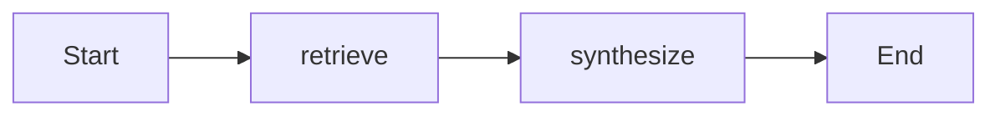

# Java 빠른 시작

이 가이드는 Java에서 AI 에이전트와 영속 워크플로우를 구축하는 과정을 안내합니다. 이 가이드를 마치면 JamJet 도구, 에이전트 전략, IR 컴파일, 타입 지정 워크플로우 상태가 어떻게 연결되는지, 그리고 *왜* 각 설계 선택이 프로덕션 에이전트 시스템에서 중요한지 이해하게 됩니다.

---

## 사전 요구사항

시작하기 전에 다음을 준비하세요:

- **Java 21+** — JamJet은 콜백 지옥 없이 논블로킹 I/O를 위해 가상 스레드(`Thread.ofVirtual`)를 사용합니다. 가상 스레드는 Java 21(JEP 444)에서 정식(비프리뷰) 기능입니다.
- **Maven 3.9+** 또는 **Gradle 8+** — Maven Central에서 의존성을 가져올 수 있는 빌드 도구면 됩니다.
- **실행 중인 JamJet 런타임** — 프로덕션 실행을 위해 필요합니다. 개발 중에는 모든 것을 인프로세스로 실행할 수 있으며(서버 불필요), 로컬 런타임은 다음과 같이 시작할 수 있습니다:
  ```bash
  jamjet dev
  ```
- **LLM API 키** — 환경 변수에 `OPENAI_API_KEY` 또는 `ANTHROPIC_API_KEY`를 설정하세요. 로컬 전용 개발의 경우 [Ollama](https://ollama.com)를 키 없이 사용할 수 있습니다.

> **팁:** 
> 런타임 없이도 이 가이드 전체를 따라할 수 있습니다. 인프로세스 실행기를 사용하면 워크플로우를 로컬에서 컴파일하고 검증하고 실행할 수 있습니다. 충돌 복구와 영속 상태가 필요할 때 런타임을 추가하세요.

---

## 의존성 추가

Java SDK는 Maven Central에 `dev.jamjet:jamjet-sdk`로 배포됩니다.

### Maven

```xml
<dependency>
    <groupId>dev.jamjet</groupId>
    <artifactId>jamjet-sdk</artifactId>
    <version>0.5.0</version>
</dependency>
```

### Gradle (Kotlin DSL)

```kotlin
implementation("dev.jamjet:jamjet-sdk:0.5.0")
```

### Gradle (Groovy DSL)

```groovy
implementation 'dev.jamjet:jamjet-sdk:0.5.0'
```

프로젝트가 Java 21 이상을 타겟으로 하는지 확인하세요. Maven의 경우:

```xml
<properties>
    <maven.compiler.source>21</maven.compiler.source>
    <maven.compiler.target>21</maven.compiler.target>
</properties>
```

---

## 도구 정의

도구는 에이전트와 외부 세계 간의 연결 고리입니다 — 웹 검색, 데이터베이스 쿼리, API 호출, 파일 I/O 등을 수행합니다. JamJet에서 도구는 `@Tool`로 어노테이션되고 `ToolCall<T>`를 구현하는 Java **record**입니다.

```java
import dev.jamjet.tool.Tool;
import dev.jamjet.tool.ToolCall;

@Tool(description = "Search the web for information about a topic")
record WebSearch(String query) implements ToolCall<String> {
    public String execute() {
        // 프로덕션에서는 여기서 검색 API를 호출하세요
        return "Results for '" + query + "': JamJet is a performance-first, "
                + "agent-native runtime and framework for AI agents.";
    }
}
```

### 왜 레코드를 사용하나요?

이 설계는 의도적입니다. Java 레코드는 에이전트 툴링에 중요한 세 가지 속성을 제공합니다:

1. **불변성** — 도구 호출의 파라미터는 생성 후 절대 변경되지 않습니다. 이를 통해 도구 호출을 안전하게 직렬화하고, 재실행하며, 감사할 수 있습니다. JamJet이 실패한 워크플로우를 재실행할 때, 정확히 동일한 파라미터로 동일한 도구 호출을 다시 실행합니다.

2. **자동 JSON 스키마 생성** — SDK가 레코드 컴포넌트(위의 `String query` 등)를 검사하여 LLM이 도구를 호출하는 데 필요한 JSON 스키마를 생성합니다. 수동 스키마 작성도, 어노테이션 범벅도, 코드와 스키마 간 불일치도 없습니다.

3. **구조적 동등성** — 두 개의 `WebSearch("jamjet")` 인스턴스는 동일합니다. 이를 통해 재시도 간 도구 호출의 중복 제거와 캐싱이 가능합니다.

`@Tool` 어노테이션은 LLM이 어떤 도구를 사용할지 결정할 때 보는 `description`을 제공합니다. 동료에게 도구를 설명하듯이 작성하세요 — 명확하고, 구체적이며, 행동 지향적으로.

> **참고:** 
> 도구 설계 패턴, 에이전트 전략, 각 전략을 언제 사용할지에 대한 심화 내용은 [Agentic AI Patterns](https://sunilprakash.com/agentic-ai)를 참조하세요.

---

## 에이전트 구축하기

에이전트는 모델, 도구, 인스트럭션, 그리고 **추론 전략**을 결합합니다. 전략은 에이전트가 *어떻게* 사고하는지를 결정합니다 — 단순히 *무엇을* 하는지만이 아닙니다.

```java
import dev.jamjet.agent.Agent;

var agent = Agent.builder("researcher")
        .model("claude-haiku-4-5-20251001")
        .tools(WebSearch.class)
        .instructions("당신은 유용한 연구 어시스턴트입니다. "
                + "항상 먼저 검색한 후, 철저한 요약을 제공하세요.")
        .strategy("react")
        .maxIterations(5)
        .build();
```

각 부분을 하나씩 살펴보겠습니다.

### `react` 전략

`.strategy("react")`를 설정하면, JamJet에게 **ReAct**(Reasoning + Acting) 루프를 사용하라고 지시하는 것입니다:

1. **사고(Thought)** — 모델이 다음에 무엇을 할지 추론합니다
2. **행동(Action)** — 모델이 도구를 호출합니다
3. **관찰(Observation)** — 도구 결과가 모델에 다시 전달됩니다
4. 모델이 최종 답변을 생성하거나 반복 제한에 도달할 때까지 반복합니다

이는 가장 일반적인 에이전트 전략입니다. 유연하기 때문입니다: 모델이 어떤 도구를 어떤 순서로 호출할지 동적으로 결정합니다. 정확한 단계 시퀀스를 예측할 수 없는 개방형 작업에 적합합니다.

JamJet은 세 가지 내장 전략을 지원합니다:

| 전략 | 언제 사용할까 | 작동 방식 |
|----------|-------------|--------------|
| `react` | 개방형 작업, 탐색적 연구 | 사고-행동-관찰 루프 |
| `plan-and-execute` | 사전 계획이 도움이 되는 구조화된 작업 | 계획 생성 후 각 단계를 순차적으로 실행 |
| `critic` | 품질 관리가 필요한 작업 | 초안 작성, 비평, 수정 루프 |

> **팁:** 
> 어떤 전략을 선택할지 확실하지 않으세요? `react`로 시작하세요. 에이전트가 방황하는 것이 보이면 `plan-and-execute`로 업그레이드하고, 속도보다 출력 품질이 중요하면 `critic`으로 전환하세요. 벤치마크는 [jamjet.dev/research의 전략 비교](https://jamjet.dev/research)를 참조하세요.

### 가드레일: 비용, 시간, 반복 횟수

프로덕션 에이전트에는 엄격한 제한이 필요합니다. 제한이 없으면 혼란스러운 모델이 루프에서 API 예산을 소진할 수 있습니다:

```java
var agent = Agent.builder("investment-researcher")
        .model("gpt-4o")
        .tools(WebSearch.class, FetchUrl.class, StoreNote.class)
        .instructions("""
                You are a professional investment research analyst.
                Search for recent news and financials, then produce
                a structured investment memo.
                """)
        .strategy("plan-and-execute")
        .maxIterations(6)
        .maxCostUsd(0.50)
        .timeoutSeconds(120)
        .build();
```

- **`maxIterations(6)`** — 에이전트는 완료되지 않았더라도 6번의 추론 단계 후 중지됩니다. 무한 루프를 방지합니다.
- **`maxCostUsd(0.50)`** — 런타임이 실시간으로 토큰 비용을 추적하고 지출이 50센트를 초과하면 에이전트를 중단합니다.
- **`timeoutSeconds(120)`** — 실제 시간 제한입니다. 에이전트가 2분 안에 완료되지 않으면 실행이 중단됩니다.

이것들은 제안이 아니라 런타임에서 강제되는 엄격한 제한입니다. JamJet 런타임은 끝이 아니라 *모든 단계 사이*에서 이를 확인합니다.

---

## 실행하기

에이전트를 구축한 후 실행하고 결과를 확인할 수 있습니다:

```java
public static void main(String[] args) {
    var agent = Agent.builder("researcher")
            .model("claude-haiku-4-5-20251001")
            .tools(WebSearch.class)
            .instructions("You are a helpful research assistant. "
                    + "Always search first, then provide a thorough summary.")
            .strategy("react")
            .maxIterations(5)
            .build();

    // Run the agent
    var result = agent.run("What is JamJet?");

    System.out.println(result.output());
    System.out.printf("Duration: %.2f ms%n", result.durationUs() / 1000.0);
    System.out.printf("Tool calls: %d%n", result.toolCalls().size());
}
```

```bash
export OPENAI_API_KEY=sk-...
mvn compile exec:java -Dexec.mainClass=com.example.MyAgent
```

### IR 컴파일: 내부 동작 방식

에이전트가 실행되기 전에 JamJet은 이를 중간 표현(IR)으로 **컴파일**합니다. IR은 Java SDK, Python SDK, YAML 워크플로에서 공유되는 표준 그래프 형식입니다. IR을 직접 검사할 수 있습니다:

```java
var ir = agent.compile();

System.out.println("workflow_id: " + ir.id());
System.out.println("start_node:  " + ir.startNode());
System.out.println("nodes:       " + ir.nodes().size());
System.out.println("edges:       " + ir.edges().size());
```

다음과 같은 결과가 출력됩니다:

```
workflow_id: researcher
start_node:  react_start
nodes:       3
edges:       4
```

왜 중요할까요? IR이 JamJet 런타임이 실제로 실행하는 것이기 때문입니다. Java, Python, YAML 중 어떤 것으로 에이전트를 작성하든 동일한 그래프 형식으로 컴파일됩니다. 즉:

- **이식성** — Java로 작성된 에이전트를 모든 JamJet 런타임에 배포 가능
- **검사** — 실행 전 실행 그래프를 검증하고 시각화 가능
- **내구성** — 런타임이 노드 경계에서 체크포인트를 생성하여 충돌 후 재개 가능

IR을 제출 전에 검증할 수도 있습니다:

```java
import dev.jamjet.ir.IrValidator;

IrValidator.validateOrThrow(ir);
```

이를 통해 런타임이 아닌 컴파일 시점에 구조적 문제(연결되지 않은 노드, 누락된 엣지, 잘못된 상태 스키마)를 포착합니다.

---

## 워크플로우 구축하기

에이전트는 모델이 수행할 작업을 결정하는 개방형 작업에 적합합니다. 하지만 많은 실제 시스템은 **결정적인 다단계 파이프라인**이 필요합니다 — 데이터 보강, RAG, 승인 체인, ETL 등. 이런 경우에는 **워크플로우**를 사용하세요.

핵심 차이점: 에이전트에서는 LLM이 실행 경로를 결정합니다. 워크플로우에서는 *개발자*가 실행 경로를 결정하고 LLM은 파이프라인의 한 단계일 뿐입니다.

다음은 2단계 RAG(검색 증강 생성) 워크플로우입니다:

```java
import dev.jamjet.workflow.Workflow;
import java.util.List;

// 타입이 지정된 상태 — Java 레코드
record RagState(
        String query,
        List<String> retrievedDocs,
        String answer) {}

var workflow = Workflow.<RagState>builder("rag-assistant")
        .version("1.0.0")
        .state(RagState.class)
        // 1단계: 관련 문서 검색
        .step("retrieve", state -> {
            var docs = searchKnowledgeBase(state.query());
            return new RagState(state.query(), docs, null);
        })
        // 2단계: 컨텍스트에서 답변 생성
        .step("synthesize", state -> {
            var context = String.join("\n\n", state.retrievedDocs());
            var answer = callLlm(state.query(), context);
            return new RagState(state.query(), state.retrievedDocs(), answer);
        })
        .build();
```

### 워크플로우를 통한 상태 흐름

각 단계는 현재 `RagState`를 받아 *새로운* `RagState`를 반환합니다. 상태는 항상 불변입니다 — 기존 레코드를 변경하지 않고 새 레코드를 생성합니다. 이것이 워크플로우를 지속 가능하게 만드는 요소입니다: 런타임이 "retrieve"와 "synthesize" 사이에 크래시되면, 마지막으로 완료된 체크포인트에서 저장된 정확한 상태로 재실행됩니다.

이 워크플로우의 실행 과정은 다음과 같습니다:



"retrieve" 단계는 `retrievedDocs`를 채웁니다. "synthesize" 단계는 이를 읽어 최종 `answer`를 생성합니다. 각 단계는 체크포인트로 저장됩니다 — 프로세스가 "retrieve" 완료 후 크래시되면, 런타임은 검색을 다시 실행하지 않고 "synthesize"에서 재개됩니다.

### 워크플로우 실행

```java
import dev.jamjet.workflow.ExecutionResult;
import java.util.ArrayList;

var initialState = new RagState(
        "JamJet은 동시 도구 호출을 어떻게 처리하나요?",
        new ArrayList<>(),
        null);

ExecutionResult<RagState> result = workflow.run(initialState);

System.out.println(result.state().answer());
System.out.printf("%.2f ms 동안 %d개의 단계 실행%n",
        result.totalDurationUs() / 1000.0, result.stepsExecuted());
```

### 에이전트 vs 워크플로우: 언제 무엇을 사용할지

| | 에이전트 | 워크플로우 |
|---|---|---|
| **제어 흐름** | LLM이 결정 | 개발자가 결정 |
| **최적 용도** | 개방형 작업, 리서치, 채팅 | 파이프라인, RAG, 승인 체인, ETL |
| **결정성** | 비결정적 (모델 주도) | 결정적 (코드 주도) |
| **내구성** | 전략 경계에서 체크포인트 | 모든 단계마다 체크포인트 |
| **도구** | 모델이 호출할 도구 선택 | 단계가 도구를 명시적으로 호출 |

두 가지를 조합할 수도 있습니다: 워크플로우를 외부 오케스트레이터로 사용하고 개별 단계 내부에 에이전트를 포함시키세요. 이를 통해 지능적인 하위 단계를 가진 결정적 파이프라인을 구축할 수 있습니다.

---

## 다음 단계

이제 작동하는 에이전트와 워크플로우를 갖추었습니다. 더 깊이 알아볼 수 있는 방향은 다음과 같습니다:

- **[Java SDK 레퍼런스](/java-sdk)** — 전체 API 커버리지: 조건부 라우팅, 평가, 상태 관리, 런타임 클라이언트, 어노테이션 기반 에이전트
- **[Spring Boot Starter 가이드](/spring-boot-starter)** — JamJet을 Spring AI, Spring Security, Micrometer 관찰 가능성과 통합
- **[LangChain4j 통합](/langchain4j)** — JamJet을 LangChain4j 에이전트를 위한 내구성 있는 실행 레이어로 사용
- **[핵심 개념](/concepts)** — 에이전트, 노드, 상태, 내구성에 대한 심층 설명
- **[GitHub 예제](https://github.com/jamjet-labs/jamjet/tree/main/sdk/java/examples)** — 기본 도구 플로우, 계획-실행 에이전트, RAG 어시스턴트를 포함한 실행 가능한 예제
- **[에이전트 AI 패턴](https://sunilprakash.com/agentic-ai)** — 전략 선택, 도구 설계, 에이전트 시스템을 위한 프로덕션 패턴

> **팁:** 
> 이미 Spring Boot를 사용 중이신가요? [Spring Boot Starter 가이드](/spring-boot-starter)로 바로 이동하세요 — 이 퀵스타트의 모든 내용을 헬스 체크, 메트릭, 감사 추적을 포함한 자동 구성으로 감싸줍니다.
