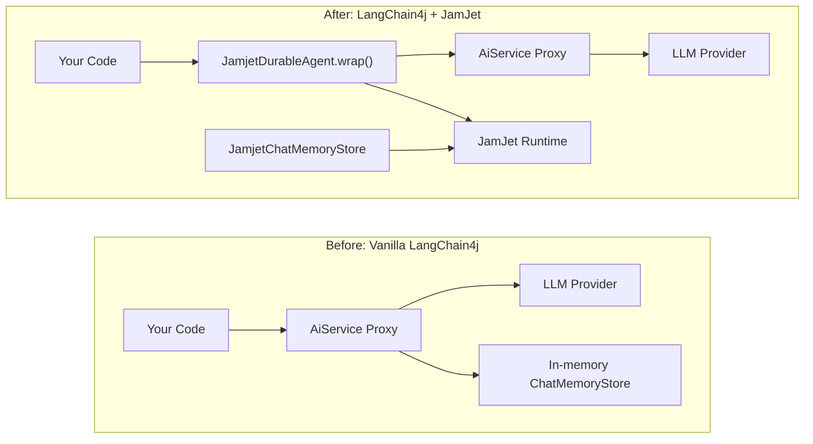

# LangChain4j 통합

JamJet은 자체 [Java SDK](/java-sdk)를 갖춘 완전한 에이전트 런타임입니다. LLM과 직접 통신하고, 도구를 관리하며, 내구성 있는 워크플로 IR로 컴파일하고, 런타임에서 비용 및 시간 가드레일을 적용합니다. 새 프로젝트의 경우 이 방식이 권장됩니다.

하지만 이미 프로덕션에서 LangChain4j 에이전트(`AiServices` 프록시, 채팅 메모리 저장소, 도구 바인딩)를 운영 중이라면 다시 작성할 필요가 없습니다. 이 통합은 기존 LangChain4j 코드를 JamJet의 내구성 실행 엔진으로 래핑하여 최소한의 변경으로 크래시 복구, 감사 추적, 리플레이 테스트를 제공합니다.

### 적용 전후 비교



왼쪽은 현재 사용 중인 구조입니다. 오른쪽은 기존 에이전트 앞에 내구성 프록시를 추가하고 JamJet 런타임을 통해 채팅 메모리를 영속화합니다. `AiService` 인터페이스, 도구 정의, LLM 설정은 변경되지 않습니다.

> **참고:**
> 새로운 Java 프로젝트의 경우 [Java SDK](/java-sdk)를 직접 사용하는 것을 고려하세요. LangChain4j 의존성 없이 네이티브 LLM 통합, 타입 지정 도구, 전략 선택, IR 컴파일을 제공합니다.

---

## 설정

### 1. 의존성 추가

통합 모듈은 Maven Central에 배포되어 있습니다. 런타임 클라이언트를 위해 `jamjet-spring-boot-starter`를 피어 의존성으로 필요로 합니다.

#### Maven

```xml
<dependency>
    <groupId>dev.jamjet</groupId>
    <artifactId>langchain4j-jamjet</artifactId>
    <version>0.1.0</version>
</dependency>
<dependency>
    <groupId>dev.jamjet</groupId>
    <artifactId>jamjet-spring-boot-starter</artifactId>
    <version>0.1.0</version>
</dependency>
```

#### Gradle (Kotlin DSL)

```kotlin
implementation("dev.jamjet:langchain4j-jamjet:0.1.0")
implementation("dev.jamjet:jamjet-spring-boot-starter:0.1.0")
```

#### Gradle (Groovy DSL)

```groovy
implementation 'dev.jamjet:langchain4j-jamjet:0.1.0'
implementation 'dev.jamjet:jamjet-spring-boot-starter:0.1.0'
```

### 2. JamJet 런타임 시작

런타임은 이벤트를 영속화하고 워크플로우 상태를 관리하는 실행 엔진입니다. Docker로 실행하세요:

```bash
docker run -p 7700:7700 ghcr.io/jamjet-labs/jamjet:latest
```

또는 CLI가 설치되어 있다면:

```bash
jamjet dev
```

### 3. 구성

`application.yml`에 런타임 URL을 추가하세요:

```yaml
spring:
  jamjet:
    runtime-url: http://localhost:7700
    # api-token: ${JAMJET_API_TOKEN}      # 선택 사항, 인증된 런타임용
    # tenant-id: default                   # 멀티 테넌트 격리
    durability-enabled: true
```

---

## 기존 에이전트 래핑

프로덕션에서 이미 사용 중인 LangChain4j `AiService`가 있다고 가정해 봅시다:

**기존 코드 (변경 불필요):**

```java
import dev.langchain4j.service.AiServices;
import dev.langchain4j.model.openai.OpenAiChatModel;

interface ResearchAssistant {
    String research(String topic);
}

var model = OpenAiChatModel.builder()
        .apiKey(System.getenv("OPENAI_API_KEY"))
        .modelName("gpt-4o")
        .build();

ResearchAssistant assistant = AiServices.create(ResearchAssistant.class, model);
```

**한 번의 호출로 내구성 추가:**

```java
import dev.jamjet.langchain4j.JamjetDurableAgent;
import dev.jamjet.spring.client.JamjetRuntimeClient;

// client는 jamjet-spring-boot-starter에 의해 자동 구성되거나,
// JamjetConfig로 수동으로 빌드할 수 있습니다 (아래 구성 참조)
ResearchAssistant durable = JamjetDurableAgent.wrap(
        assistant,                // 기존 AiService 프록시
        ResearchAssistant.class,  // 인터페이스 타입
        client                    // JamjetRuntimeClient
);

// 이전과 동일하게 사용 — 인터페이스는 변경되지 않았습니다
String result = durable.research("양자 오류 정정");
```

이것이 전부입니다. 호출 코드, 인터페이스 정의, 도구 어노테이션, 모델 구성은 그대로 유지됩니다.

### 내부 동작 방식

`JamjetDurableAgent.wrap()`을 호출하면 `AiService` 인터페이스를 감싸는 JDK 동적 프록시(`java.lang.reflect.Proxy`)가 생성됩니다. 래핑된 프록시의 모든 메서드 호출은 다음 순서로 진행됩니다:

1. **워크플로우 IR 구축** — 프록시는 단일 `LlmGenerate` 노드를 가진 `langchain4j-{InterfaceName}-{methodName}`이라는 경량 중간 표현을 구성합니다. 이 IR은 JamJet의 네이티브 SDK 및 Rust 런타임에서 사용하는 것과 동일한 형식입니다.

2. **워크플로우 생성 및 실행 시작** — 프록시는 `client.createWorkflow(ir)`를 호출한 다음 `client.startExecution(workflowId, ...)`를 호출합니다. 이제 실행은 고유한 실행 ID로 JamJet 런타임에 의해 추적됩니다.

3. **델리게이트 호출** — 원본 `AiService` 프록시가 실제 LLM 호출을 처리합니다. 도구, 메모리, 모델 구성이 모두 이전과 동일하게 작동합니다.

4. **완료 또는 실패 기록** — 성공 시, 프록시는 `status=completed` 및 결과와 함께 `completion` 이벤트를 보냅니다. 실패 시, 오류 메시지와 함께 `status=failed`를 기록합니다.

5. **우아한 성능 저하** — JamJet 런타임에 도달할 수 없는 경우(네트워크 파티션, 컨테이너 미시작), 프록시는 경고를 로깅하고 원본 `AiService`에 직접 위임합니다. JamJet이 다운되었다고 해서 애플리케이션이 실패하지 않습니다.

---

## 구성

Spring Boot를 사용하는 경우, `JamjetRuntimeClient`는 `application.yml` 속성에서 자동으로 구성됩니다([Spring Boot Starter](/spring-boot-starter) 가이드 참조). Spring 외부의 독립 실행형 사용을 위해서는 `JamjetConfig`를 사용하여 클라이언트를 수동으로 빌드하세요:

```java
import dev.jamjet.langchain4j.JamjetConfig;

var config = new JamjetConfig()
        .runtimeUrl("http://localhost:7700")
        .apiToken("your-token")
        .tenantId("default")
        .connectTimeout(10)
        .readTimeout(120);

var client = config.buildClient();
```

### 구성 옵션

| 옵션 | 메서드 | 기본값 | 설명 |
|--------|--------|---------|-------------|
| 런타임 URL | `.runtimeUrl(String)` | `http://localhost:7700` | JamJet 런타임 주소 |
| API 토큰 | `.apiToken(String)` | `null` | 보안 런타임 인증 토큰 |
| 테넌트 ID | `.tenantId(String)` | `"default"` | 멀티 테넌트 격리 식별자 |
| 연결 타임아웃 | `.connectTimeout(int)` | `10` (초) | TCP 연결 타임아웃 |
| 읽기 타임아웃 | `.readTimeout(int)` | `120` (초) | 장기 실행 작업의 HTTP 읽기 타임아웃 |

모든 옵션은 플루언트 빌더 패턴을 사용합니다. `JamjetConfig`는 `.buildClient()`를 통해 `JamjetRuntimeClient`를 생성하며, 이는 Spring Boot 자동 구성에서 사용되는 클라이언트 타입과 동일합니다.

---

## 영구 채팅 메모리

LangChain4j는 `ChatMemoryStore` 인터페이스를 통해 대화 기록을 저장합니다. 기본 구현은 인메모리 방식으로, 프로세스가 재시작되면 모든 대화 기록이 손실됩니다.

`JamjetChatMemoryStore`는 JamJet 런타임의 감사 이벤트 시스템을 통해 대화 기록을 영구 저장합니다. 메시지는 LangChain4j의 내장 `ChatMessageSerializer`를 사용하여 JSON으로 직렬화되고 외부 이벤트로 저장되어, 재시작 후에도 유지되며 감사 API를 통해 조회할 수 있습니다.

```java
import dev.jamjet.langchain4j.JamjetChatMemoryStore;
import dev.langchain4j.memory.chat.MessageWindowChatMemory;

var memoryStore = new JamjetChatMemoryStore(client);

var memory = MessageWindowChatMemory.builder()
        .maxMessages(20)
        .chatMemoryStore(memoryStore)
        .build();

// 평소처럼 AiService와 함께 사용
ResearchAssistant assistant = AiServices.builder(ResearchAssistant.class)
        .chatLanguageModel(model)
        .chatMemory(memory)
        .build();
```

### 작동 방식

| 작업 | 동작 내용 |
|-----------|-------------|
| `getMessages(memoryId)` | 메모리 ID와 연결된 최신 `chat_memory` 이벤트를 JamJet 감사 추적에서 조회합니다. 저장된 JSON을 `ChatMessage` 객체로 역직렬화합니다. 히스토리가 없으면 빈 목록을 반환합니다. |
| `updateMessages(memoryId, messages)` | 모든 메시지를 JSON으로 직렬화하고 `chat_memory` 외부 이벤트를 런타임으로 전송하여 페이로드와 함께 메시지 수를 기록합니다. |
| `deleteMessages(memoryId)` | `memory_cleared` 이벤트를 런타임으로 전송합니다. 이벤트 로그는 추가 전용이므로 삭제는 이전 항목을 제거하는 대신 사실로 기록됩니다. |

세 가지 작업 모두 graceful하게 저하됩니다 — JamJet 런타임에 연결할 수 없는 경우 스토어는 경고를 로깅하고 빈 결과를 반환하거나(읽기의 경우) 쓰기를 조용히 삭제합니다. 이는 `JamjetDurableAgent`가 사용하는 동일한 graceful 저하 패턴과 일치합니다.

---

## 제공되는 기능

LangChain4j 에이전트를 JamJet으로 래핑하면 애플리케이션 코드를 변경하지 않고도 다음 기능이 추가됩니다:

| 기능 | JamJet 없이 | JamJet 사용 시 |
|------------|---------------|-------------|
| **크래시 복구** | 프로세스 종료 시 상호작용 손실, 토큰 낭비 | 런타임이 실행을 추적하고 재시작 후 재개 가능 |
| **감사 추적** | 발생한 일에 대한 기록 없음 | 모든 메서드 호출이 인수, 결과 및 상태와 함께 불변 이벤트로 기록됨 |
| **리플레이 테스트** | 테스트하려면 실제 LLM 호출 필요 | 기록된 실행을 테스트 스위트에서 재생, LLM 호출 불필요 |
| **비용 추적** | 수동 토큰 집계 | 실행 이벤트에 비용 귀속을 위한 메서드 이름과 인수 포함 |
| **관찰 가능성** | 애플리케이션 수준 로깅만 가능 | 분산 추적 상관관계를 위한 실행 ID, Spring Boot 스타터를 통한 Micrometer 메트릭 제공 |
| **채팅 메모리 영속성** | 인메모리 전용, 재시작 시 손실 | JamJet 감사 이벤트 시스템을 통한 영속성, 재시작에도 유지됨 |

---

## 래핑된 에이전트 테스트

`jamjet-spring-boot-starter-test` 모듈은 래핑된 LangChain4j 에이전트와 함께 작동합니다. `JamjetDurableAgent.wrap()`이 JamJet 실행을 생성하므로, `@ReplayExecution`을 사용하여 테스트에서 재생할 수 있습니다.

```java
import dev.jamjet.spring.test.annotations.WithJamjetRuntime;
import dev.jamjet.spring.test.annotations.ReplayExecution;
import dev.jamjet.spring.test.RecordedExecution;
import dev.jamjet.spring.test.AgentAssertions;
import org.junit.jupiter.api.Test;
import java.util.concurrent.TimeUnit;

@WithJamjetRuntime
class ResearchAssistantTest {

    @Test
    @ReplayExecution("exec-lc4j-abc123")
    void wrappedAgentProducesConsistentOutput(RecordedExecution execution) {
        AgentAssertions.assertThat(execution)
                .completedSuccessfully()
                .completedWithin(30, TimeUnit.SECONDS)
                .outputContains("quantum");
    }
}
```

테스트 의존성을 추가하세요:

```xml
<dependency>
    <groupId>dev.jamjet</groupId>
    <artifactId>jamjet-spring-boot-starter-test</artifactId>
    <version>0.1.0</version>
    <scope>test</scope>
</dependency>
```

전체 테스트 API — `RecordedExecution` 필드, `AgentAssertions` 플루언트 API, `DeterministicModelStub`, 노드 지점 재생 — 에 대해서는 [Spring Boot Starter](/spring-boot-starter) 가이드의 테스트 섹션을 참조하세요.

---

## 다음 단계

- **[Java SDK 레퍼런스](/java-sdk)** — 신규 프로젝트의 경우, JamJet의 네이티브 Java SDK는 LangChain4j 의존성 없이 직접적인 LLM 통합, 타입 기반 도구, 전략 선택, IR 컴파일을 제공합니다
- **[Java 퀵스타트](/java-quickstart)** — 네이티브 SDK로 처음부터 첫 에이전트와 워크플로우를 구축하세요
- **[Spring Boot Starter](/spring-boot-starter)** — 자동 구성된 내구성, 감사 추적, 휴먼-인-더-루프 승인, 관측성을 갖춘 완전한 Spring AI 통합
- **[Agentic AI 패턴](https://sunilprakash.com/agentic-ai)** — 에이전트 시스템을 위한 전략 선택, 도구 설계, 프로덕션 패턴
