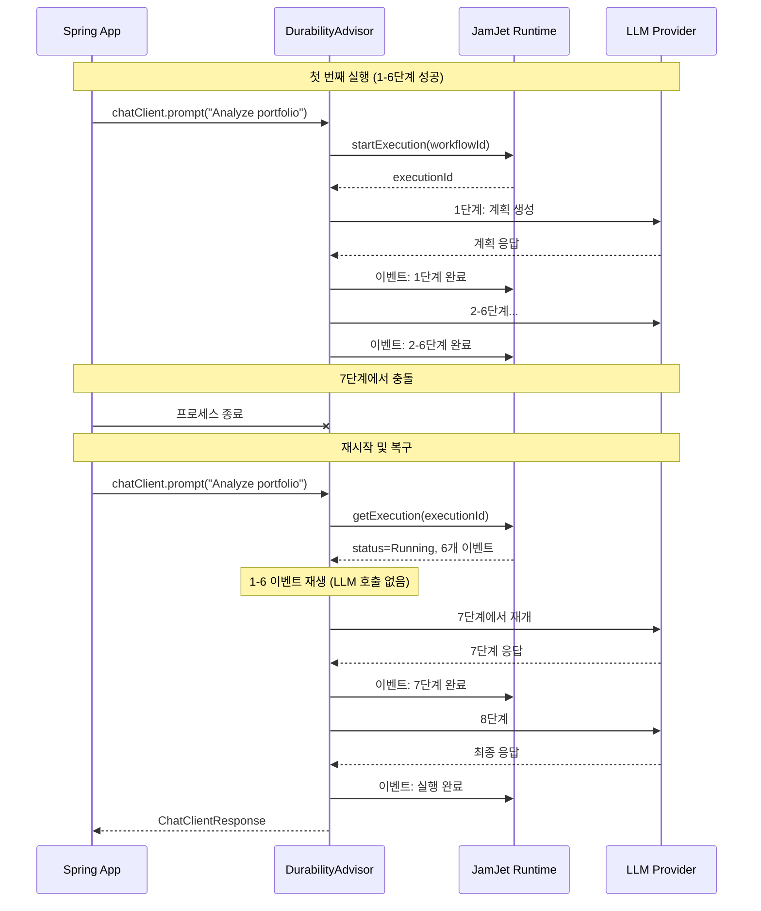
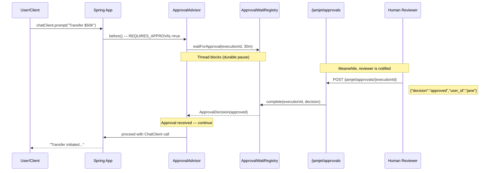
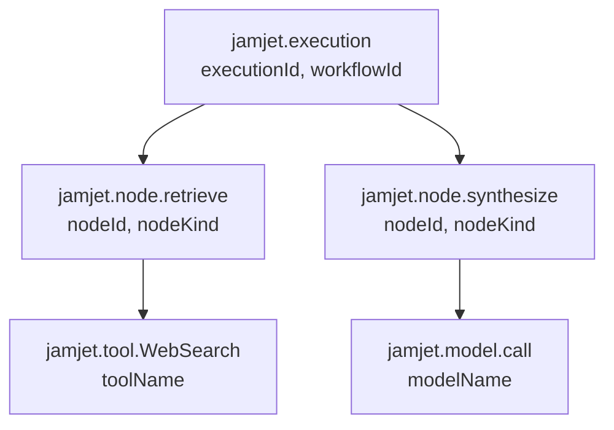

# Spring Boot 스타터

이 가이드는 JamJet Spring Boot 통합의 전체 내용을 다룹니다: AI 에이전트에서 내구성이 중요한 이유, 각 advisor가 내부적으로 작동하는 방식, 에이전트를 결정론적으로 테스트하는 방법, 프로덕션 환경에서 모니터링하는 방법. 이 가이드를 마치면 모든 LLM 호출이 크래시 복구 가능하고, 감사되며, 관찰 가능한 Spring AI 애플리케이션을 구축할 수 있습니다.

---

## AI 에이전트에서 내구성이 중요한 이유

Spring AI는 LLM 기반 애플리케이션을 구축하기 위한 깔끔한 추상화를 제공합니다. `ChatClient`, advisor, 도구 호출, 모델 이식성을 제공합니다. 하지만 런타임에 문제가 발생했을 때 보호 기능은 제공하지 않습니다.

Spring AI 에이전트가 다단계 작업을 진행하는 도중 --- 검색 도구를 호출하고, 결과를 검색하고, 답변을 종합하려는 시점에 --- 프로세스가 크래시된다고 생각해보세요. 일반 Spring AI에서는 전체 상호작용이 손실됩니다. 사용자는 오류를 보게 되고, 이미 사용한 토큰은 낭비되며, 무슨 일이 일어났는지 기록도 남지 않습니다.

이것이 바로 **내구성 실행**이 해결하는 문제입니다. JamJet은 에이전트의 모든 상호작용 단계를 불변 이벤트로 기록합니다. 프로세스가 크래시되고 재시작되면, 해당 이벤트를 재생하여 정확히 중단된 지점부터 재개합니다. 작업 손실도, 토큰 낭비도, 사용자에게 보이는 실패도 없습니다.

내구성은 이것 없이는 불가능한 기능들도 가능하게 합니다:

- **감사 추적** --- 모든 프롬프트, 응답, 도구 호출, 토큰 수가 불변 이벤트로 기록됩니다. 규제 산업(금융 서비스, 의료, 법률)에 필수입니다.
- **휴먼-인-더-루프 승인** --- 에이전트 실행을 중간에 일시 중지하고, 사람의 승인이나 거부를 기다린 후 재개합니다. 일시 중지는 내구성이 있어 재시작에도 유지됩니다.
- **재생 테스트** --- 프로덕션 실행을 테스트 환경에서 재생하고 결과를 검증합니다. LLM 호출이 필요 없습니다.
- **비용 추적** --- 실행당, 사용자당, 워크플로우당 실제 토큰 비용을 집계합니다.

JamJet을 구축한 이유와 해결하는 문제에 대한 더 자세한 배경은 [Why We Built JamJet](https://jamjet.dev/blog/why-we-built-jamjet)을 참조하세요.

---

## 설정

### 1. 의존성 추가

스타터는 Maven Central에 게시되어 있습니다. 단일 의존성을 추가하면 Spring Boot 자동 구성이 나머지를 처리합니다.

#### Maven

```xml
<dependency>
    <groupId>dev.jamjet</groupId>
    <artifactId>jamjet-spring-boot-starter</artifactId>
    <version>0.2.0</version>
</dependency>
```

#### Gradle (Kotlin DSL)

```kotlin
implementation("dev.jamjet:jamjet-spring-boot-starter:0.2.0")
```

#### Gradle (Groovy DSL)

```groovy
implementation 'dev.jamjet:jamjet-spring-boot-starter:0.2.0'
```

### 2. JamJet 런타임 시작

런타임은 이벤트를 영속화하고 워크플로 상태를 관리하는 실행 엔진입니다. Docker로 실행하세요:

```bash
docker run -p 7700:7700 ghcr.io/jamjet-labs/jamjet:latest
```

또는 CLI가 설치된 경우:

```bash
jamjet dev
```

### 3. 구성

`application.yml`에 런타임 URL을 추가하세요:

```yaml
spring:
  jamjet:
    runtime-url: http://localhost:7700
    # api-token: ${JAMJET_API_TOKEN}      # 선택사항, 인증된 런타임용
    # tenant-id: default                   # 멀티 테넌트 격리
    durability-enabled: true               # 기본값: true
    connect-timeout-seconds: 10            # 기본값: 10
    read-timeout-seconds: 120              # 기본값: 120
```

또는 `application.properties`에:

```properties
spring.jamjet.runtime-url=http://localhost:7700
```

### 자동 구성의 역할

`JamjetAutoConfiguration`이 클래스패스에서 Spring AI의 `ChatClient`를 감지하고 `spring.jamjet.durability-enabled=true`(기본값)인 경우 다음 빈을 등록합니다:

| 빈 | 조건 | 목적 |
|------|-----------|---------|
| `JamjetRuntimeClient` | 항상 (내구성 활성화 시) | JamJet 런타임에 대한 HTTP 클라이언트 |
| `JamjetDurabilityAdvisor` | 항상 (내구성 활성화 시) | 모든 ChatClient 호출을 내구성 실행으로 래핑 |
| `ChatClientCustomizer` | 항상 (내구성 활성화 시) | 모든 ChatClient 인스턴스에 내구성 어드바이저 자동 주입 |
| `JamjetAuditAdvisor` | `spring.jamjet.audit.enabled=true` (기본값) | 프롬프트, 응답 및 토큰 사용량을 감사 이벤트로 기록 |
| `JamjetAuditService` | `spring.jamjet.audit.enabled=true` (기본값) | 감사 추적에 대한 프로그래밍 방식 액세스 |
| `JamjetApprovalAdvisor` | `spring.jamjet.approval.enabled=true` (옵트인) | 사람의 승인을 위해 실행 일시 중지 |
| `JamjetApprovalController` | 승인 활성화 + 웹 애플리케이션 | `/jamjet/approvals`의 REST 엔드포인트 |
| `JamjetMicrometerBridge` | 클래스패스에 Micrometer (기본값) | 실행 메트릭 게시 |
| `JamjetOtelBridge` | `spring.jamjet.observability.opentelemetry=true` (옵트인) | OpenTelemetry 스팬 생성 |

내구성 어드바이저는 `ChatClientCustomizer`를 통해 주입되므로 수동으로 추가할 필요가 없습니다. 자동 구성된 `ChatClient.Builder`에서 빌드하는 모든 `ChatClient`는 자동으로 내구성을 갖습니다.

### 우아한 성능 저하

JamJet 런타임을 사용할 수 없는 경우 --- 네트워크 파티션, 컨테이너 미시작, 인증 실패 등 --- `JamjetDurabilityAdvisor`는 경고를 로깅하고 내구성 없이 요청을 진행합니다. JamJet이 다운되었다고 해서 애플리케이션이 실패하지 않습니다. 이는 의도적인 설계입니다: 내구성은 안전망이지, 단일 장애 지점이 아닙니다.

---

## Durability Advisor

`JamjetDurabilityAdvisor`는 통합의 핵심입니다. Spring AI의 `BaseAdvisor` 인터페이스를 구현하며, 모든 `ChatClient` 호출을 가로채 내구성 실행으로 감쌉니다.

### Spring 개발자를 위한 이벤트 소싱

이벤트 소싱을 다뤄본 적이 없다면, 핵심 아이디어는 다음과 같습니다: 작업의 *현재 상태*만 저장하는 대신, 그 상태에 이르게 한 모든 *이벤트*를 저장합니다. 현재 상태는 파생된 뷰입니다 --- 처음부터 이벤트를 재생하여 언제든 재구성할 수 있습니다.

AI 에이전트의 경우, 이는 모든 LLM 호출, 모든 도구 실행, 모든 상태 변경이 JamJet 런타임에 불변 이벤트로 기록된다는 의미입니다. 이벤트 로그가 진실의 원천입니다.

이것이 왜 중요할까요? 충돌 복구를 무료로 제공하기 때문입니다. 프로세스가 어느 시점에서 죽더라도, 마지막으로 완료된 이벤트까지 이벤트 로그를 재생하고 그 지점부터 재개합니다. 데이터 손실도, 중복 작업도 없습니다.

### 충돌 복구 과정

8단계를 수행하는 에이전트를 생각해보세요: 컨텍스트 검색, LLM 호출, 도구 실행, LLM 재호출 등. 프로세스가 7단계에서 충돌하면 다음과 같은 일이 발생합니다:



재시작 시 1단계부터 6단계까지는 **재실행되지 않습니다**. advisor는 런타임에서 해당 이벤트를 읽어 상태를 재구성합니다. 실제로 LLM을 호출하는 것은 7단계(및 이후)뿐입니다. 이를 통해 토큰과 시간이 절약됩니다.

### 변경 전후 비교

핵심 통찰: **애플리케이션 코드는 변경되지 않습니다**. 내구성은 어드바이저에서 제공되며, 비즈니스 로직에서 제공되는 것이 아닙니다.

**JamJet 없이** (순수 Spring AI):

```java
@Bean
ChatClient chatClient(ChatClient.Builder builder) {
    return builder.build();
}

@Bean
CommandLineRunner demo(ChatClient chatClient) {
    return args -> {
        String result = chatClient.prompt("Summarize AI trends")
                .call()
                .content();
        System.out.println(result);
        // 프로세스가 여기서 크래시되면 모든 것이 손실됩니다
    };
}
```

**JamJet 사용** (동일한 코드, 내구성은 자동 구성에서 제공):

```java
@Bean
ChatClient chatClient(ChatClient.Builder builder) {
    return builder.build(); // JamjetDurabilityAdvisor 자동 주입됨
}

@Bean
CommandLineRunner demo(ChatClient chatClient) {
    return args -> {
        String result = chatClient.prompt("Summarize AI trends")
                .call()
                .content();
        System.out.println(result);
        // 내구성 보장 — 크래시에도 살아남고, 이벤트가 저장되며, 실행이 추적됩니다
    };
}
```

유일한 차이는 클래스패스의 의존성입니다. `JamjetAutoConfiguration`이 등록한 `ChatClientCustomizer`는 모든 `ChatClient.Builder`에 `JamjetDurabilityAdvisor`를 자동으로 추가합니다.

### 컨텍스트 키

내구성 어드바이저는 실행 상태를 추적하기 위해 세 가지 컨텍스트 키를 사용합니다:

| 키 | 타입 | 설명 |
|-----|------|------|
| `jamjet.execution.id` | `String` | 런타임이 할당한 고유 실행 ID |
| `jamjet.workflow.id` | `String` | 워크플로 ID (컴파일된 IR에서 파생됨) |
| `jamjet.session.id` | `String` | 관련된 상호작용을 그룹화하기 위한 세션 ID |

이 값들은 응답 컨텍스트에서 읽어 로깅, 상관관계 분석 또는 후속 처리에 활용할 수 있습니다.

내구성이 가능하게 하는 에이전틱 패턴 --- ReAct 루프, 계획-실행, 비평 체인 --- 에 대한 자세한 내용은 [Agentic AI Patterns](https://sunilprakash.com/agentic-ai)를 참고하세요.

---

## 감사 어드바이저

`JamjetAuditAdvisor`는 모든 프롬프트, 응답 및 토큰 사용량을 JamJet 런타임의 불변 감사 이벤트로 기록합니다. 내구성 어드바이저 이후 어드바이저 체인에서 실행되며(순서 `LOWEST_PRECEDENCE - 50`), 모든 감사 항목은 내구성 있는 실행 ID와 연결됩니다.

### 감사 추적이 중요한 이유

금융 서비스, 의료, 보험, 법률 등 엔터프라이즈 환경에서 AI 에이전트를 구축하는 경우, 기록 보관과 관련된 규제 요구사항을 충족해야 합니다. 규제 기관은 다음을 확인하고자 합니다:

- 모델에 어떤 프롬프트가 전송되었는가?
- 모델이 어떻게 응답했는가?
- 얼마나 많은 토큰이 소비되었는가 (그리고 비용은 얼마인가)?
- 어떤 사용자가 상호작용을 시작했는가?
- 6개월 후에도 이 상호작용을 재현할 수 있는가?

감사 추적이 없으면 이러한 질문에 답할 수 없습니다. `JamjetAuditAdvisor`는 기본적으로 이 모든 질문에 대한 답을 제공합니다.

### 감사 이벤트 구조

각 감사 항목은 실행의 외부 이벤트로 저장됩니다. 프롬프트 감사 이벤트의 예시는 다음과 같습니다:

```json
{
  "type": "prompt",
  "advisor": "JamjetAuditAdvisor",
  "content": "Analyze the risk profile of portfolio XYZ-1234"
}
```

그리고 해당 응답 이벤트:

```json
{
  "type": "response",
  "advisor": "JamjetAuditAdvisor",
  "content": "Based on the current allocation, portfolio XYZ-1234 has...",
  "prompt_tokens": 847,
  "completion_tokens": 1203,
  "total_tokens": 2050
}
```

### 구성

감사는 **기본적으로 활성화**되어 있습니다. 기록되는 내용을 제어할 수 있습니다:

```yaml
spring:
  jamjet:
    audit:
      enabled: true              # 기본값: true
      include-prompts: true      # 기본값: true — 전체 프롬프트 텍스트 기록
      include-responses: true    # 기본값: true — 전체 응답 텍스트 기록
```

감사 추적은 필요하지만 PII나 민감한 프롬프트 내용을 저장해서는 안 되는 규제 환경의 경우:

```yaml
spring:
  jamjet:
    audit:
      enabled: true
      include-prompts: false     # 감사 이벤트에서 프롬프트 텍스트 제외
      include-responses: false   # 감사 이벤트에서 응답 텍스트 제외
```

이렇게 하면 실제 내용을 저장하지 않으면서도 상호작용이 발생했다는 *사실* 자체(실행 ID, 타임스탬프, 토큰 수)는 여전히 기록됩니다. 에이전트 시스템에서의 PII 처리 및 데이터 거버넌스에 대한 자세한 내용은 [데이터 거버넌스 및 PII 보관](https://jamjet.dev/blog/data-governance-pii-retention)을 참조하세요.

---

## 사람 개입 승인

`JamjetApprovalAdvisor`는 지속 가능한 일시 정지 및 재개 패턴을 구현합니다. 에이전트는 실행 중간에 일시 정지하고, REST 엔드포인트를 통해 사람이 승인하거나 거부할 때까지 대기한 후 계속 진행하거나 중단합니다. 일시 정지가 지속 가능한 실행 엔진으로 뒷받침되기 때문에 프로세스 재시작 시에도 유지됩니다.

### 승인 게이트를 사용해야 하는 경우

승인 게이트는 에이전트가 실행하기 전에 사람이 계획을 검토해야 하는 중요한 작업에 사용됩니다:

- 임계값을 초과하는 금융 거래
- 고객 대면 커뮤니케이션
- 프로덕션 환경의 데이터베이스 변경
- 법적 또는 규정 준수 관련 작업

### 승인 활성화

승인은 **옵트인** 방식입니다(기본적으로 비활성화):

```yaml
spring:
  jamjet:
    approval:
      enabled: true
      webhook-url: https://hooks.slack.com/services/T.../B.../xxx  # 선택 사항
      timeout: 30m            # 기본값: 30m (s, m, h 접미사 지원)
      default-decision: rejected   # 기본값: rejected — 타임아웃 시 처리 방식
```

| 속성 | 기본값 | 설명 |
|----------|---------|-------------|
| `spring.jamjet.approval.enabled` | `false` | 승인 워크플로우 활성화 |
| `spring.jamjet.approval.webhook-url` | --- | 알림용 외부 웹훅(Slack, 이메일 등) |
| `spring.jamjet.approval.timeout` | `30m` | 타임아웃 전 최대 대기 시간(`s`, `m`, `h` 지원) |
| `spring.jamjet.approval.default-decision` | `rejected` | 타임아웃 시 적용되는 결정: `approved` 또는 `rejected` |

### 승인 트리거

특정 요청에 승인이 필요하다고 표시하려면 `jamjet.approval.required` 컨텍스트 키를 설정하세요:

```java
String result = chatClient.prompt("계좌 9876으로 $50,000 이체")
        .advisors(approvalAdvisor)  // 또는 자동 주입
        .context("jamjet.approval.required", true)
        .call()
        .content();
// 승인이 수신될 때까지(또는 타임아웃까지) 스레드가 차단됨
```

### 승인 플로우



### REST를 통한 승인 또는 거부

승인이 활성화되면 자동 구성은 두 개의 엔드포인트를 가진 `JamjetApprovalController`를 등록합니다:

**실행 승인:**

```bash
curl -X POST http://localhost:8080/jamjet/approvals/{executionId} \
  -H "Content-Type: application/json" \
  -d '{
    "decision": "approved",
    "user_id": "jane.doe",
    "comment": "검토 및 승인됨"
  }'
```

**실행 거부:**

```bash
curl -X POST http://localhost:8080/jamjet/approvals/{executionId} \
  -H "Content-Type: application/json" \
  -d '{
    "decision": "rejected",
    "user_id": "jane.doe",
    "comment": "금액이 정책 한도를 초과함"
  }'
```

**대기 중인 승인 목록 조회:**

```bash
curl http://localhost:8080/jamjet/approvals/pending
```

거부가 수신되면 어드바이저는 실행 ID와 검토자의 코멘트를 포함한 `ApprovalRejectedException`을 발생시킵니다.

승인 요청 본문은 다음 필드를 지원합니다:

| 필드 | 타입 | 필수 | 설명 |
|-------|------|----------|-------------|
| `decision` | `String` | 예 | `"approved"` 또는 `"rejected"` |
| `user_id` | `String` | 아니오 | 검토자의 식별자 |
| `comment` | `String` | 아니오 | 사람이 읽을 수 있는 근거 |
| `node_id` | `String` | 아니오 | 승인할 특정 노드 (고급) |
| `state_patch` | `Map<String, Object>` | 아니오 | 승인 시 적용할 상태 수정 사항 |

에이전트 시스템의 휴먼-인-더-루프 패턴에 대한 자세한 내용은 [Agentic AI Patterns](https://sunilprakash.com/agentic-ai)를 참조하세요.

---

## 테스트

AI 에이전트는 테스트하기 매우 어렵습니다. LLM은 비결정적입니다 --- 동일한 프롬프트가 호출할 때마다 다른 출력을 생성할 수 있습니다. 실제 API에 대해 테스트를 실행하면 토큰 비용이 증가합니다. 그리고 매번 변하는 출력에 대해 단언하기가 어렵습니다.

JamJet의 테스트 모듈은 두 가지 보완적 접근 방식으로 이를 해결합니다: **재생 테스트** (LLM을 호출하지 않고 실제 실행을 재생)와 **결정적 스텁** (LLM을 패턴 매칭된 가짜로 대체).

### 테스트 의존성 추가

```xml
<dependency>
    <groupId>dev.jamjet</groupId>
    <artifactId>jamjet-spring-boot-starter-test</artifactId>
    <version>0.2.0</version>
    <scope>test</scope>
</dependency>
```

### `@WithJamjetRuntime`와 `@ReplayExecution`을 사용한 재생 테스트

재생 테스트는 프로덕션 실행을 캡처하여 테스트 스위트에서 재생합니다. 테스트는 JamJet 런타임에 연결하고(Testcontainers를 통해), 실행의 이벤트 로그를 가져와서 결과를 검증할 수 있습니다 --- LLM 호출 없이.

```java
import dev.jamjet.spring.test.annotations.WithJamjetRuntime;
import dev.jamjet.spring.test.annotations.ReplayExecution;
import dev.jamjet.spring.test.RecordedExecution;
import dev.jamjet.spring.test.AgentAssertions;
import org.junit.jupiter.api.Test;
import java.util.concurrent.TimeUnit;

@WithJamjetRuntime
class PortfolioAgentTest {

    @Test
    @ReplayExecution("exec-abc123")
    void agentProducesConsistentOutput(RecordedExecution execution) {
        AgentAssertions.assertThat(execution)
                .completedSuccessfully()
                .usedTool("WebSearch")
                .completedWithin(30, TimeUnit.SECONDS)
                .costLessThan(0.50);
    }

    @Test
    @ReplayExecution(value = "exec-abc123", forkAtNode = "retrieve")
    void forkAndRerunFromRetrieveStep(RecordedExecution execution) {
        AgentAssertions.assertThat(execution)
                .nodeCompleted("retrieve")
                .outputContains("portfolio");
    }
}
```

`@WithJamjetRuntime`는 테스트 전에 JamJet 런타임 컨테이너를 시작하는 JUnit 5 확장입니다. 이미지와 태그를 설정할 수 있습니다:

```java
@WithJamjetRuntime(image = "ghcr.io/jamjet-labs/jamjet", tag = "0.3.1")
```

`@ReplayExecution`은 재생할 실행을 지정합니다. 선택적 `forkAtNode` 매개변수를 사용하면 특정 노드에서 실행을 분기할 수 있습니다 --- "X 단계의 출력을 변경하면 어떻게 될까?"를 테스트할 때 유용합니다.

### `RecordedExecution` 레코드

`RecordedExecution`은 재생된 실행에 대한 모든 정보를 캡처합니다:

| 필드 | 타입 | 설명 |
|-------|------|-------------|
| `executionId` | `String` | 고유 실행 ID |
| `workflowId` | `String` | 워크플로 ID |
| `status` | `String` | 최종 상태 (`Completed`, `Failed`, `Cancelled`) |
| `input` | `Object` | 실행을 시작한 입력 |
| `finalState` | `Object` | 모든 노드 완료 후 최종 상태 |
| `events` | `List<ExecutionEvent>` | 전체 이벤트 로그 |
| `nodes` | `List<NodeExecution>` | 노드별 실행 세부 정보 |
| `totalDuration` | `Duration` | 실제 소요 시간 |
| `toolCallCount` | `int` | 총 도구 호출 수 |
| `totalCostUsd` | `double` | 집계된 토큰 비용 |

각 `NodeExecution`은 `nodeId`, `kind`, `status`, `input`, `output`, `duration`, `retryCount`를 포함합니다.

### `AgentAssertions` 플루언트 API

`AgentAssertions.assertThat(execution)` 진입점은 에이전트 테스트를 위해 특별히 설계된 플루언트 API를 반환합니다:

| 단언문 | 설명 |
|-----------|-------------|
| `.completedSuccessfully()` | 실행 상태가 `Completed`임 |
| `.failedWith(errorContaining)` | 상태가 `Failed`이며 일치하는 오류 메시지 포함 |
| `.wasCancelled()` | 상태가 `Cancelled`임 |
| `.completedWithin(amount, unit)` | 실제 실행 시간이 제한 내에 있음 |
| `.costLessThan(usd)` | 총 비용이 임계값 미만 |
| `.usedTool(toolName)` | 도구가 최소 1회 호출됨 |
| `.usedToolTimes(toolName, n)` | 도구가 정확히 `n`회 호출됨 |
| `.didNotUseTool(toolName)` | 도구가 한 번도 호출되지 않음 |
| `.toolCallCount(matcher)` | 전체 도구 호출 횟수에 대한 Hamcrest 매처 |
| `.nodeCompleted(nodeId)` | 특정 노드가 성공적으로 완료됨 |
| `.nodeRetried(nodeId, times)` | 노드가 정확히 `times`회 재시도됨 |
| `.nodeCount(matcher)` | 노드 수에 대한 Hamcrest 매처 |
| `.outputContains(substring)` | 최종 출력이 부분 문자열 포함 |
| `.outputMatches(regex)` | 최종 출력이 정규식 패턴과 일치 |
| `.outputSatisfies(consumer)` | 출력에 대한 커스텀 단언 람다 |
| `.hasEvent(eventType)` | 이벤트 로그가 지정된 타입의 이벤트 포함 |
| `.eventCount(matcher)` | 이벤트 수에 대한 Hamcrest 매처 |
| `.auditTrailContains(eventType)` | `.hasEvent()`의 별칭 |
| `.auditTrailSize(matcher)` | `.eventCount()`의 별칭 |

모든 단언문은 체이닝 가능합니다 --- `.completedSuccessfully().usedTool("X").costLessThan(1.0)`은 자연스럽게 읽히며 명확한 오류 메시지와 함께 실패합니다.

### 결정적 모델 스텁

실제 실행을 재현하고 싶지 않은 단위 테스트의 경우, `DeterministicModelStub`을 사용하면 `ChatModel`을 패턴 매칭 방식의 페이크로 대체할 수 있습니다:

```java
import dev.jamjet.spring.test.DeterministicModelStub;

var stub = DeterministicModelStub.builder()
        .onPromptContaining("weather", "Sunny, 72F in San Francisco")
        .onPromptContaining("stock price", "ACME: $142.50, up 2.3%")
        .defaultResponse("I don't have information about that topic.")
        .build();

// Spring 컨텍스트에서 ChatModel로 사용
@Bean
ChatModel chatModel() {
    return stub;
}
```

스텁은 프롬프트를 순서대로 매칭합니다: 첫 번째로 일치하는 `onPromptContaining` 패턴이 적용됩니다. 일치하는 패턴이 없으면 `defaultResponse`를 반환합니다. 스텁은 모든 호출을 기록하므로 호출 횟수를 검증할 수 있습니다:

```java
assertEquals(3, stub.getCallCount());
assertEquals("weather in SF", stub.getCalls().get(0).getContents());
stub.reset(); // 호출 기록 초기화
```

`DeterministicModelStub`은 `ChatModel`을 구현하므로 `call()`과 `stream()` 모두에서 작동합니다 --- 스트림 변형은 매칭된 응답을 담은 단일 요소 `Flux`를 반환합니다.

---

## 관찰 가능성

### Micrometer 메트릭

Spring Boot Actuator와 Micrometer가 클래스패스에 있으면 `JamjetMicrometerBridge`가 자동으로 실행 메트릭을 게시합니다. 이는 기본적으로 활성화되어 있으며 별도의 옵트인이 필요하지 않습니다.

```yaml
spring:
  jamjet:
    observability:
      micrometer: true           # 기본값: true
      metric-prefix: jamjet      # 기본값: jamjet
```

#### 메트릭 참조

| 메트릭 | 유형 | 태그 | 설명 |
|--------|------|------|-------------|
| `jamjet.execution.duration` | Timer | `status` | 각 실행의 소요 시간 |
| `jamjet.execution.count` | Counter | `status` | 상태별 총 실행 횟수 |
| `jamjet.node.duration` | Timer | `node_id`, `node_kind` | 각 노드의 소요 시간 |
| `jamjet.node.retries` | Counter | `node_id` | 노드별 재시도 횟수 |
| `jamjet.tool.calls` | Counter | `tool_name` | 이름별 도구 호출 횟수 |
| `jamjet.tool.duration` | Timer | `tool_name` | 도구 호출당 소요 시간 |
| `jamjet.execution.cost.usd` | DistributionSummary | --- | 실행당 토큰 비용 |
| `jamjet.audit.events` | Counter | `event_type` | 유형별 감사 이벤트 |

메트릭 접두사는 설정 가능합니다. `metric-prefix: myapp.agent`로 설정하면 메트릭이 `myapp.agent.execution.duration` 등이 됩니다.

#### 알림 권장 사항

| 알림 | 조건 | 이유 |
|-------|-----------|-----|
| 높은 실패율 | `rate(jamjet.execution.count{status="Failed"}) > 0.05 * rate(jamjet.execution.count)` | 실행의 5% 이상이 실패 |
| 느린 실행 | `jamjet.execution.duration{quantile="0.95"} > 30s` | P95 지연 시간이 30초 초과 |
| 비용 급증 | `rate(jamjet.execution.cost.usd) > 10` | 분당 $10 이상 지출 |
| 과도한 재시도 | `rate(jamjet.node.retries) > 5` | 노드가 너무 자주 재시도 (불안정한 도구 또는 속도 제한) |
| 승인 적체 | 대기 중인 승인 수 증가 | 검토자가 응답하지 않음 (웹훅 통합 문제) |

### OpenTelemetry 트레이싱

분산 트레이싱을 위해 OpenTelemetry 브리지를 활성화하세요:

```yaml
spring:
  jamjet:
    observability:
      opentelemetry: true        # 기본값: false (옵트인)
```

이를 위해서는 클래스패스에 `io.opentelemetry:opentelemetry-api`가 필요합니다. 브리지는 실행 구조를 반영하는 스팬 계층을 생성합니다:



각 스팬은 JamJet 관련 속성을 포함합니다:

| 스팬 | 종류 | 속성 |
|------|------|------------|
| `jamjet.execution` | `INTERNAL` | `jamjet.execution.id`, `jamjet.workflow.id` |
| `jamjet.node.{id}` | `INTERNAL` | `jamjet.node.id`, `jamjet.node.kind` |
| `jamjet.tool.{name}` | `CLIENT` | `jamjet.tool.name` |
| `jamjet.model.call` | `CLIENT` | `jamjet.model.name` |

오류 스팬에는 `StatusCode.ERROR`, 예외 메시지, 기록된 예외 이벤트가 포함되며 --- 모든 트레이싱 백엔드(Jaeger, Zipkin, Grafana Tempo, Datadog)와 호환되는 표준 OTel 시맨틱입니다.

완료된 스팬은 비용 데이터가 있는 경우 `jamjet.cost.usd`를 포함하여 트레이싱 UI에서 비용과 지연 시간을 연관지을 수 있습니다.

---

## 전체 예제

내구성, 감사, 승인, 가시성을 통합한 전체 Spring Boot 애플리케이션입니다:

### `pom.xml` (의존성)

```xml
<dependencies>
    <!-- Spring AI + OpenAI -->
    <dependency>
        <groupId>org.springframework.ai</groupId>
        <artifactId>spring-ai-openai-spring-boot-starter</artifactId>
    </dependency>

    <!-- JamJet durability -->
    <dependency>
        <groupId>dev.jamjet</groupId>
        <artifactId>jamjet-spring-boot-starter</artifactId>
        <version>0.2.0</version>
    </dependency>

    <!-- Spring Boot Actuator (enables Micrometer metrics) -->
    <dependency>
        <groupId>org.springframework.boot</groupId>
        <artifactId>spring-boot-starter-actuator</artifactId>
    </dependency>

    <!-- Test -->
    <dependency>
        <groupId>dev.jamjet</groupId>
        <artifactId>jamjet-spring-boot-starter-test</artifactId>
        <version>0.2.0</version>
        <scope>test</scope>
    </dependency>
</dependencies>
```

### `application.yml`

```yaml
spring:
  ai:
    openai:
      api-key: ${OPENAI_API_KEY}

  jamjet:
    runtime-url: http://localhost:7700
    durability-enabled: true

    audit:
      enabled: true
      include-prompts: true
      include-responses: true

    approval:
      enabled: true
      timeout: 15m
      default-decision: rejected

    observability:
      micrometer: true
      metric-prefix: jamjet
```

### `DurableAgentApplication.java`

```java
import dev.jamjet.spring.advisor.JamjetApprovalAdvisor;
import org.springframework.ai.chat.client.ChatClient;
import org.springframework.boot.SpringApplication;
import org.springframework.boot.autoconfigure.SpringBootApplication;
import org.springframework.context.annotation.Bean;
import org.springframework.web.bind.annotation.*;

@SpringBootApplication
public class DurableAgentApplication {

    public static void main(String[] args) {
        SpringApplication.run(DurableAgentApplication.class, args);
    }

    @Bean
    ChatClient chatClient(ChatClient.Builder builder) {
        return builder.build(); // Durability + audit advisors auto-injected
    }

    @RestController
    @RequestMapping("/api/agent")
    static class AgentController {

        private final ChatClient chatClient;

        AgentController(ChatClient chatClient) {
            this.chatClient = chatClient;
        }

        // Standard durable call — crash recovery + audit trail
        @PostMapping("/ask")
        String ask(@RequestBody String prompt) {
            return chatClient.prompt(prompt)
                    .call()
                    .content();
        }

        // High-stakes call — requires human approval before proceeding
        @PostMapping("/ask-with-approval")
        String askWithApproval(@RequestBody String prompt) {
            return chatClient.prompt(prompt)
                    .context(JamjetApprovalAdvisor.REQUIRES_APPROVAL_KEY, true)
                    .call()
                    .content();
        }
    }
}
```

### 실행하기

```bash

# 터미널 1: JamJet 런타임 시작

docker run -p 7700:7700 ghcr.io/jamjet-labs/jamjet:latest

# 터미널 2: Spring Boot 앱 시작

export OPENAI_API_KEY=sk-...
mvn spring-boot:run

# 터미널 3: 지속 가능한 호출 실행

curl -X POST http://localhost:8080/api/agent/ask \
  -H "Content-Type: text/plain" \
  -d "What are the top 3 AI trends in 2026?"

# 승인이 필요한 호출 실행

curl -X POST http://localhost:8080/api/agent/ask-with-approval \
  -H "Content-Type: text/plain" \
  -d "Draft an email to all customers about a pricing change"

# 다른 터미널에서: 대기 중인 실행 승인

curl http://localhost:8080/jamjet/approvals/pending

# 응답에서 executionId를 복사한 후:

curl -X POST http://localhost:8080/jamjet/approvals/{executionId} \
  -H "Content-Type: application/json" \
  -d '{"decision":"approved","user_id":"admin","comment":"Looks good"}'
```

---

## Engram 메모리

[Engram](https://java-ai-memory.dev)은 AI 에이전트를 위한 JamJet의 영속적 메모리 레이어입니다. 단순한 채팅 기록을 넘어 --- Engram은 대화에서 엔티티와 관계를 추출하고, 시간적 지식 그래프를 구축하며, 임베딩을 통한 시맨틱 검색을 지원합니다. Spring Boot 스타터와 함께 사용하면 에이전트에게 재시작 후에도 유지되고 세션 간 확장 가능한 영속적이고 검색 가능한 장기 메모리를 제공합니다.

### 의존성 추가

Engram 스타터는 JamJet 코어 스타터와 별도의 아티팩트입니다. 기존 의존성과 함께 추가하세요:

#### Maven

```xml
<dependency>
    <groupId>dev.jamjet</groupId>
    <artifactId>engram-spring-boot-starter</artifactId>
    <version>0.2.0</version>
</dependency>
```

#### Gradle (Kotlin DSL)

```kotlin
implementation("dev.jamjet:engram-spring-boot-starter:0.2.0")
```

#### Gradle (Groovy DSL)

```groovy
implementation 'dev.jamjet:engram-spring-boot-starter:0.2.0'
```

### Engram 서버 시작

Docker로 Engram 서버를 실행하세요:

```bash
docker run -p 7680:7680 ghcr.io/jamjet-labs/engram-server:latest
```

또는 특정 버전을 사용하려면:

```bash
docker run -p 7680:7680 ghcr.io/jamjet-labs/engram-server:0.5.0
```

### 설정

`application.yml`에 Engram 서버 연결 정보를 추가하세요:

```yaml
engram:
  server:
    host: localhost
    port: 7680
```

### ChatMemoryRepository

스타터는 Engram 서버가 지원하는 `ChatMemoryRepository` 빈을 자동으로 설정합니다. Spring AI의 `MessageChatMemoryAdvisor`는 이를 사용하여 대화 기록을 영속적으로 저장합니다 --- 재시작 시 손실될 인메모리 상태가 없습니다.

```java
@Bean
public ChatClient chatClient(ChatClient.Builder builder, ChatMemoryRepository memoryRepository) {
    return builder
        .defaultAdvisors(MessageChatMemoryAdvisor.builder(memoryRepository).build())
        .build();
}
```

이 설정으로 모든 대화 턴이 Engram을 통해 저장됩니다. `ChatMemoryRepository`는 메시지 기록 읽기 및 쓰기를 투명하게 처리합니다 --- 애플리케이션 코드는 평소처럼 `ChatClient`와 작동합니다.

### 채팅 기록을 넘어서

`ChatMemoryRepository`는 원시 대화 메시지를 저장합니다. Engram은 내부적으로 그 이상의 작업을 수행합니다: 각 메시지에서 엔티티와 관계를 추출하고, 타임스탬프를 기록하며, 시맨틱 검색을 위해 인덱싱합니다. 이는 에이전트가 과거 대화에서 사실을 회상할 수 있음을 의미합니다 --- 단순히 메시지 로그를 재생하는 것이 아니라, Engram MCP 도구 또는 API를 통해 "지난주에 사용자가 예산에 대해 무엇이라고 말했습니까?"와 같은 질문에 답할 수 있습니다.

전체 Engram 기능 세트 --- 지식 그래프 쿼리, 시맨틱 검색, SQLite 및 Postgres 백엔드, MCP 서버 도구 --- 에 대해서는 [Engram 문서](https://java-ai-memory.dev)를 참조하세요.

---

## 요구사항

| 요구사항 | 최소 버전 |
|-------------|----------------|
| Java | 21+ |
| Spring Boot | 3.4+ |
| Spring AI | 1.0+ |
| JamJet 런타임 | 0.3.1+ (Docker 또는 바이너리) |

---

## 다음 단계

- **[LangChain4j 통합](/langchain4j-integration)** --- `JamjetDurableAgent` 및 `JamjetChatMemoryStore`를 사용하여 JamJet을 LangChain4j 에이전트의 내구성 실행 계층으로 활용
- **[Java SDK 레퍼런스](/java-sdk)** --- 도구, 전략, IR 컴파일 및 런타임 클라이언트에 대한 완전한 API 문서
- **[Java 빠른 시작](/java-quickstart)** --- Java SDK로 처음부터 에이전트와 워크플로우 구축
- **[핵심 개념](/concepts)** --- 에이전트, 노드, 상태, 내구성에 대한 심층 설명
- **[에이전틱 AI 패턴](https://sunilprakash.com/agentic-ai)** --- 에이전트 시스템을 위한 전략 선택, 도구 설계 및 프로덕션 패턴
