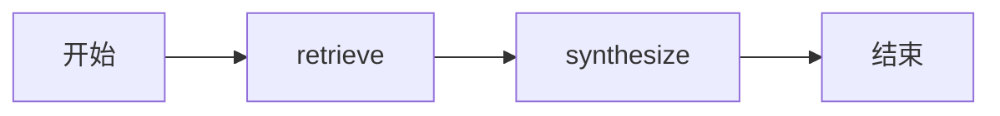

# Java 快速入门

本指南将带你在 Java 中构建 AI 智能体和持久化工作流。完成后，你将理解 JamJet 工具、智能体策略、IR 编译和类型化工作流状态如何协同工作——以及每个设计选择对生产环境智能体系统的*重要性*。

---

## 前置要求

开始之前，请确保你具备：

- **Java 21+** — JamJet 使用虚拟线程（`Thread.ofVirtual`）实现非阻塞 I/O，无需回调地狱。虚拟线程在 Java 21 中是正式（非预览）特性（JEP 444）。
- **Maven 3.9+** 或 **Gradle 8+** — 任何能从 Maven Central 拉取依赖的构建工具。
- **运行中的 JamJet 运行时** — 用于生产环境执行。开发期间可以在进程内运行所有功能（无需服务器），或使用以下命令启动本地运行时：
  ```bash
  jamjet dev
  ```
- **LLM API 密钥** — 在环境变量中设置 `OPENAI_API_KEY` 或 `ANTHROPIC_API_KEY`。对于纯本地开发，[Ollama](https://ollama.com) 无需任何密钥即可使用。

> **提示：** 
> 你可以在没有运行时的情况下完成整个指南。进程内执行器让你能够在本地编译、验证和运行工作流。当需要崩溃恢复和持久化状态时，再添加运行时。

---

## 添加依赖

Java SDK 已发布到 Maven Central，包名为 `dev.jamjet:jamjet-sdk`。

### Maven

```xml
<dependency>
    <groupId>dev.jamjet</groupId>
    <artifactId>jamjet-sdk</artifactId>
    <version>0.4.0</version>
</dependency>
```

### Gradle（Kotlin DSL）

```kotlin
implementation("dev.jamjet:jamjet-sdk:0.4.0")
```

### Gradle（Groovy DSL）

```groovy
implementation 'dev.jamjet:jamjet-sdk:0.4.0'
```

确保你的项目目标为 Java 21 或更高版本。在 Maven 中：

```xml
<properties>
    <maven.compiler.source>21</maven.compiler.source>
    <maven.compiler.target>21</maven.compiler.target>
</properties>
```

---

## 定义工具

工具是智能体与外部世界的桥梁——网页搜索、数据库查询、API 调用、文件 I/O。在 JamJet 中，工具是一个用 `@Tool` 注解的 Java **record**，实现 `ToolCall<T>` 接口。

```java
import dev.jamjet.tool.Tool;
import dev.jamjet.tool.ToolCall;

@Tool(description = "搜索网络以获取关于某个主题的信息")
record WebSearch(String query) implements ToolCall<String> {
    public String execute() {
        // 在生产环境中，在此调用你的搜索 API
        return "'" + query + "' 的搜索结果：JamJet 是一个性能优先、"
                + "智能体原生的运行时和框架，专为 AI 智能体设计。";
    }
}
```

### 为什么使用记录？

这种设计是有意为之的。Java 记录为你提供了三个对代理工具至关重要的属性：

1. **不可变性** — 工具调用的参数在构造后永不改变。这使得工具调用可以安全地序列化、重放和审计。当 JamJet 重放失败的工作流时，它会使用完全相同的参数重新调用完全相同的工具调用。

2. **自动 JSON Schema 派生** — SDK 检查记录组件（上面的 `String query`）并生成 LLM 调用工具所需的 JSON Schema。无需手动编写 schema，无需注解堆砌，代码与 schema 之间不会产生偏差。

3. **结构相等性** — 两个 `WebSearch("jamjet")` 实例是相等的。这使得在重试过程中可以对工具调用进行去重和缓存。

`@Tool` 注解提供了 LLM 在决定使用哪个工具时看到的 `description`。像你向同事解释工具那样编写它 — 清晰、具体、以行动为导向。

> **注意：** 
> 关于工具设计模式、代理策略以及何时使用每种策略的深入内容，请参阅 [代理 AI 模式](https://sunilprakash.com/agentic-ai)。

---

## 构建代理

代理结合了模型、工具、指令和**推理策略**。策略决定了代理*如何*思考 — 而不仅仅是*做什么*。

```java
import dev.jamjet.agent.Agent;

var agent = Agent.builder("researcher")
        .model("claude-haiku-4-5-20251001")
        .tools(WebSearch.class)
        .instructions("你是一个有用的研究助手。"
                + "总是先搜索，然后提供全面的摘要。")
        .strategy("react")
        .maxIterations(5)
        .build();
```

让我们逐一解析每个部分。

### `react` 策略

当你设置 `.strategy("react")` 时，你是在告诉 JamJet 使用 **ReAct**（推理 + 行动）循环：

1. **思考** — 模型推理下一步该做什么
2. **行动** — 模型调用工具
3. **观察** — 工具结果反馈给模型
4. 重复上述过程，直到模型产生最终答案或达到迭代限制

这是最常见的代理策略，因为它很灵活：模型动态决定调用哪些工具以及以什么顺序调用。它适用于无法预测确切步骤序列的开放式任务。

JamJet 支持三种内置策略：

| 策略 | 何时使用 | 工作原理 |
|----------|-------------|--------------|
| `react` | 开放式任务、探索性研究 | 思考-行动-观察循环 |
| `plan-and-execute` | 受益于前期规划的结构化任务 | 生成计划，然后按顺序执行每个步骤 |
| `critic` | 需要质量控制的任务 | 起草-批评-修订循环 |

> **提示：** 
> 不确定选择哪个策略？从 `react` 开始。当你发现代理行为发散时，升级到 `plan-and-execute`；或者当输出质量比速度更重要时，升级到 `critic`。查看 [jamjet.dev/research 上的策略对比](https://jamjet.dev/research) 了解基准测试。

### 护栏：成本、时间和迭代次数

生产环境的 agent 需要硬性限制。如果没有限制，一个混乱的模型可能会在循环中耗尽你的 API 预算：

```java
var agent = Agent.builder("investment-researcher")
        .model("gpt-4o")
        .tools(WebSearch.class, FetchUrl.class, StoreNote.class)
        .instructions("""
                You are a professional investment research analyst.
                Search for recent news and financials, then produce
                a structured investment memo.
                """)
        .strategy("plan-and-execute")
        .maxIterations(6)
        .maxCostUsd(0.50)
        .timeoutSeconds(120)
        .build();
```

- **`maxIterations(6)`** — agent 在 6 个推理步骤后停止，即使尚未完成。这可以防止无限循环。
- **`maxCostUsd(0.50)`** — 运行时实时跟踪 token 成本，如果支出超过 50 美分则停止 agent。
- **`timeoutSeconds(120)`** — 实际时钟超时。如果 agent 在 2 分钟内未完成，执行将被中止。

这些不是建议 — 而是运行时强制执行的硬性限制。JamJet 运行时会在*每一步之间*检查它们，而不仅仅是在结束时。

---

## 运行它

构建好 agent 后，你可以运行它并检查结果：

```java
public static void main(String[] args) {
    var agent = Agent.builder("researcher")
            .model("claude-haiku-4-5-20251001")
            .tools(WebSearch.class)
            .instructions("You are a helpful research assistant. "
                    + "Always search first, then provide a thorough summary.")
            .strategy("react")
            .maxIterations(5)
            .build();

    // Run the agent
    var result = agent.run("What is JamJet?");

    System.out.println(result.output());
    System.out.printf("Duration: %.2f ms%n", result.durationUs() / 1000.0);
    System.out.printf("Tool calls: %d%n", result.toolCalls().size());
}
```

```bash
export OPENAI_API_KEY=sk-...
mvn compile exec:java -Dexec.mainClass=com.example.MyAgent
```

### IR 编译：底层运作机制

在 agent 运行之前，JamJet 会将其**编译**为中间表示（IR）— 这是一种跨 Java SDK、Python SDK 和 YAML 工作流共享的规范图格式。你可以直接检查 IR：

```java
var ir = agent.compile();

System.out.println("workflow_id: " + ir.id());
System.out.println("start_node:  " + ir.startNode());
System.out.println("nodes:       " + ir.nodes().size());
System.out.println("edges:       " + ir.edges().size());
```

这会打印类似以下内容：

```
workflow_id: researcher
start_node:  react_start
nodes:       3
edges:       4
```

为什么这很重要？因为 IR 是 JamJet 运行时实际执行的内容。无论你用 Java、Python 还是 YAML 编写 agent，它都会编译成相同的图格式。这意味着：

- **可移植性** — 用 Java 编写的 agent 可以在任何 JamJet 运行时上部署
- **可检查性** — 你可以在运行之前验证和可视化执行图
- **持久性** — 运行时在节点边界处设置检查点，因此可以在崩溃后恢复

你还可以在提交之前验证 IR：

```java
import dev.jamjet.ir.IrValidator;

IrValidator.validateOrThrow(ir);
```

这可以在编译时而不是运行时捕获结构问题（断开的节点、缺失的边、无效的状态模式）。

---

## 构建工作流

Agent 非常适合开放式任务，由模型决定执行什么操作。但许多实际系统需要**确定性的多步骤管道** —— 数据丰富、RAG、审批链、ETL。对于这些场景，请使用 **Workflow**。

关键区别在于：在 Agent 中，LLM 决定执行路径。在工作流中，*你*决定执行路径，LLM 只是管道中的一个步骤。

以下是一个两步 RAG（检索增强生成）工作流：

```java
import dev.jamjet.workflow.Workflow;
import java.util.List;

// 类型化状态 —— 一个 Java record
record RagState(
        String query,
        List<String> retrievedDocs,
        String answer) {}

var workflow = Workflow.<RagState>builder("rag-assistant")
        .version("1.0.0")
        .state(RagState.class)
        // 步骤 1：检索相关文档
        .step("retrieve", state -> {
            var docs = searchKnowledgeBase(state.query());
            return new RagState(state.query(), docs, null);
        })
        // 步骤 2：根据上下文合成答案
        .step("synthesize", state -> {
            var context = String.join("\n\n", state.retrievedDocs());
            var answer = callLlm(state.query(), context);
            return new RagState(state.query(), state.retrievedDocs(), answer);
        })
        .build();
```

### 状态如何在工作流中流转

每个步骤接收当前的 `RagState` 并返回一个*新的* `RagState`。状态始终是不可变的 —— 你永远不会修改现有的 record，而是构造一个新的。这正是工作流持久化的原理：如果运行时在 "retrieve" 和 "synthesize" 之间崩溃，它会从最后完成的检查点以持久化的确切状态恢复执行。

以下是该工作流的执行流程：



步骤 "retrieve" 填充 `retrievedDocs`。步骤 "synthesize" 读取这些文档并生成最终的 `answer`。每个步骤都会设置检查点 —— 如果进程在 "retrieve" 完成后崩溃，运行时会从 "synthesize" 恢复，无需重新运行检索。

### 运行工作流

```java
import dev.jamjet.workflow.ExecutionResult;
import java.util.ArrayList;

var initialState = new RagState(
        "How does JamJet handle concurrent tool calls?",
        new ArrayList<>(),
        null);

ExecutionResult<RagState> result = workflow.run(initialState);

System.out.println(result.state().answer());
System.out.printf("Ran %d steps in %.2f ms%n",
        result.stepsExecuted(), result.totalDurationUs() / 1000.0);
```

### Agent 与 Workflow：何时使用哪个

| | Agent | Workflow |
|---|---|---|
| **控制流** | LLM 决定 | 你决定 |
| **最适合** | 开放式任务、研究、对话 | 管道、RAG、审批链、ETL |
| **确定性** | 非确定性（模型驱动） | 确定性（代码驱动） |
| **持久性** | 在策略边界处设置检查点 | 在每个步骤设置检查点 |
| **工具** | 模型选择调用哪些工具 | 步骤显式调用工具 |

你可以将两者结合使用：使用 workflow 作为外层编排器，并在各个步骤内嵌入 agent。这为你提供了具有智能子步骤的确定性管道。

---

## 下一步

你现在已经有了一个可运行的 agent 和 workflow。以下是深入学习的方向：

- **[Java SDK 参考文档](/java-sdk)** — 完整的 API 覆盖：条件路由、评估、状态管理、运行时客户端、基于注解的 agent
- **[Spring Boot Starter 指南](/spring-boot-starter)** — 将 JamJet 与 Spring AI、Spring Security 和 Micrometer 可观测性集成
- **[LangChain4j 集成](/langchain4j)** — 将 JamJet 用作 LangChain4j agent 的持久化执行层
- **[核心概念](/concepts)** — 深入了解 agent、节点、状态和持久性
- **[GitHub 示例](https://github.com/jamjet-labs/jamjet/tree/main/sdk/java/examples)** — 可运行的示例，包括基本工具流、计划并执行 agent 和 RAG 助手
- **[Agentic AI 模式](https://sunilprakash.com/agentic-ai)** — agent 系统的策略选择、工具设计和生产模式

> **提示：** 
> 已经在使用 Spring Boot？直接跳到 [Spring Boot Starter 指南](/spring-boot-starter) — 它将本快速入门中的所有内容封装为自动配置，并提供健康检查、指标和审计日志。
