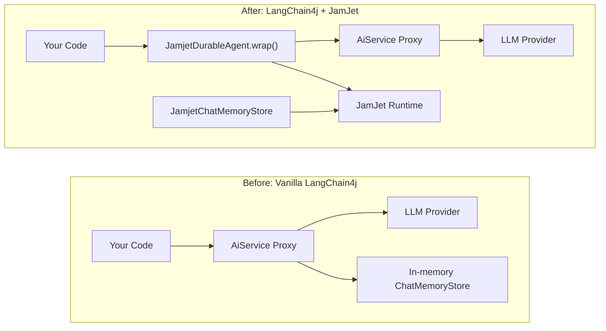

# LangChain4j 集成

JamJet 是一个完整的智能体运行时，配备自己的 [Java SDK](/java-sdk)——它原生与 LLM 通信、管理工具、编译为持久化工作流 IR，并在运行时强制执行成本和时间限制。对于新项目，这是推荐的路径。

但如果你已经在生产环境中使用了 LangChain4j 智能体——`AiServices` 代理、对话记忆存储、工具绑定——你不需要重写它们。此集成用 JamJet 的持久化执行引擎包装你现有的 LangChain4j 代码，只需最少的改动即可获得崩溃恢复、审计跟踪和重放测试。

### 改造前后对比



左侧是你当前的架构。右侧在现有智能体前添加了一个持久化代理，并通过 JamJet 运行时持久化对话记忆。你的 `AiService` 接口、工具定义和 LLM 配置无需更改。

> **注意：**
> 对于全新的 Java 项目，建议直接使用 [Java SDK](/java-sdk)——它提供原生 LLM 集成、类型化工具、策略选择和 IR 编译，无需 LangChain4j 依赖。

---

## 设置

### 1. 添加依赖

集成模块已发布到 Maven Central。它需要 `jamjet-spring-boot-starter` 作为对等依赖以提供运行时客户端。

#### Maven

```xml
<dependency>
    <groupId>dev.jamjet</groupId>
    <artifactId>langchain4j-jamjet</artifactId>
    <version>0.1.2</version>
</dependency>
<dependency>
    <groupId>dev.jamjet</groupId>
    <artifactId>jamjet-spring-boot-starter</artifactId>
    <version>0.2.0</version>
</dependency>
```

#### Gradle (Kotlin DSL)

```kotlin
implementation("dev.jamjet:langchain4j-jamjet:0.1.2")
implementation("dev.jamjet:jamjet-spring-boot-starter:0.2.0")
```

#### Gradle (Groovy DSL)

```groovy
implementation 'dev.jamjet:langchain4j-jamjet:0.1.2'
implementation 'dev.jamjet:jamjet-spring-boot-starter:0.2.0'
```

### 2. 启动 JamJet 运行时

运行时是持久化事件并管理工作流状态的执行引擎。使用 Docker 运行：

```bash
docker run -p 7700:7700 ghcr.io/jamjet-labs/jamjet:latest
```

或者，如果你已经安装了 CLI：

```bash
jamjet dev
```

### 3. 配置

将运行时 URL 添加到你的 `application.yml`：

```yaml
spring:
  jamjet:
    runtime-url: http://localhost:7700
    # api-token: ${JAMJET_API_TOKEN}      # 可选，用于需要身份验证的运行时
    # tenant-id: default                   # 多租户隔离
    durability-enabled: true
```

---

## 包装现有智能体

假设你已经有一个在生产环境中运行的 LangChain4j `AiService`：

**你现有的代码（无需修改）：**

```java
import dev.langchain4j.service.AiServices;
import dev.langchain4j.model.openai.OpenAiChatModel;

interface ResearchAssistant {
    String research(String topic);
}

var model = OpenAiChatModel.builder()
        .apiKey(System.getenv("OPENAI_API_KEY"))
        .modelName("gpt-4o")
        .build();

ResearchAssistant assistant = AiServices.create(ResearchAssistant.class, model);
```

**通过一次调用添加持久化：**

```java
import dev.jamjet.langchain4j.JamjetDurableAgent;
import dev.jamjet.spring.client.JamjetRuntimeClient;

// client 由 jamjet-spring-boot-starter 自动配置，
// 或使用 JamjetConfig 手动构建（参见下方配置部分）
ResearchAssistant durable = JamjetDurableAgent.wrap(
        assistant,                // 你现有的 AiService 代理
        ResearchAssistant.class,  // 接口类型
        client                    // JamjetRuntimeClient
);

// 使用方式完全相同 — 接口没有变化
String result = durable.research("量子纠错");
```

这就是全部修改。你的调用代码、接口定义、工具注解和模型配置都保持不变。

### 底层原理

当你调用 `JamjetDurableAgent.wrap()` 时，它会围绕你的 `AiService` 接口创建一个 JDK 动态代理（`java.lang.reflect.Proxy`）。包装代理上的每个方法调用都会经过以下流程：

1. **构建工作流 IR** — 代理构造一个命名为 `langchain4j-{InterfaceName}-{methodName}` 的轻量级中间表示，包含单个 `LlmGenerate` 节点。此 IR 与 JamJet 原生 SDK 和 Rust 运行时使用的格式相同。

2. **创建工作流并启动执行** — 代理调用 `client.createWorkflow(ir)`，然后调用 `client.startExecution(workflowId, ...)`。该执行现在由 JamJet 运行时使用唯一的执行 ID 进行跟踪。

3. **调用委托** — 原始 `AiService` 代理处理实际的 LLM 调用。你的工具、记忆和模型配置都像之前一样工作。

4. **记录完成或失败** — 成功时，代理发送一个带有 `status=completed` 和结果的 `completion` 事件。失败时，记录 `status=failed` 及错误消息。

5. **优雅降级** — 如果 JamJet 运行时不可达（网络分区、容器未启动），代理会记录警告并直接委托给原始 `AiService`。你的应用程序永远不会因为 JamJet 宕机而失败。

---

## 配置

如果你使用的是 Spring Boot，`JamjetRuntimeClient` 会根据 `application.yml` 中的配置自动装配（参见 [Spring Boot Starter](/spring-boot-starter) 指南）。对于 Spring 之外的独立使用场景，可以使用 `JamjetConfig` 手动构建客户端：

```java
import dev.jamjet.langchain4j.JamjetConfig;

var config = new JamjetConfig()
        .runtimeUrl("http://localhost:7700")
        .apiToken("your-token")
        .tenantId("default")
        .connectTimeout(10)
        .readTimeout(120);

var client = config.buildClient();
```

### 配置选项

| 选项 | 方法 | 默认值 | 说明 |
|--------|--------|---------|-------------|
| Runtime URL | `.runtimeUrl(String)` | `http://localhost:7700` | JamJet runtime 的地址 |
| API token | `.apiToken(String)` | `null` | 用于安全 runtime 的身份验证令牌 |
| Tenant ID | `.tenantId(String)` | `"default"` | 多租户隔离标识符 |
| Connect timeout | `.connectTimeout(int)` | `10`（秒） | TCP 连接超时 |
| Read timeout | `.readTimeout(int)` | `120`（秒） | 长时间运行操作的 HTTP 读取超时 |

所有选项均使用流式构建器模式。`JamjetConfig` 通过 `.buildClient()` 生成 `JamjetRuntimeClient`，与 Spring Boot 自动配置使用的客户端类型相同。

---

## 持久化对话记忆

LangChain4j 通过 `ChatMemoryStore` 接口存储对话历史。默认实现是内存存储 —— 如果进程重启，所有对话历史将丢失。

`JamjetChatMemoryStore` 通过 JamJet runtime 的审计事件系统持久化对话历史。消息使用 LangChain4j 内置的 `ChatMessageSerializer` 序列化为 JSON 并作为外部事件存储，使其能够在重启后保留并可通过审计 API 查询。

```java
import dev.jamjet.langchain4j.JamjetChatMemoryStore;
import dev.langchain4j.memory.chat.MessageWindowChatMemory;

var memoryStore = new JamjetChatMemoryStore(client);

var memory = MessageWindowChatMemory.builder()
        .maxMessages(20)
        .chatMemoryStore(memoryStore)
        .build();

// 像往常一样与你的 AiService 配合使用
ResearchAssistant assistant = AiServices.builder(ResearchAssistant.class)
        .chatLanguageModel(model)
        .chatMemory(memory)
        .build();
```

### 工作原理

| 操作 | 发生的事情 |
|-----------|-------------|
| `getMessages(memoryId)` | 查询 JamJet 审计跟踪，获取与内存 ID 关联的最新 `chat_memory` 事件。将存储的 JSON 反序列化为 `ChatMessage` 对象。如果不存在历史记录则返回空列表。|
| `updateMessages(memoryId, messages)` | 将所有消息序列化为 JSON，并向运行时发送 `chat_memory` 外部事件，同时记录消息数量和负载。|
| `deleteMessages(memoryId)` | 向运行时发送 `memory_cleared` 事件。事件日志是仅追加的，因此清除操作会被记录为事实，而不是删除先前的条目。|

这三个操作都具有优雅降级能力——如果 JamJet 运行时无法访问，存储会记录警告并返回空结果（读取操作）或静默丢弃写入。这与 `JamjetDurableAgent` 使用的优雅降级模式一致。

### Engram:超越聊天历史的长期记忆

`JamjetChatMemoryStore` 通过 JamJet 运行时持久化原始对话消息。对于需要更丰富记忆能力的智能体——实体提取、时序知识图谱、语义搜索——可以考虑 [Engram](https://java-ai-memory.dev),这是 JamJet 的专用记忆层。`engram-spring-boot-starter` 为 Spring AI 提供了 `ChatMemoryRepository`,通过 Engram 服务器存储消息,同时额外提取实体和关系并为语义召回建立索引。设置详情请参阅 Spring Boot Starter 指南中的 [Engram 记忆部分](/spring-boot-starter#engram-memory)。

---

## 你将获得什么

使用 JamJet 包装你的 LangChain4j 智能体,无需更改应用代码即可增加以下能力:

| 能力 | 不使用 JamJet | 使用 JamJet |
|------------|---------------|-------------|
| **崩溃恢复** | 进程终止,交互丢失,token 浪费 | 运行时跟踪执行,重启后可恢复 |
| **审计日志** | 无操作记录 | 每个方法调用记录为不可变事件,包含参数、结果和状态 |
| **回放测试** | 必须调用实时 LLM 进行测试 | 在测试套件中回放已记录的执行,无需 LLM 调用 |
| **成本跟踪** | 手动统计 token | 执行事件包含方法名和参数,用于成本归因 |
| **可观测性** | 仅应用层日志 | 执行 ID 用于分布式追踪关联,通过 Spring Boot starter 支持 Micrometer 指标 |
| **聊天记忆持久化** | 仅内存存储,重启后丢失 | 通过 JamJet 审计事件系统持久化,可跨重启保存 |

---

## 测试封装的智能体

`jamjet-spring-boot-starter-test` 模块支持封装的 LangChain4j 智能体。由于 `JamjetDurableAgent.wrap()` 会创建 JamJet 执行记录,您可以在测试中使用 `@ReplayExecution` 重放它们。

```java
import dev.jamjet.spring.test.annotations.WithJamjetRuntime;
import dev.jamjet.spring.test.annotations.ReplayExecution;
import dev.jamjet.spring.test.RecordedExecution;
import dev.jamjet.spring.test.AgentAssertions;
import org.junit.jupiter.api.Test;
import java.util.concurrent.TimeUnit;

@WithJamjetRuntime
class ResearchAssistantTest {

    @Test
    @ReplayExecution("exec-lc4j-abc123")
    void wrappedAgentProducesConsistentOutput(RecordedExecution execution) {
        AgentAssertions.assertThat(execution)
                .completedSuccessfully()
                .completedWithin(30, TimeUnit.SECONDS)
                .outputContains("quantum");
    }
}
```

添加测试依赖:

```xml
<dependency>
    <groupId>dev.jamjet</groupId>
    <artifactId>jamjet-spring-boot-starter-test</artifactId>
    <version>0.2.0</version>
    <scope>test</scope>
</dependency>
```

关于完整的测试 API —— `RecordedExecution` 字段、`AgentAssertions` 流式 API、`DeterministicModelStub`、节点级分叉重放 —— 请参阅 [Spring Boot Starter](/spring-boot-starter) 指南的测试部分。

---

## 下一步

- **[Java SDK 参考文档](/java-sdk)** — 对于新项目,JamJet 的原生 Java SDK 提供直接的 LLM 集成、类型化工具、策略选择和 IR 编译,无需 LangChain4j 依赖
- **[Java 快速入门](/java-quickstart)** — 使用原生 SDK 从零开始构建您的第一个智能体和工作流
- **[Spring Boot Starter](/spring-boot-starter)** — 完整的 Spring AI 集成,具备自动配置的持久化、审计跟踪、人工审批和可观测性
- **[智能体 AI 模式](https://sunilprakash.com/agentic-ai)** — 智能体系统的策略选择、工具设计和生产模式
