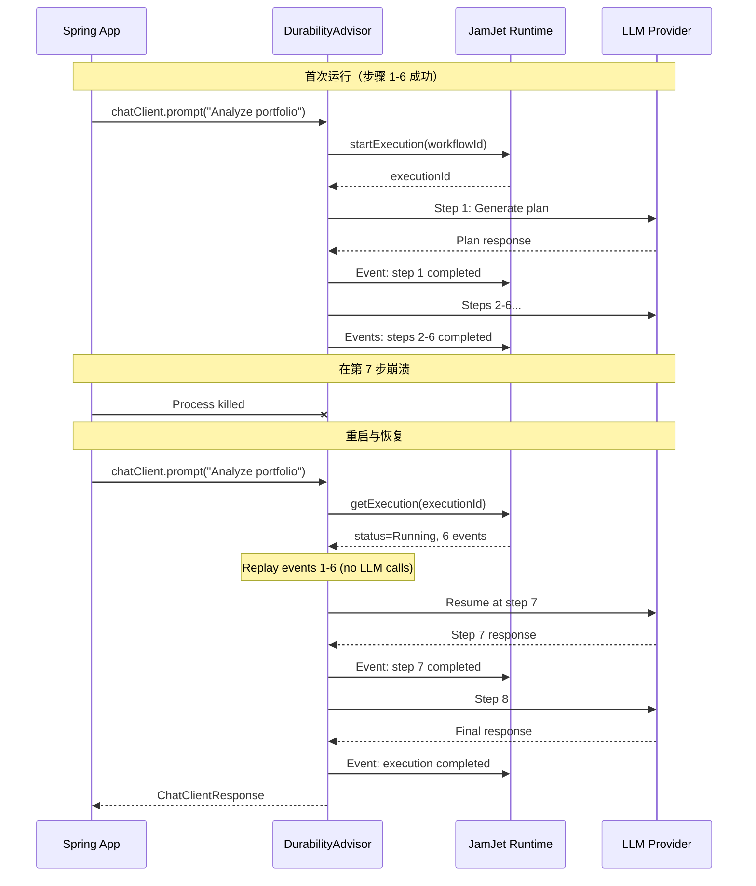
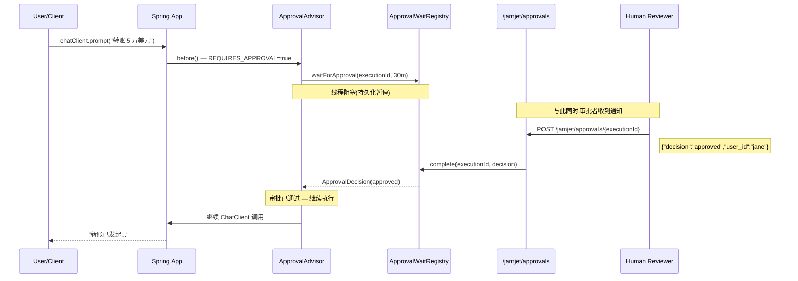
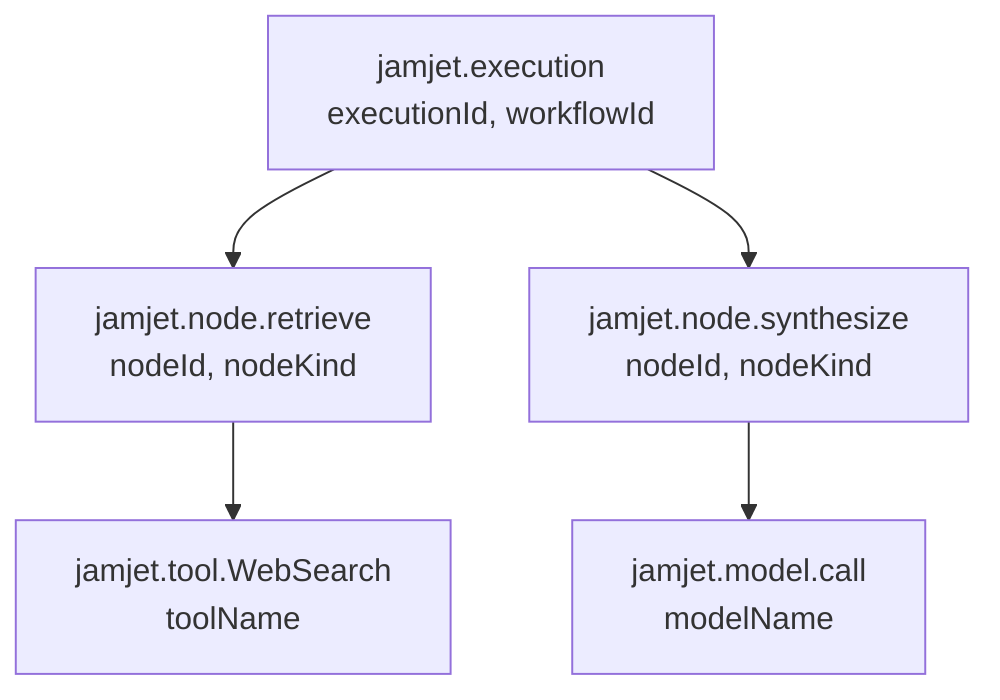

# Spring Boot Starter

本指南全面介绍 JamJet Spring Boot 集成：为什么持久性对 AI 智能体至关重要、每个 advisor 的底层工作原理、如何确定性地测试智能体，以及如何在生产环境中监控它们。学完本指南后，你将拥有一个可运行的 Spring AI 应用程序，其中每次 LLM 调用都是崩溃可恢复的、可审计的和可观测的。

---

## 为什么持久性对 AI 智能体至关重要

Spring AI 为构建基于 LLM 的应用程序提供了简洁的抽象。你可以使用 `ChatClient`、advisors、工具调用和模型可移植性。但它无法在运行时出现问题时提供任何保护。

考虑这样的场景：你的 Spring AI 智能体正在执行一个多步骤任务——它已经调用了搜索工具、检索了结果，并即将生成答案——此时进程崩溃了。使用原生 Spring AI 时,整个交互将丢失。用户会看到错误。你已经消耗的 token 被浪费了。没有任何记录表明发生了什么。

这正是**持久化执行**要解决的问题。JamJet 将智能体交互的每个步骤记录为不可变事件。如果进程崩溃并重启,它会重放这些事件,并从中断处精确恢复。不会丢失工作成果,不会浪费 token,用户也不会看到失败。

持久性还解锁了一些没有它就无法实现的能力:

- **审计追踪** — 每个提示、响应、工具调用和 token 计数都作为不可变事件记录。这是受监管行业(金融服务、医疗、法律)的必备功能。
- **人工参与审批** — 在执行过程中暂停智能体,等待人工批准或拒绝,然后恢复。暂停是持久的:它能在重启后保持。
- **回放测试** — 在测试环境中重放生产执行记录并对结果进行断言。无需调用 LLM。
- **成本跟踪** — 按执行、按用户、按工作流汇总真实 token 成本。

关于我们为什么构建 JamJet 以及它解决的问题的更深入背景,请参阅 [Why We Built JamJet](https://jamjet.dev/blog/why-we-built-jamjet)。

---

## 设置

### 1. 添加依赖

此 starter 已发布到 Maven Central。只需添加一个依赖，Spring Boot 自动配置会处理其余部分。

#### Maven

```xml
<dependency>
    <groupId>dev.jamjet</groupId>
    <artifactId>jamjet-spring-boot-starter</artifactId>
    <version>0.2.0</version>
</dependency>
```

#### Gradle (Kotlin DSL)

```kotlin
implementation("dev.jamjet:jamjet-spring-boot-starter:0.2.0")
```

#### Gradle (Groovy DSL)

```groovy
implementation 'dev.jamjet:jamjet-spring-boot-starter:0.2.0'
```

### 2. 启动 JamJet 运行时

运行时是持久化事件和管理工作流状态的执行引擎。使用 Docker 运行:

```bash
docker run -p 7700:7700 ghcr.io/jamjet-labs/jamjet:latest
```

或者,如果已安装 CLI:

```bash
jamjet dev
```

### 3. 配置

将运行时 URL 添加到你的 `application.yml`:

```yaml
spring:
  jamjet:
    runtime-url: http://localhost:7700
    # api-token: ${JAMJET_API_TOKEN}      # 可选,用于需要身份验证的运行时
    # tenant-id: default                   # 多租户隔离
    durability-enabled: true               # 默认值: true
    connect-timeout-seconds: 10            # 默认值: 10
    read-timeout-seconds: 120              # 默认值: 120
```

或在 `application.properties` 中:

```properties
spring.jamjet.runtime-url=http://localhost:7700
```

### 自动配置的作用

当 `JamjetAutoConfiguration` 检测到类路径上存在 Spring AI 的 `ChatClient` 且 `spring.jamjet.durability-enabled=true`(默认值)时,会注册以下 bean:

| Bean | 条件 | 用途 |
|------|-----------|---------|
| `JamjetRuntimeClient` | 始终(启用持久化时) | 连接 JamJet 运行时的 HTTP 客户端 |
| `JamjetDurabilityAdvisor` | 始终(启用持久化时) | 为每个 ChatClient 调用包装持久化执行 |
| `ChatClientCustomizer` | 始终(启用持久化时) | 自动将持久化顾问注入所有 ChatClient 实例 |
| `JamjetAuditAdvisor` | `spring.jamjet.audit.enabled=true`(默认值) | 将提示、响应和 token 使用记录为审计事件 |
| `JamjetAuditService` | `spring.jamjet.audit.enabled=true`(默认值) | 程序化访问审计轨迹 |
| `JamjetApprovalAdvisor` | `spring.jamjet.approval.enabled=true`(选择性启用) | 暂停执行以等待人工批准 |
| `JamjetApprovalController` | 批准已启用 + Web 应用 | 在 `/jamjet/approvals` 提供 REST 端点 |
| `JamjetMicrometerBridge` | 类路径上存在 Micrometer(默认) | 发布执行指标 |
| `JamjetOtelBridge` | `spring.jamjet.observability.opentelemetry=true`(选择性启用) | 创建 OpenTelemetry span |

持久化顾问通过 `ChatClientCustomizer` 注入,无需手动添加。从自动配置的 `ChatClient.Builder` 构建的每个 `ChatClient` 都会自动获得持久化能力。

### 优雅降级

如果 JamJet 运行时不可用——网络分区、容器未启动、身份验证失败——`JamjetDurabilityAdvisor` 会记录警告并允许请求在没有持久性保障的情况下继续执行。你的应用程序永远不会因为 JamJet 宕机而失败。这是有意为之的：持久性是安全网，而不是单点故障。

---

## 持久性顾问器

`JamjetDurabilityAdvisor` 是集成的核心。它实现了 Spring AI 的 `BaseAdvisor` 接口，并拦截每个 `ChatClient` 调用以将其包装为持久执行。

### 面向 Spring 开发者的事件溯源

如果你之前没有接触过事件溯源，这里是核心思想：与其仅存储操作的*当前状态*，不如存储导致该状态的每个*事件*。当前状态是派生视图——你始终可以通过从头回放事件来重建它。

对于 AI 智能体，这意味着每次 LLM 调用、每次工具调用、每次状态变更都会作为不可变事件记录在 JamJet 运行时中。事件日志就是真实数据源。

为什么这很重要？因为它为你提供了开箱即用的崩溃恢复能力。如果进程在任何时刻终止,你只需回放事件日志到最后完成的事件，然后从那里恢复。无数据丢失。无重复工作。

### 崩溃恢复演示

考虑一个执行 8 个步骤的智能体：检索上下文、调用 LLM、执行工具、再次调用 LLM，以此类推。当进程在第 7 步崩溃时会发生什么：



重启后，步骤 1 到 6 **不会重新执行**。顾问器从运行时读取它们的事件并重建状态。只有第 7 步（及之后）才真正调用 LLM。这节省了 token 和时间。

### 前后对比

核心洞察：**你的应用代码无需改变**。持久性来自增强器，而非业务逻辑。

**不使用 JamJet**（原生 Spring AI）：

```java
@Bean
ChatClient chatClient(ChatClient.Builder builder) {
    return builder.build();
}

@Bean
CommandLineRunner demo(ChatClient chatClient) {
    return args -> {
        String result = chatClient.prompt("Summarize AI trends")
                .call()
                .content();
        System.out.println(result);
        // 如果进程在此崩溃，一切都会丢失
    };
}
```

**使用 JamJet**（相同代码，持久性来自自动配置）：

```java
@Bean
ChatClient chatClient(ChatClient.Builder builder) {
    return builder.build(); // JamjetDurabilityAdvisor 自动注入
}

@Bean
CommandLineRunner demo(ChatClient chatClient) {
    return args -> {
        String result = chatClient.prompt("Summarize AI trends")
                .call()
                .content();
        System.out.println(result);
        // 持久化——能够从崩溃中恢复，事件已持久化，执行被跟踪
    };
}
```

唯一的区别是类路径中的依赖。由 `JamjetAutoConfiguration` 注册的 `ChatClientCustomizer` 会自动将 `JamjetDurabilityAdvisor` 添加到每个 `ChatClient.Builder` 中。

### 上下文键

持久性增强器使用三个上下文键来跟踪执行状态：

| 键 | 类型 | 描述 |
|-----|------|-------------|
| `jamjet.execution.id` | `String` | 运行时分配的唯一执行 ID |
| `jamjet.workflow.id` | `String` | 工作流 ID（从编译后的 IR 派生） |
| `jamjet.session.id` | `String` | 用于分组相关交互的会话 ID |

你可以从响应上下文中读取这些值，用于日志记录、关联或下游处理。

有关持久性支持的智能体模式——ReAct 循环、计划-执行、评判链——详见[智能体 AI 模式](https://sunilprakash.com/agentic-ai)。

---

## 审计增强器

`JamjetAuditAdvisor` 将每个提示、响应和令牌使用情况作为不可变审计事件记录到 JamJet 运行时中。它在增强器链中位于持久性增强器之后运行（优先级为 `LOWEST_PRECEDENCE - 50`），因此每条审计记录都关联一个持久执行 ID。

### 为什么审计日志很重要

如果你正在为企业用途构建 AI 代理——金融服务、医疗保健、保险、法律——你将面临记录保存方面的监管要求。监管机构希望了解：

- 发送给模型的提示词是什么？
- 模型返回了什么响应？
- 消耗了多少令牌（成本是多少）？
- 是哪个用户发起的交互？
- 六个月后你能重现这次交互吗？

没有审计日志，你无法回答这些问题中的任何一个。`JamjetAuditAdvisor` 默认回答所有这些问题。

### 审计事件结构

每条审计记录都作为执行上的外部事件持久化。以下是提示词审计事件的示例：

```json
{
  "type": "prompt",
  "advisor": "JamjetAuditAdvisor",
  "content": "Analyze the risk profile of portfolio XYZ-1234"
}
```

以及相应的响应事件：

```json
{
  "type": "response",
  "advisor": "JamjetAuditAdvisor",
  "content": "Based on the current allocation, portfolio XYZ-1234 has...",
  "prompt_tokens": 847,
  "completion_tokens": 1203,
  "total_tokens": 2050
}
```

### 配置

审计功能**默认启用**。你可以控制记录的内容：

```yaml
spring:
  jamjet:
    audit:
      enabled: true              # 默认值：true
      include-prompts: true      # 默认值：true — 记录完整的提示词文本
      include-responses: true    # 默认值：true — 记录完整的响应文本
```

对于需要审计日志但不得持久化 PII 或敏感提示词内容的受监管环境：

```yaml
spring:
  jamjet:
    audit:
      enabled: true
      include-prompts: false     # 从审计事件中省略提示词文本
      include-responses: false   # 从审计事件中省略响应文本
```

这仍然会记录交互*发生的事实*（包括执行 ID、时间戳和令牌计数），而不存储实际内容。有关代理系统中 PII 处理和数据治理的更多信息，请参阅[数据治理与 PII 保留](https://jamjet.dev/blog/data-governance-pii-retention)。

---

## 人工审批

`JamjetApprovalAdvisor` 实现了一个持久化的暂停-恢复模式:代理在执行过程中暂停,等待人工通过 REST 端点批准或拒绝,然后继续或中止。由于暂停由持久化执行引擎支持,它可以在进程重启后继续存在。

### 何时使用审批关卡

审批关卡用于高风险操作,您希望在代理执行前由人工审查其计划:

- 超过阈值的金融交易
- 面向客户的通信
- 生产环境中的数据库变更
- 具有法律或合规影响的操作

### 启用审批

审批是**可选的**(默认禁用):

```yaml
spring:
  jamjet:
    approval:
      enabled: true
      webhook-url: https://hooks.slack.com/services/T.../B.../xxx  # 可选
      timeout: 30m            # 默认值: 30m (支持 s, m, h 后缀)
      default-decision: rejected   # 默认值: rejected — 超时时的处理方式
```

| 属性 | 默认值 | 说明 |
|----------|---------|-------------|
| `spring.jamjet.approval.enabled` | `false` | 启用审批流程 |
| `spring.jamjet.approval.webhook-url` | --- | 外部通知 webhook (Slack、邮件等) |
| `spring.jamjet.approval.timeout` | `30m` | 超时前的最长等待时间 (支持 `s`、`m`、`h`) |
| `spring.jamjet.approval.default-decision` | `rejected` | 超时时应用的决策: `approved` 或 `rejected` |

### 触发审批

要将特定请求标记为需要审批,请设置 `jamjet.approval.required` 上下文键:

```java
String result = chatClient.prompt("向账户 9876 转账 50,000 美元")
        .advisors(approvalAdvisor)  // 或自动注入
        .context("jamjet.approval.required", true)
        .call()
        .content();
// 线程在此处阻塞,直到收到审批(或超时)
```

### 审批流程



### 通过 REST 批准或拒绝

启用审批后，自动配置会注册 `JamjetApprovalController`，提供两个端点：

**批准执行：**

```bash
curl -X POST http://localhost:8080/jamjet/approvals/{executionId} \
  -H "Content-Type: application/json" \
  -d '{
    "decision": "approved",
    "user_id": "jane.doe",
    "comment": "Reviewed and approved"
  }'
```

**拒绝执行：**

```bash
curl -X POST http://localhost:8080/jamjet/approvals/{executionId} \
  -H "Content-Type: application/json" \
  -d '{
    "decision": "rejected",
    "user_id": "jane.doe",
    "comment": "Amount exceeds policy limit"
  }'
```

**列出待审批项：**

```bash
curl http://localhost:8080/jamjet/approvals/pending
```

收到拒绝时，advisor 会抛出 `ApprovalRejectedException`，包含执行 ID 和审核者评论。

审批请求体支持以下字段：

| 字段 | 类型 | 必填 | 说明 |
|-------|------|----------|-------------|
| `decision` | `String` | 是 | `"approved"` 或 `"rejected"` |
| `user_id` | `String` | 否 | 审核者标识符 |
| `comment` | `String` | 否 | 人类可读的理由说明 |
| `node_id` | `String` | 否 | 要批准的特定节点（高级功能）|
| `state_patch` | `Map<String, Object>` | 否 | 批准时应用的状态修改 |

关于智能体系统中人机协作模式的更多信息，请参阅 [Agentic AI Patterns](https://sunilprakash.com/agentic-ai)。

---

## 测试

AI 智能体测试难度极高。LLM 具有非确定性——同一提示每次调用可能产生不同输出。针对实际 API 运行测试时，token 成本迅速累积。而且很难对每次都变化的输出进行断言。

JamJet 的测试模块通过两种互补方法解决这个问题：**回放测试**（回放真实执行而不调用 LLM）和**确定性桩**（用模式匹配的伪实现替换 LLM）。

### 添加测试依赖

```xml
<dependency>
    <groupId>dev.jamjet</groupId>
    <artifactId>jamjet-spring-boot-starter-test</artifactId>
    <version>0.2.0</version>
    <scope>test</scope>
</dependency>
```

### 使用 `@WithJamjetRuntime` 和 `@ReplayExecution` 进行回放测试

回放测试会捕获生产环境的执行记录,并在测试套件中重放。测试会连接到 JamJet 运行时(通过 Testcontainers),获取执行的事件日志,让你对结果进行断言 --- 无需调用任何 LLM。

```java
import dev.jamjet.spring.test.annotations.WithJamjetRuntime;
import dev.jamjet.spring.test.annotations.ReplayExecution;
import dev.jamjet.spring.test.RecordedExecution;
import dev.jamjet.spring.test.AgentAssertions;
import org.junit.jupiter.api.Test;
import java.util.concurrent.TimeUnit;

@WithJamjetRuntime
class PortfolioAgentTest {

    @Test
    @ReplayExecution("exec-abc123")
    void agentProducesConsistentOutput(RecordedExecution execution) {
        AgentAssertions.assertThat(execution)
                .completedSuccessfully()
                .usedTool("WebSearch")
                .completedWithin(30, TimeUnit.SECONDS)
                .costLessThan(0.50);
    }

    @Test
    @ReplayExecution(value = "exec-abc123", forkAtNode = "retrieve")
    void forkAndRerunFromRetrieveStep(RecordedExecution execution) {
        AgentAssertions.assertThat(execution)
                .nodeCompleted("retrieve")
                .outputContains("portfolio");
    }
}
```

`@WithJamjetRuntime` 是一个 JUnit 5 扩展,会在测试前启动 JamJet 运行时容器。你可以配置镜像和标签:

```java
@WithJamjetRuntime(image = "ghcr.io/jamjet-labs/jamjet", tag = "0.3.1")
```

`@ReplayExecution` 指定要重放的执行记录。可选的 `forkAtNode` 参数允许你在特定节点分叉执行 --- 适用于测试「如果我们改变步骤 X 的输出会怎样?」

### `RecordedExecution` 记录

`RecordedExecution` 捕获重放执行的所有信息:

| 字段 | 类型 | 描述 |
|-------|------|-------------|
| `executionId` | `String` | 唯一执行 ID |
| `workflowId` | `String` | 工作流 ID |
| `status` | `String` | 最终状态(`Completed`、`Failed`、`Cancelled`) |
| `input` | `Object` | 启动执行的输入 |
| `finalState` | `Object` | 所有节点完成后的最终状态 |
| `events` | `List<ExecutionEvent>` | 完整事件日志 |
| `nodes` | `List<NodeExecution>` | 每个节点的执行详情 |
| `totalDuration` | `Duration` | 实际耗时 |
| `toolCallCount` | `int` | 工具调用总次数 |
| `totalCostUsd` | `double` | 聚合 token 成本 |

每个 `NodeExecution` 包含 `nodeId`、`kind`、`status`、`input`、`output`、`duration` 和 `retryCount`。

### `AgentAssertions` 流式 API

`AgentAssertions.assertThat(execution)` 入口点返回一个专为智能体测试设计的流式 API：

| 断言 | 描述 |
|-----------|-------------|
| `.completedSuccessfully()` | 执行状态为 `Completed` |
| `.failedWith(errorContaining)` | 状态为 `Failed` 且错误消息匹配 |
| `.wasCancelled()` | 状态为 `Cancelled` |
| `.completedWithin(amount, unit)` | 实际执行时长在限制范围内 |
| `.costLessThan(usd)` | 总成本低于阈值 |
| `.usedTool(toolName)` | 工具至少被调用一次 |
| `.usedToolTimes(toolName, n)` | 工具被调用恰好 `n` 次 |
| `.didNotUseTool(toolName)` | 工具从未被调用 |
| `.toolCallCount(matcher)` | 对工具调用总次数使用 Hamcrest 匹配器 |
| `.nodeCompleted(nodeId)` | 特定节点成功完成 |
| `.nodeRetried(nodeId, times)` | 节点被重试恰好 `times` 次 |
| `.nodeCount(matcher)` | 对节点数量使用 Hamcrest 匹配器 |
| `.outputContains(substring)` | 最终输出包含子串 |
| `.outputMatches(regex)` | 最终输出匹配正则表达式模式 |
| `.outputSatisfies(consumer)` | 对输出使用自定义断言 lambda |
| `.hasEvent(eventType)` | 事件日志包含给定类型的事件 |
| `.eventCount(matcher)` | 对事件数量使用 Hamcrest 匹配器 |
| `.auditTrailContains(eventType)` | `.hasEvent()` 的别名 |
| `.auditTrailSize(matcher)` | `.eventCount()` 的别名 |

所有断言都可以链式调用 --- `.completedSuccessfully().usedTool("X").costLessThan(1.0)` 读起来自然，失败时会给出清晰的错误消息。

### 确定性模型桩

对于不想重放真实执行的单元测试，`DeterministicModelStub` 允许你用模式匹配的伪对象替换 `ChatModel`：

```java
import dev.jamjet.spring.test.DeterministicModelStub;

var stub = DeterministicModelStub.builder()
        .onPromptContaining("weather", "Sunny, 72F in San Francisco")
        .onPromptContaining("stock price", "ACME: $142.50, up 2.3%")
        .defaultResponse("I don't have information about that topic.")
        .build();

// 在你的 Spring 上下文中用作 ChatModel
@Bean
ChatModel chatModel() {
    return stub;
}
```

该桩按顺序匹配提示词：第一个匹配的 `onPromptContaining` 模式胜出。如果没有模式匹配，则返回 `defaultResponse`。该桩还会记录所有调用，因此你可以验证调用次数：

```java
assertEquals(3, stub.getCallCount());
assertEquals("weather in SF", stub.getCalls().get(0).getContents());
stub.reset(); // 清除调用历史
```

`DeterministicModelStub` 实现了 `ChatModel`，因此它同时支持 `call()` 和 `stream()` --- 流式变体返回包含匹配响应的单元素 `Flux`。

---

## 可观测性

### Micrometer 指标

当类路径中存在 Spring Boot Actuator 和 Micrometer 时，`JamjetMicrometerBridge` 会自动发布执行指标。此功能默认启用，无需手动开启。

```yaml
spring:
  jamjet:
    observability:
      micrometer: true           # 默认值：true
      metric-prefix: jamjet      # 默认值：jamjet
```

#### 指标参考

| 指标 | 类型 | 标签 | 描述 |
|--------|------|------|-------------|
| `jamjet.execution.duration` | Timer | `status` | 每次执行的持续时间 |
| `jamjet.execution.count` | Counter | `status` | 按状态统计的执行总数 |
| `jamjet.node.duration` | Timer | `node_id`, `node_kind` | 每个节点的持续时间 |
| `jamjet.node.retries` | Counter | `node_id` | 每个节点的重试次数 |
| `jamjet.tool.calls` | Counter | `tool_name` | 按名称统计的工具调用次数 |
| `jamjet.tool.duration` | Timer | `tool_name` | 每次工具调用的持续时间 |
| `jamjet.execution.cost.usd` | DistributionSummary | --- | 每次执行的 token 成本 |
| `jamjet.audit.events` | Counter | `event_type` | 按类型统计的审计事件 |

指标前缀可配置。如果设置 `metric-prefix: myapp.agent`，指标将变为 `myapp.agent.execution.duration` 等。

#### 告警建议

| 告警 | 条件 | 原因 |
|-------|-----------|-----|
| 高失败率 | `rate(jamjet.execution.count{status="Failed"}) > 0.05 * rate(jamjet.execution.count)` | 超过 5% 的执行失败 |
| 执行缓慢 | `jamjet.execution.duration{quantile="0.95"} > 30s` | P95 延迟超过 30 秒 |
| 成本激增 | `rate(jamjet.execution.cost.usd) > 10` | 每分钟花费超过 $10 |
| 过度重试 | `rate(jamjet.node.retries) > 5` | 节点重试过于频繁（工具不稳定或触发速率限制）|
| 审批积压 | 待审批数量持续增长 | 审核人员未响应（webhook 集成问题）|

### OpenTelemetry 追踪

要启用分布式追踪，请启用 OpenTelemetry 桥接：

```yaml
spring:
  jamjet:
    observability:
      opentelemetry: true        # 默认：false（需主动启用）
```

这需要在 classpath 中包含 `io.opentelemetry:opentelemetry-api`。该桥接会创建一个反映执行结构的 span 层次结构：



每个 span 都携带 JamJet 特定的属性：

| Span | Kind | 属性 |
|------|------|------------|
| `jamjet.execution` | `INTERNAL` | `jamjet.execution.id`、`jamjet.workflow.id` |
| `jamjet.node.{id}` | `INTERNAL` | `jamjet.node.id`、`jamjet.node.kind` |
| `jamjet.tool.{name}` | `CLIENT` | `jamjet.tool.name` |
| `jamjet.model.call` | `CLIENT` | `jamjet.model.name` |

错误 span 包含 `StatusCode.ERROR`、异常消息以及记录的异常事件——这些是标准的 OTel 语义，可与任何追踪后端（Jaeger、Zipkin、Grafana Tempo、Datadog）配合使用。

当有成本数据可用时，已完成的 span 会携带 `jamjet.cost.usd`，让你能够在追踪界面中关联成本与延迟数据。

---

## 完整示例

以下是一个完整的 Spring Boot 应用程序，综合了持久化、审计、审批和可观测性功能：

### `pom.xml`（依赖项）

```xml
<dependencies>
    <!-- Spring AI + OpenAI -->
    <dependency>
        <groupId>org.springframework.ai</groupId>
        <artifactId>spring-ai-openai-spring-boot-starter</artifactId>
    </dependency>

    <!-- JamJet durability -->
    <dependency>
        <groupId>dev.jamjet</groupId>
        <artifactId>jamjet-spring-boot-starter</artifactId>
        <version>0.2.0</version>
    </dependency>

    <!-- Spring Boot Actuator (enables Micrometer metrics) -->
    <dependency>
        <groupId>org.springframework.boot</groupId>
        <artifactId>spring-boot-starter-actuator</artifactId>
    </dependency>

    <!-- Test -->
    <dependency>
        <groupId>dev.jamjet</groupId>
        <artifactId>jamjet-spring-boot-starter-test</artifactId>
        <version>0.2.0</version>
        <scope>test</scope>
    </dependency>
</dependencies>
```

### `application.yml`

```yaml
spring:
  ai:
    openai:
      api-key: ${OPENAI_API_KEY}

  jamjet:
    runtime-url: http://localhost:7700
    durability-enabled: true

    audit:
      enabled: true
      include-prompts: true
      include-responses: true

    approval:
      enabled: true
      timeout: 15m
      default-decision: rejected

    observability:
      micrometer: true
      metric-prefix: jamjet
```

### `DurableAgentApplication.java`

```java
import dev.jamjet.spring.advisor.JamjetApprovalAdvisor;
import org.springframework.ai.chat.client.ChatClient;
import org.springframework.boot.SpringApplication;
import org.springframework.boot.autoconfigure.SpringBootApplication;
import org.springframework.context.annotation.Bean;
import org.springframework.web.bind.annotation.*;

@SpringBootApplication
public class DurableAgentApplication {

    public static void main(String[] args) {
        SpringApplication.run(DurableAgentApplication.class, args);
    }

    @Bean
    ChatClient chatClient(ChatClient.Builder builder) {
        return builder.build(); // 持久化 + 审计 advisor 自动注入
    }

    @RestController
    @RequestMapping("/api/agent")
    static class AgentController {

        private final ChatClient chatClient;

        AgentController(ChatClient chatClient) {
            this.chatClient = chatClient;
        }

        // 标准持久化调用——崩溃恢复 + 审计追踪
        @PostMapping("/ask")
        String ask(@RequestBody String prompt) {
            return chatClient.prompt(prompt)
                    .call()
                    .content();
        }

        // 高风险调用——继续执行前需要人工审批
        @PostMapping("/ask-with-approval")
        String askWithApproval(@RequestBody String prompt) {
            return chatClient.prompt(prompt)
                    .context(JamjetApprovalAdvisor.REQUIRES_APPROVAL_KEY, true)
                    .call()
                    .content();
        }
    }
}
```

### 运行方式

```bash

# 终端 1：启动 JamJet 运行时

docker run -p 7700:7700 ghcr.io/jamjet-labs/jamjet:latest

# 终端 2：启动 Spring Boot 应用

export OPENAI_API_KEY=sk-...
mvn spring-boot:run

# 终端 3：执行持久化调用

curl -X POST http://localhost:8080/api/agent/ask \
  -H "Content-Type: text/plain" \
  -d "What are the top 3 AI trends in 2026?"

# 执行需要审批的调用

curl -X POST http://localhost:8080/api/agent/ask-with-approval \
  -H "Content-Type: text/plain" \
  -d "Draft an email to all customers about a pricing change"

# 在另一个终端中：批准待处理的执行

curl http://localhost:8080/jamjet/approvals/pending

# 从响应中复制 executionId，然后：

curl -X POST http://localhost:8080/jamjet/approvals/{executionId} \
  -H "Content-Type: application/json" \
  -d '{"decision":"approved","user_id":"admin","comment":"Looks good"}'
```

---

## Engram 记忆

[Engram](https://java-ai-memory.dev) 是 JamJet 为 AI 智能体提供的持久化记忆层。它不仅仅是简单的聊天历史记录——Engram 从对话中提取实体和关系，构建时间知识图谱，并通过嵌入向量支持语义召回。与 Spring Boot starter 配合使用时,它为智能体提供持久化、可搜索的长期记忆,即使重启也能保持,并可跨会话扩展。

### 添加依赖

Engram starter 是独立于核心 JamJet starter 的构件。将其与现有依赖一起添加:

#### Maven

```xml
<dependency>
    <groupId>dev.jamjet</groupId>
    <artifactId>engram-spring-boot-starter</artifactId>
    <version>0.2.0</version>
</dependency>
```

#### Gradle (Kotlin DSL)

```kotlin
implementation("dev.jamjet:engram-spring-boot-starter:0.2.0")
```

#### Gradle (Groovy DSL)

```groovy
implementation 'dev.jamjet:engram-spring-boot-starter:0.2.0'
```

### 启动 Engram 服务器

使用 Docker 运行 Engram 服务器:

```bash
docker run -p 7680:7680 ghcr.io/jamjet-labs/engram-server:latest
```

或拉取指定版本:

```bash
docker run -p 7680:7680 ghcr.io/jamjet-labs/engram-server:0.5.0
```

### 配置

在 `application.yml` 中添加 Engram 服务器连接配置:

```yaml
engram:
  server:
    host: localhost
    port: 7680
```

### ChatMemoryRepository

starter 会自动配置一个由 Engram 服务器支持的 `ChatMemoryRepository` bean。Spring AI 的 `MessageChatMemoryAdvisor` 使用它来持久化存储对话历史——不会在重启时丢失内存状态。

```java
@Bean
public ChatClient chatClient(ChatClient.Builder builder, ChatMemoryRepository memoryRepository) {
    return builder
        .defaultAdvisors(MessageChatMemoryAdvisor.builder(memoryRepository).build())
        .build();
}
```

通过此配置,每次对话轮次都会通过 Engram 存储。`ChatMemoryRepository` 透明地处理消息历史的读写——应用代码照常使用 `ChatClient` 即可。

### 超越聊天历史

`ChatMemoryRepository` 存储原始对话消息。Engram 在底层做得更多：它从每条消息中提取实体和关系，为它们添加时间戳，并将其索引用于语义搜索。这意味着你的智能体可以回忆过去对话中的事实——不仅仅是重放消息日志，还能通过 Engram MCP 工具或 API 回答诸如"用户上周关于预算说了什么？"之类的问题。

有关 Engram 的完整功能集——知识图谱查询、语义搜索、SQLite 和 Postgres 后端、MCP 服务器工具——请参阅 [Engram 文档](https://java-ai-memory.dev)。

---

## 系统要求

| 要求 | 最低版本 |
|-------------|----------------|
| Java | 21+ |
| Spring Boot | 3.4+ |
| Spring AI | 1.0+ |
| JamJet 运行时 | 0.3.1+（Docker 或二进制文件）|

---

## 后续步骤

- **[LangChain4j 集成](/langchain4j-integration)** — 使用 JamJet 作为 LangChain4j 智能体的持久化执行层，配合 `JamjetDurableAgent` 和 `JamjetChatMemoryStore`
- **[Java SDK 参考](/java-sdk)** — 工具、策略、IR 编译和运行时客户端的完整 API 覆盖
- **[Java 快速入门](/java-quickstart)** — 使用 Java SDK 从零开始构建你的第一个智能体和工作流
- **[核心概念](/concepts)** — 深入了解智能体、节点、状态和持久化
- **[智能体 AI 模式](https://sunilprakash.com/agentic-ai)** — 策略选择、工具设计以及智能体系统的生产模式
